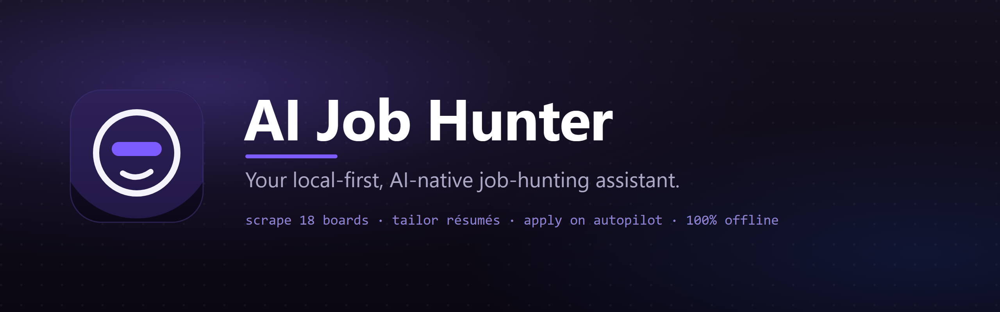

<p align="center">
  
</p>

<h1 align="center">AI Job Hunter</h1>

<p align="center">
  <em>Your local-first, AI-native desktop assistant for intelligent job searching, résumé &amp; cover-letter generation, and assisted applications — run it fully offline with Ollama, or plug in your own OpenAI, Anthropic, or Gemini key.</em>
</p>

<p align="center">
  <a href="https://github.com/saeedkolivand/ai-job-hunter-assistant-app/releases"><strong>⬇️ Download the latest release</strong></a>
  &nbsp;·&nbsp;
  <a href="https://saeedkolivand.github.io/ai-job-hunter-assistant-app/">🌐 Live site</a>
  &nbsp;·&nbsp;
  <a href="#-installation">📦 Install</a>
  &nbsp;·&nbsp;
  <a href="#-features">✨ Features</a>
  &nbsp;·&nbsp;
  <a href="docs/">📚 Docs</a>
</p>

<p align="center">
  <a href="https://github.com/saeedkolivand/ai-job-hunter-assistant-app/releases"></a>
  <a href="https://github.com/saeedkolivand/ai-job-hunter-assistant-app/releases"></a>
  <a href="https://github.com/saeedkolivand/ai-job-hunter-assistant-app/actions/workflows/ci-pipeline.yml"></a>
  <a href="https://github.com/saeedkolivand/ai-job-hunter-assistant-app/commits/main"></a>
  <a href="LICENSE"></a>
</p>

<p align="center">
  <a href="https://github.com/saeedkolivand/ai-job-hunter-assistant-app/releases"></a>
  <a href="https://saeedkolivand.github.io/ai-job-hunter-assistant-app/"></a>
  <a href="SECURITY.md"></a>
  <a href="https://github.com/saeedkolivand/ai-job-hunter-assistant-app/stargazers"></a>
  <a href="https://github.com/saeedkolivand/ai-job-hunter-assistant-app/pulls"></a>
</p>

<p align="center">
  <a href="https://tauri.app"></a>
  <a href="https://www.rust-lang.org/"></a>
  <a href="https://www.typescriptlang.org/"></a>
  <a href="https://react.dev/"></a>
  <a href="https://tailwindcss.com/"></a>
  <a href="https://ollama.com/"></a>
</p>

---

<details>
<summary><strong>📑 Table of contents</strong></summary>

- [What It Does](#what-it-does)
- [Quick Start](#quick-start)
- [Features](#-features)
- [AI Provider Flexibility](#ai-provider-flexibility)
- [Installation](#-installation)
- [Usage](#usage)
- [Configuration](#configuration)
- [Tech Stack](#tech-stack)
- [For Developers](#for-developers)
- [Project Structure](#project-structure)
- [Scripts](#scripts)
- [Documentation](#documentation)
- [Security](#security)
- [License](#license)

</details>

## Quick Start

```bash
# 🚀 Try it           → download a build for your OS:
#                        https://github.com/saeedkolivand/ai-job-hunter-assistant-app/releases
#
# 🛠️  Develop it       → run the full desktop app from source:
git clone https://github.com/saeedkolivand/ai-job-hunter-assistant-app.git
cd ai-job-hunter-assistant-app && pnpm install
ollama pull mistral   # optional: a local model for the offline Ollama provider
pnpm dev              # launches the Tauri app with hot reload
```

No API key required to start — run fully offline with Ollama, or add a cloud key later in **Settings → AI**. New here? See **[Installation](#-installation)** for prerequisites and per-OS notes.

## What It Does

AI Job Hunter is a desktop application built with **Tauri** (a Rust core with a React renderer) that brings AI-driven job hunting to your local machine. It scrapes 18+ job boards, semantically matches postings to your résumé, generates tailored cover letters and résumés with your AI provider of choice, drafts grounded answers to application questions, and tracks everything you apply to — all while keeping your data and credentials on your device.

The only outbound calls are to the AI provider **you** configure (and an optional web search you explicitly enable). Everything else — jobs, résumés, generations, applications — lives in a local database on your machine.

---

## ✨ Features

<details open>
<summary><strong>📝 Résumé &amp; cover-letter generation</strong></summary>

- **Streaming generation** with 9 professional templates, DOCX / PDF / TXT export, ATS-safe formatting.
- **Universal "thinking" view** — see the model's reasoning stream live across **every** provider (Anthropic, OpenAI, Gemini, Ollama, CLI agents), not just one.
- **Background generation** — switch tabs, close the modal, or navigate away; generation keeps running and the result is there when you come back.
- **Smaller PDFs** — fonts are glyph-subsetted per export (only the characters you actually use), shrinking a typical résumé PDF from ~3 MB to ~120 KB.
</details>

<details>
<summary><strong>🎯 Matching, ATS &amp; analysis</strong></summary>

- **Semantic job matching** — hybrid vector + keyword search; scores each posting against your résumé.
- **Résumé analysis** — ATS scoring, skill-gap detection, language-mismatch warnings, and improvement recommendations.
</details>

<details>
<summary><strong>🤖 Autopilot &amp; application tracking</strong></summary>

- **Autopilot workflows** — define a search (board, query, location, schedule, filters); it finds and scores matching jobs.
- **Dedup + New/Applied badges** — re-running a workflow merges results by URL: prior finds are kept, genuinely new ones are badged **New**, and jobs you've generated for are badged **Applied** (derived automatically from your saved generations).
- **One-click assisted apply** — from any found job, generate a tailored résumé + cover letter and **résumé-grounded answers** to common application questions, with optional company research.
- **Applications / History** — every generated application is stored as a single per-job record (résumé, cover, answers, brief, board, date) and browsable in the Résumés → Generated tab.
</details>

<details>
<summary><strong>🔎 Company research (opt-in)</strong></summary>

- Before writing a cover letter or answers, optionally research the company on the web (Brave Search → a concise, factual brief: what they do, size/stage, products, recent news).
- Default **off**, cached for a week, and treated as **untrusted** reference context — it never becomes a candidate fact, and the no-fabrication grounding rule still governs every claim.
</details>

<details>
<summary><strong>🧠 AI providers &amp; local tuning</strong></summary>

- **Multi-provider** — Ollama (local), OpenAI, Anthropic, Gemini, any OpenAI-compatible server (LM Studio, vLLM, remote Ollama), plus headless **CLI agents** (Claude Code, Codex, Gemini CLI).
- **Per-model local limits** — analyze a local model's real context window via Ollama's `/api/show`, then set the context window + max output tokens per model, with a hardware-lag warning so large prompts aren't silently truncated.
</details>

<details>
<summary><strong>🔒 Privacy &amp; data</strong></summary>

- **Credentials in the OS keychain** — encrypted, never in plain text or config files.
- **All data local** — jobs, résumés, generations, applications in a local SQLite database; **zero telemetry**.
- **Full reset** — one action wipes every store (documents, generations, autopilots, contact/job preferences, caches, keychain entries) back to a clean install.
- **Multilingual** — UI and generation in 11 languages: en, de, fr, es, it, tr, pt, ru, zh, ja, ko.
</details>

---

## AI Provider Flexibility

Switch providers at any time in **Settings → AI**:

| Provider               | Models                                           | Notes                                                                      |
| ---------------------- | ------------------------------------------------ | -------------------------------------------------------------------------- |
| **Ollama** (local)     | mistral, llama3.2, deepseek-r1, any Ollama model | No API key needed; fully offline; per-model context/output limits          |
| **OpenAI**             | GPT-4o, o-series, GPT-4 Turbo                    | Requires API key                                                           |
| **Anthropic**          | Claude (Sonnet / Opus), extended thinking        | Requires API key; reasoning streamed to the thinking view                  |
| **Google Gemini**      | Gemini 2.5 / 1.5 (Pro, Flash)                    | Requires API key; thinking models supported                                |
| **OpenAI-compatible**  | Any (LM Studio, vLLM, remote Ollama, …)          | Custom base URL                                                            |
| **CLI agents** (local) | Claude Code, Codex, Gemini CLI                   | Run headless via the installed CLI — no API key (uses the CLI's own login) |

API keys are stored encrypted in the OS keychain. CLI agents run as a headless subprocess and reuse whatever login that CLI already has, so they need no key in the app.

---

## 📦 Installation

<details open>
<summary><strong>Download a released build</strong> (recommended)</summary>

Grab the latest installer for your OS from the **[Releases](https://github.com/saeedkolivand/ai-job-hunter-assistant-app/releases)** page.

**macOS** — open the `.dmg` and drag the app into Applications. Because the app isn't notarized by Apple, Gatekeeper may refuse to open it the first time ("app is damaged and can't be opened"). Clear the quarantine attribute once:

```bash
xattr -cr "/Applications/AI Job Hunter Assistant.app"
```

**Windows / Linux** — run the installer / AppImage from the Releases page.

</details>

<details>
<summary><strong>Homebrew (macOS)</strong></summary>

> ⚠️ The cask definition lives in the repo at [`Casks/ai-job-hunter.rb`](Casks/ai-job-hunter.rb), but it is **not installable yet** — the GitHub releases don't carry `.dmg` artifacts for Homebrew to download. Once the release pipeline attaches the macOS installers (and the cask's `sha256` is pinned), publish the cask in a tap and install with:

```bash
brew tap saeedkolivand/tap
brew install --cask ai-job-hunter
```

Until then, use the `.dmg` from the [Releases](https://github.com/saeedkolivand/ai-job-hunter-assistant-app/releases) page.

</details>

<details>
<summary><strong>Build from source</strong></summary>

**Prerequisites**

| Requirement    | Version | Notes                                           |
| -------------- | ------- | ----------------------------------------------- |
| Node.js        | 20+     | LTS recommended                                 |
| pnpm           | 11+     | `npm install -g pnpm`                           |
| Rust toolchain | stable  | `rustup install stable`                         |
| Ollama         | latest  | [ollama.com](https://ollama.com) — for local AI |

```bash
git clone https://github.com/saeedkolivand/ai-job-hunter-assistant-app.git
cd ai-job-hunter-assistant-app
pnpm install

# Pull a local model (optional — only for the Ollama provider)
ollama pull mistral        # or: ollama pull llama3.2

# Start the full Tauri desktop app with hot reload
pnpm dev
```

</details>

<details>
<summary><strong>Troubleshooting</strong></summary>

| Symptom                                       | Fix                                                                                                           |
| --------------------------------------------- | ------------------------------------------------------------------------------------------------------------- |
| macOS: _"app is damaged and can't be opened"_ | Not notarized — clear quarantine once: `xattr -cr "/Applications/AI Job Hunter Assistant.app"`                |
| No models in the picker / "select a model"    | Start Ollama and `ollama pull <model>`, or add a cloud key in **Settings → AI**                               |
| Company research does nothing                 | It's opt-in and needs a **Brave Search** key (Settings → AI); without it, generation proceeds without a brief |
| Scraping can't find a browser                 | Set the browser path in **Settings → Scraping**                                                               |
| `pnpm dev` fails to build the Rust core       | Ensure the stable Rust toolchain is installed (`rustup install stable`) and re-run                            |

</details>

---

## Usage

<details open>
<summary><strong>Generate a tailored résumé / cover letter</strong></summary>

```
1. Open the app → AI Generate
2. Paste your résumé text, or upload a PDF/DOCX/TXT file
3. Paste the job ad text, or upload a job description file
4. Click Continue → the app detects languages, role, company, top requirements
5. Choose a template + style; optionally enable "Research the company"
6. Generate → watch streaming output (with live reasoning) → export as DOCX / PDF / TXT
```

</details>

<details>
<summary><strong>Run Autopilot &amp; answer application questions</strong></summary>

```
1. Autopilot → New → set board, query, location, schedule, filters
2. Run it → found jobs appear, scored and deduped (New badges on fresh results)
3. Open a found job → Apply:
   • generate a tailored résumé + cover letter (target: Both)
   • pick application questions → get résumé-grounded answers
   • the job flips to "Applied" and is saved to Résumés → Generated
```

</details>

<details>
<summary><strong>Scrape boards &amp; search semantically</strong></summary>

```
1. Jobs → Scrape → select boards (e.g. LinkedIn + Greenhouse) → query + location → Start
2. Results stream into the jobs table
3. Semantic search ranks postings against your résumé (hybrid vector + keyword)
```

</details>

---

## Configuration

The app uses the OS keychain for secrets — no `.env` files. Keys and credentials are set in the UI and encrypted via Tauri's keychain plugin.

| Setting            | Location            | Description                                       |
| ------------------ | ------------------- | ------------------------------------------------- |
| AI provider + key  | Settings → AI       | Ollama / OpenAI / Anthropic / Gemini / compatible |
| Local model limits | Settings → AI       | Context window + max output, per Ollama model     |
| Brave Search key   | Settings → AI       | Optional — enables company research               |
| Performance mode   | Settings → General  | Low / Balanced / Performance                      |
| Language           | Settings → General  | UI and generation locale                          |
| Browser            | Settings → Scraping | Path to system browser                            |

---

## Tech Stack

| Layer               | Technology                                       |
| ------------------- | ------------------------------------------------ |
| Desktop shell       | Tauri 2.x — Rust core + React renderer           |
| UI framework        | React 19, TypeScript 6                           |
| Routing             | TanStack Router 1.x (file-based)                 |
| Server state        | TanStack Query 5.x                               |
| Client state        | Zustand 5                                        |
| Styling             | TailwindCSS v4 + CSS custom properties           |
| Animations          | motion/react                                     |
| Build system        | Vite 8 + Turbo (monorepo)                        |
| Package manager     | pnpm 11 (workspaces)                             |
| Local AI            | Ollama                                           |
| Relational DB       | SQLite via `rusqlite` (Rust core)                |
| Vector search       | Hybrid vector + keyword matching                 |
| Browser automation  | `chromiumoxide` (Rust) — Playwright for e2e only |
| Document generation | `printpdf` + `docx-rs` (Rust)                    |
| Validation          | Zod (shared schemas → generated Rust structs)    |

---

## For Developers

**Architecture in one line:** the React renderer never calls the OS directly — it talks to the Rust core over a typed IPC contract.

```
React renderer  →  service hook (React Query)  →  tauri-client  →  Rust #[tauri::command]  →  core (scrape · AI · export · DB)
                         apps/tauri/src/renderer/services            apps/tauri/src-tauri/src
```

IPC request shapes have a single source of truth: **Zod schemas in `packages/shared`**, from which `pnpm gen:ipc` generates the matching Rust structs — so the TS and Rust sides can't drift.

<details>
<summary><strong>Add a new IPC capability (5 hand-synced touchpoints)</strong></summary>

1. `packages/shared/src/ipc/contracts/*.ts` — add the method signature.
2. `apps/tauri/src-tauri/src/commands/*.rs` — implement the `#[tauri::command]` and register it in `main.rs`.
3. `apps/tauri/src/tauri-client/namespaces/*` — wire the `invoke(...)` call.
4. `apps/tauri/src/renderer/services/*` — add the React Query service hook.
5. If the request has a new shape: add a Zod schema and run `pnpm gen:ipc`.

</details>

<details>
<summary><strong>Add an AI provider / a job board (config + adapter, no business-logic changes)</strong></summary>

- **AI provider** — implement the provider adapter and register it; the rest of the app routes through the centralized provider abstraction (`Completer` / streaming contract). Reasoning, limits, and job state are normalized at the adapter boundary, so the renderer holds one contract and zero per-provider branching.
- **Job board** — add an entry to the scraper registry (`scraping/boards/mod.rs` `SCRAPERS`) / applier registry (`applying/registry/mod.rs` `APPLIERS`); discovery is registry-driven, so no caller changes.

</details>

<details>
<summary><strong>Conventions &amp; guardrails</strong></summary>

- **PRs only** — never push to `main`; Conventional Commits; ESLint + commitlint + architecture tests gate every change.
- **Ports &amp; adapters** — UI imports `@ajh/ui` primitives and service hooks, never `window.api` directly; design-system tokens (`text-brand`, motion tokens) over hardcoded values.
- **Backend owns business logic** — Rust-first; the renderer is a thin client.
- See **[CLAUDE.md](CLAUDE.md)** for the enforced rules and **[docs/PATTERNS.md](docs/PATTERNS.md)** for the patterns.

</details>

<details>
<summary><strong>Knowledge base &amp; AI agent system</strong></summary>

This repo ships a knowledge base under [docs/knowledge/](docs/knowledge/) — domain notes plus **architecture decision records** ([ADRs](docs/knowledge/decision-records/)) — and a Claude Code agent system under `.claude/` (specialized reviewers + commands). When in doubt about _why_ something is built a certain way, the ADRs are the fastest answer.

</details>

---

## Project Structure

```
ai-job-hunter-assistant-app/
├── apps/
│   └── tauri/                    # Main desktop app
│       ├── src-tauri/            # Rust core (commands, scraping, AI, export, DB)
│       └── src/renderer/         # React frontend
│           ├── features/         # Feature-scoped components
│           ├── routes/           # TanStack Router pages
│           ├── services/         # React Query IPC hooks
│           ├── lib/              # Utilities (generate, motion, i18n, machines)
│           ├── store/            # Zustand stores
│           └── providers/        # React context providers
├── packages/
│   ├── shared/                   # IPC contracts, Zod schemas, shared types
│   ├── ui/                       # @ajh/ui — React component library
│   └── prompts/                  # Provider-aware, locale-driven AI prompt templates
├── docs/                         # Documentation + knowledge base (ADRs)
├── turbo.json                    # Turbo build configuration
├── pnpm-workspace.yaml           # pnpm workspaces
└── package.json                  # Root scripts
```

---

## Scripts

```bash
pnpm dev              # Start Tauri dev app (full stack)
pnpm dev:frontend     # Frontend-only Vite dev server
pnpm build            # Build all packages (Turbo)
pnpm build:packages   # Build packages only (excludes Tauri)
pnpm package          # Package desktop installers
pnpm gen:ipc          # Regenerate Rust IPC structs from the shared Zod schemas
pnpm typecheck        # TypeScript check across the monorepo
pnpm test             # Run the Vitest suite
pnpm lint:strict      # Lint with --max-warnings 0 (CI mode)
pnpm format           # Prettier format
```

---

## Contributing

See [CONTRIBUTING.md](CONTRIBUTING.md) for branching, commit conventions, code style, and PR guidelines. Quick rules:

- All changes go through PRs — never push directly to `main`.
- Use Conventional Commits (`feat:`, `fix:`, `chore:`, …).
- Run `pnpm lint:fix && pnpm typecheck` before pushing; ESLint errors block commits.

---

## Documentation

| Document                                                   | Description                                           |
| ---------------------------------------------------------- | ----------------------------------------------------- |
| [docs/ARCHITECTURE.md](docs/ARCHITECTURE.md)               | System design, data flow, diagrams                    |
| [docs/PATTERNS.md](docs/PATTERNS.md)                       | IPC, state machines, AI streaming, search patterns    |
| [docs/API.md](docs/API.md)                                 | IPC namespaces + commands                             |
| [docs/EXPORT_TEMPLATES.md](docs/EXPORT_TEMPLATES.md)       | Templates, theming, PDF/DOCX export                   |
| [docs/DESIGN_SYSTEM.md](docs/DESIGN_SYSTEM.md)             | Tokens, components, motion, theming                   |
| [docs/DEVELOPMENT.md](docs/DEVELOPMENT.md)                 | Local dev environment setup                           |
| [docs/DEPLOYMENT.md](docs/DEPLOYMENT.md)                   | Building and releasing installers                     |
| [docs/ARCHITECTURE_STATUS.md](docs/ARCHITECTURE_STATUS.md) | Implementation status tracker                         |
| [docs/knowledge/](docs/knowledge/)                         | Knowledge base + architecture decision records (ADRs) |
| [SECURITY.md](SECURITY.md)                                 | Security policy &amp; vulnerability reporting         |
| [CONTRIBUTING.md](CONTRIBUTING.md)                         | Code style, branching, PR process                     |

---

## Security

Found a vulnerability? Please report it privately — see **[SECURITY.md](SECURITY.md)**. Don't open a public issue for security reports.

---

## License

MIT — see [LICENSE](LICENSE).

---

<h2 align="center">Contributors</h2>

<p align="center">
  <a href="https://github.com/saeedkolivand/ai-job-hunter-assistant-app/graphs/contributors">
    
  </a>
</p>

<p align="center"><em>Contributions welcome — see <a href="CONTRIBUTING.md">CONTRIBUTING.md</a>.</em></p>

---

<h2 align="center">Star History</h2>

<p align="center">
  <a href="https://star-history.com/#saeedkolivand/ai-job-hunter-assistant-app&Date">
    
  </a>
</p>
