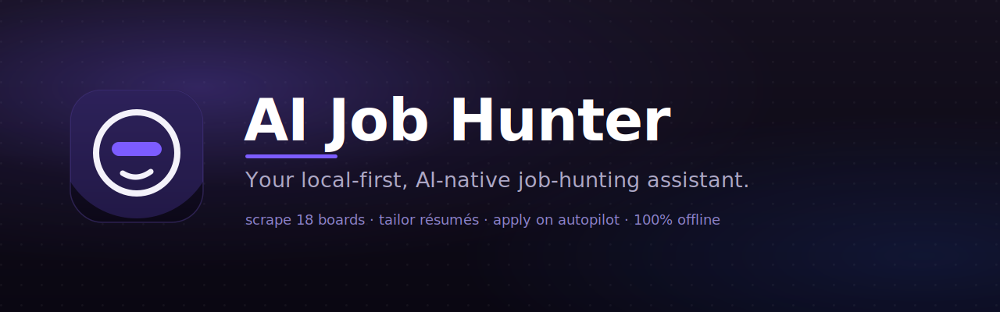
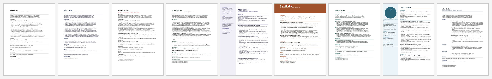

<p align="center">
  
</p>

<h1 align="center">AI Job Hunter</h1>

<p align="center">
  <em>Your local-first, AI-native desktop assistant for intelligent job searching, résumé &amp; cover-letter generation, and assisted applications — run it fully offline with Ollama, plug in your own OpenAI, Anthropic, or Gemini key, or route it through an AI CLI agent (Claude Code, Codex, Gemini CLI).</em>
</p>

<p align="center">
  <a href="https://github.com/saeedkolivand/ai-job-hunter-app/releases"><strong>⬇️ Download the latest release</strong></a>
  &nbsp;·&nbsp;
  <a href="https://aijobhunter.app">🌐 Live site</a>
  &nbsp;·&nbsp;
  <a href="https://aijobhunter.app/creature.html">🎬 Short film</a>
  &nbsp;·&nbsp;
  <a href="#-installation">📦 Install</a>
  &nbsp;·&nbsp;
  <a href="#-features">✨ Features</a>
  &nbsp;·&nbsp;
  <a href="docs/">📚 Docs</a>
</p>

<p align="center">
  <a href="https://github.com/saeedkolivand/ai-job-hunter-app/releases"></a>
  <a href="https://github.com/saeedkolivand/ai-job-hunter-app/releases"></a>
  <a href="https://github.com/saeedkolivand/ai-job-hunter-app/actions/workflows/ci-pipeline.yml"></a>
  <a href="https://github.com/saeedkolivand/ai-job-hunter-app/commits/main"></a>
  <a href="LICENSE"></a>
</p>

<p align="center">
  <a href="https://github.com/saeedkolivand/ai-job-hunter-app/releases"></a>
  <a href="https://aijobhunter.app"></a>
  <a href="https://chromewebstore.google.com/detail/ai-job-hunter-%E2%80%94-job-impor/oaoekkgkhmgdfnpmfkpphgiikliaicll"></a>
  <a href="https://addons.mozilla.org/en-US/firefox/addon/ai-job-hunter-job-importer/"></a>
  <a href="SECURITY.md"></a>
  <a href="https://github.com/saeedkolivand/ai-job-hunter-app/stargazers"></a>
  <a href="https://github.com/saeedkolivand/ai-job-hunter-app/pulls"></a>
</p>

<p align="center">
  <a href="https://tauri.app"></a>
  <a href="https://www.rust-lang.org/"></a>
  <a href="https://www.typescriptlang.org/"></a>
  <a href="https://react.dev/"></a>
  <a href="https://tailwindcss.com/"></a>
  <a href="https://ollama.com/"></a>
</p>

---

<details open>
<summary><strong>📑 Table of contents</strong></summary>

- <a href="#what-it-does" target="_blank" rel="noopener noreferrer">What It Does</a>
- <a href="#quick-start" target="_blank" rel="noopener noreferrer">Quick Start</a>
- <a href="#-features" target="_blank" rel="noopener noreferrer">Features</a>
- <a href="#ai-provider-flexibility" target="_blank" rel="noopener noreferrer">AI Provider Flexibility</a>
- <a href="#-installation" target="_blank" rel="noopener noreferrer">Installation</a>
- <a href="#usage" target="_blank" rel="noopener noreferrer">Usage</a>
- <a href="#configuration" target="_blank" rel="noopener noreferrer">Configuration</a>
- <a href="#tech-stack" target="_blank" rel="noopener noreferrer">Tech Stack</a>
- <a href="#for-developers" target="_blank" rel="noopener noreferrer">For Developers</a>
- <a href="#project-structure" target="_blank" rel="noopener noreferrer">Project Structure</a>
- <a href="#scripts" target="_blank" rel="noopener noreferrer">Scripts</a>
- <a href="#documentation" target="_blank" rel="noopener noreferrer">Documentation</a>
- <a href="#security" target="_blank" rel="noopener noreferrer">Security</a>
- <a href="#license" target="_blank" rel="noopener noreferrer">License</a>

</details>

## Quick Start

```bash
# 🚀 Try it           → download a build for your OS:
#                        https://github.com/saeedkolivand/ai-job-hunter-app/releases
#
# 🛠️  Develop it       → run the full desktop app from source:
git clone https://github.com/saeedkolivand/ai-job-hunter-app.git
cd ai-job-hunter-app && pnpm install
ollama pull mistral   # optional: a local model for the offline Ollama provider
pnpm dev              # launches the Tauri app with hot reload
```

No API key required to start — run fully offline with [Ollama][ollama], or add a cloud key later in **Settings → AI**. New here? See **<a href="#-installation" target="_blank" rel="noopener noreferrer">Installation</a>** for prerequisites and per-OS notes.

## What It Does

AI Job Hunter is a desktop application built with **[Tauri][tauri]** (a [Rust][rust] core with a [React][react] renderer) that brings AI-driven job hunting to your local machine. It scrapes 16 job boards (including an Adzuna/JSearch aggregator that covers walled boards like Indeed, Glassdoor, and Xing, plus company-scoped ATS boards like Greenhouse and Lever), semantically matches postings to your résumé, generates tailored cover letters and résumés with your AI provider of choice, drafts grounded answers to application questions, and tracks everything you apply to — all while keeping your data and credentials on your device.

The only outbound calls are to the AI provider **you** configure (and an optional web search you explicitly enable). Everything else — jobs, résumés, generations, applications — lives in a local database on your machine.

<p align="center">
  
</p>
<p align="center">
  <sub>Nine ATS-safe résumé templates — Classic · Modern · Swiss Minimal · Academic · Atelier · Meridian · Throughline · Portrait · Lebenslauf</sub>
</p>

---

## ✨ Features

<details open>
<summary><strong>📝 Résumé &amp; cover-letter generation</strong></summary>

- **Streaming generation** with 9 professional templates, DOCX / PDF / TXT export, ATS-safe formatting.
- **Universal "thinking" view** — see the model's reasoning stream live across **every** provider (Anthropic, OpenAI, Gemini, [Ollama][ollama], CLI agents), not just one.
- **Background generation** — switch tabs, close the modal, or navigate away; generation keeps running and the result is there when you come back.
- **Smaller PDFs** — fonts are glyph-subsetted per export (only the characters you actually use), shrinking a typical résumé PDF from ~3 MB to ~120 KB.
</details>

<details>
<summary><strong>🎯 Matching, ATS &amp; analysis</strong></summary>

- **Semantic job matching** — hybrid vector + keyword search; scores each posting against your résumé.
- **Résumé analysis** — ATS scoring, skill-gap detection, language-mismatch warnings, and improvement recommendations.
</details>

<details>
<summary><strong>🤖 Autopilot &amp; application tracking</strong></summary>

- **Autopilot workflows** — define a search (board, query, location, schedule, filters); it finds and scores matching jobs.
- **Dedup + New/Applied badges** — re-running a workflow merges results by URL: prior finds are kept, genuinely new ones are badged **New**, and jobs you've generated for are badged **Applied** (derived automatically from your saved generations).
- **One-click tailoring** — from any found job, click **Tailor** to seed the AI Generate workspace, open the posting, and mark it applied — on any board. Generate a tailored résumé + cover letter and **résumé-grounded answers** to common application questions, with optional company research.
- **Documents / Activity** — every generated application is stored as a single per-job record (résumé, cover, answers, brief, board, date) and browsable in the **Documents** page (Résumés / Cover Letters / Activity tabs).
</details>

<details>
<summary><strong>🌐 Browser extension (save jobs one-click)</strong></summary>

- **Now on the Chrome Web Store and Firefox Add-ons** — <a href="https://chromewebstore.google.com/detail/ai-job-hunter-%E2%80%94-job-impor/oaoekkgkhmgdfnpmfkpphgiikliaicll" target="_blank" rel="noopener noreferrer">Install for Chrome</a> · <a href="https://addons.mozilla.org/en-US/firefox/addon/ai-job-hunter-job-importer/" target="_blank" rel="noopener noreferrer">Install for Firefox</a>.
- MV3 extension for **Chrome & Firefox** — while browsing any job board, click the extension button to import the job into your saved applications.
- **Two import modes:** **Import via URL** (extension sends the URL, app fetches + parses), or **Scan page** (extension captures the authenticated DOM, useful for login-walled boards).
- Fully local — jobs are sent to the desktop app over a **loopback-only WebSocket**, paired with a secret token. Zero remote backend, zero analytics.
- See <a href="apps/extension/README.md" target="_blank" rel="noopener noreferrer">apps/extension/README.md</a> for setup, dev pairing, and architecture. Try it locally — see the extension's <a href="apps/extension/README.md#local-development--testing" target="_blank" rel="noopener noreferrer">Local development & testing</a> guide.
</details>

<details>
<summary><strong>🔎 Company research (opt-in)</strong></summary>

- Before writing a cover letter or answers, optionally research the company on the web — using your active AI provider's **own** web search (or the free Ollama Web Search API on Ollama) → a concise, factual brief: what they do, size/stage, products, mission, recent news.
- Default **off**, cached for a week, and treated as **untrusted** reference context — it never becomes a candidate fact, and the no-fabrication grounding rule still governs every claim.
</details>

<details>
<summary><strong>🧠 AI providers &amp; local tuning</strong></summary>

- **Multi-provider** — [Ollama][ollama] (local), OpenAI, Anthropic, Gemini, any OpenAI-compatible server (LM Studio, vLLM, remote [Ollama][ollama]), plus headless **CLI agents** (Claude Code, Codex, Gemini CLI).
- **Per-model local limits** — analyze a local model's real context window via [Ollama][ollama]'s `/api/show`, then set the context window + max output tokens per model, with a hardware-lag warning so large prompts aren't silently truncated.
</details>

<details>
<summary><strong>🔒 Privacy &amp; data</strong></summary>

- **Credentials in the OS keychain** — encrypted, never in plain text or config files.
- **All data local** — jobs, résumés, generations, applications in a local SQLite database; **zero telemetry**.
- **Full reset** — one action wipes every store (documents, generations, autopilots, contact/job preferences, caches, keychain entries) back to a clean install.
- **Multilingual** — UI in English & German; generation in 11 languages: en, de, fr, es, it, tr, pt, ru, zh, ja, ko.
</details>

---

## AI Provider Flexibility

Switch providers at any time in **Settings → AI**:

| Provider               | Models                                           | Notes                                                                      |
| ---------------------- | ------------------------------------------------ | -------------------------------------------------------------------------- |
| **Ollama** (local)     | mistral, llama3.2, deepseek-r1, any Ollama model | No API key needed; fully offline; per-model context/output limits          |
| **OpenAI**             | GPT-4o, o-series, GPT-4 Turbo                    | Requires API key                                                           |
| **Anthropic**          | Claude (Sonnet / Opus), extended thinking        | Requires API key; reasoning streamed to the thinking view                  |
| **Google Gemini**      | Gemini 2.5 / 1.5 (Pro, Flash)                    | Requires API key; thinking models supported                                |
| **OpenAI-compatible**  | Any (LM Studio, vLLM, remote Ollama, …)          | Custom base URL                                                            |
| **CLI agents** (local) | Claude Code, Codex, Gemini CLI                   | Run headless via the installed CLI — no API key (uses the CLI's own login) |

API keys are stored encrypted in the OS keychain. CLI agents run as a headless subprocess and reuse whatever login that CLI already has, so they need no key in the app.

---

## 📦 Installation

<details open>
<summary><strong>Download a released build</strong> (recommended)</summary>

Grab the latest installer for your OS from the **<a href="https://github.com/saeedkolivand/ai-job-hunter-app/releases" target="_blank" rel="noopener noreferrer">Releases</a>** page.

**macOS** — open the `.dmg` and drag the app into Applications. Because the app isn't notarized by Apple, Gatekeeper may refuse to open it the first time ("app is damaged and can't be opened"). Clear the quarantine attribute once:

```bash
xattr -cr "/Applications/AI Job Hunter.app"
```

**Windows / Linux** — run the installer / AppImage from the Releases page.

</details>

<details>
<summary><strong>Homebrew (macOS)</strong></summary>

Releases ship signed macOS `.dmg`s, and the repo doubles as its own Homebrew tap (the <a href="Casks/ai-job-hunter.rb" target="_blank" rel="noopener noreferrer">`Casks/ai-job-hunter.rb`</a> cask). Install with:

```bash
brew tap saeedkolivand/ai-job-hunter-app https://github.com/saeedkolivand/ai-job-hunter-app
brew install --cask ai-job-hunter
```

The cask clears the Gatekeeper quarantine flag for you (the app isn't notarized). Prefer a one-off download? Grab the `.dmg` straight from the <a href="https://github.com/saeedkolivand/ai-job-hunter-app/releases" target="_blank" rel="noopener noreferrer">Releases</a> page.

> The cask pins per-arch `sha256` checksums for a verified install, tracking the latest release that ships macOS `.dmg`s. Since the installer build is manual, bump the cask `version` + both checksums when a newer build publishes dmgs (`brew bump-cask-pr`).

</details>

<details>
<summary><strong>Build from source</strong></summary>

**Prerequisites**

| Requirement    | Version | Notes                                                                                                |
| -------------- | ------- | ---------------------------------------------------------------------------------------------------- |
| Node.js        | 20+     | LTS recommended                                                                                      |
| pnpm           | 11+     | `npm install -g pnpm`                                                                                |
| Rust toolchain | stable  | `rustup install stable`                                                                              |
| Ollama         | latest  | <a href="https://ollama.com" target="_blank" rel="noopener noreferrer">ollama.com</a> — for local AI |

```bash
git clone https://github.com/saeedkolivand/ai-job-hunter-app.git
cd ai-job-hunter-app
pnpm install

# Pull a local model (optional — only for the Ollama provider)
ollama pull mistral        # or: ollama pull llama3.2

# Start the full Tauri desktop app with hot reload
pnpm dev
```

</details>

<details>
<summary><strong>Troubleshooting</strong></summary>

| Symptom                                       | Fix                                                                                                                                                                                |
| --------------------------------------------- | ---------------------------------------------------------------------------------------------------------------------------------------------------------------------------------- |
| macOS: _"app is damaged and can't be opened"_ | Not notarized — clear quarantine once: `xattr -cr "/Applications/AI Job Hunter.app"`                                                                                               |
| No models in the picker / "select a model"    | Start Ollama and `ollama pull <model>`, or add a cloud key in **Settings → AI**                                                                                                    |
| Company research does nothing                 | It's opt-in and uses your AI provider's own web search; on **Ollama** add the free Ollama key (Settings → AI). Without a usable search, generation proceeds without a brief        |
| Scraping can't find a browser                 | The app auto-detects an installed Chromium browser (`detect_system_chrome`). If none is found, install Chrome or Edge, or set the `CHROME` env var to the browser executable path. |
| `pnpm dev` fails to build the Rust core       | Ensure the stable Rust toolchain is installed (`rustup install stable`) and re-run                                                                                                 |

</details>

---

## Usage

<details open>
<summary><strong>Generate a tailored résumé / cover letter</strong></summary>

```
1. Open the app → AI Generate
2. Paste your résumé text, or upload a PDF/DOCX/TXT file
3. Paste the job ad text, or upload a job description file
4. Click Continue → the app detects languages, role, company, top requirements
5. Choose a template + style; optionally enable "Research the company"
6. Generate → watch streaming output (with live reasoning) → export as DOCX / PDF / TXT
```

</details>

<details>
<summary><strong>Run Autopilot &amp; answer application questions</strong></summary>

```
1. Autopilot → New → set board, query, location, schedule, filters
2. Run it → found jobs appear, scored and deduped (New badges on fresh results)
3. Open a found job → Tailor:
   • generate a tailored résumé + cover letter (target: Both)
   • pick application questions → get résumé-grounded answers
   • the job flips to "Applied" and is saved in Documents → Activity
```

</details>

<details>
<summary><strong>Scrape boards &amp; search semantically</strong></summary>

```
1. Jobs → Scrape → select boards (e.g. LinkedIn + Greenhouse + Aggregator)
2. Query + location; for company-scoped ATS boards (Greenhouse, Lever, etc.), enter company slugs
3. Click Start → results stream into the jobs table
4. Semantic search ranks postings against your résumé (hybrid vector + keyword)
```

**Note:** Company-scoped ATS boards require company slugs instead of free-text keywords. The **Aggregator** (Adzuna + JSearch) replaces direct scraping of anti-bot boards (Indeed, Glassdoor, Xing); free Adzuna keys available at https://developer.adzuna.com. See `docs/knowledge/scraping-domain.md` for the full board list and configuration details.

</details>

---

## Configuration

The app uses the OS keychain for secrets — no `.env` files. Keys and credentials are set in the UI and encrypted via Tauri's keychain plugin.

| Setting                 | Location               | Description                                                                                                                                                                                                   |
| ----------------------- | ---------------------- | ------------------------------------------------------------------------------------------------------------------------------------------------------------------------------------------------------------- |
| AI provider + key       | Settings → AI          | Ollama / OpenAI / Anthropic / Gemini / compatible                                                                                                                                                             |
| Local model limits      | Settings → AI          | Context window + max output, per Ollama model                                                                                                                                                                 |
| Ollama account key      | Settings → AI          | Optional — Ollama Cloud models + company research                                                                                                                                                             |
| **Adzuna/JSearch keys** | **Settings → Jobs**    | **Optional — provider registry with Adzuna (primary, free) and JSearch (paid fallback). Covers anti-bot boards like Indeed, Glassdoor, Xing, and more. See `docs/knowledge/scraping-domain.md` for details.** |
| Performance mode        | Settings → Performance | Low / Balanced / Performance                                                                                                                                                                                  |
| Language                | Settings → General     | UI and generation locale                                                                                                                                                                                      |

---

## Tech Stack

| Layer               | Technology                                                                |
| ------------------- | ------------------------------------------------------------------------- |
| Desktop shell       | [Tauri][tauri] 2.x — [Rust][rust] core + [React][react] renderer          |
| UI framework        | [React][react] 19, [TypeScript][typescript] 6                             |
| Routing             | [TanStack Router][tanstack-router] 1.x (file-based)                       |
| Server state        | [TanStack Query][tanstack-query] 5.x                                      |
| Client state        | [Zustand][zustand] 5                                                      |
| Styling             | [Tailwind CSS][tailwindcss] v4 + CSS custom properties                    |
| Animations          | [motion/react][motion-react]                                              |
| Build system        | [Vite][vite] 8 + [Turborepo][turborepo] (monorepo)                        |
| Package manager     | [pnpm][pnpm] 11 (workspaces)                                              |
| Local AI            | [Ollama][ollama]                                                          |
| Relational DB       | [SQLite][sqlite] via [rusqlite][rusqlite] ([Rust][rust] core)             |
| Vector search       | Hybrid vector + keyword matching                                          |
| Browser automation  | [chromiumoxide][chromiumoxide] ([Rust][rust]) — Playwright for e2e only   |
| Document generation | Typst engine (`export/typst_engine/`) + [docx-rs][docx-rs] ([Rust][rust]) |
| Validation          | [Zod][zod] (shared schemas → generated [Rust][rust] structs)              |

---

## For Developers

**Architecture in one line:** the React renderer never calls the OS directly — it talks to the Rust core over a typed IPC contract.

```
React renderer  →  service hook (React Query)  →  tauri-client  →  Rust #[tauri::command]  →  core (scrape · AI · export · DB)
                         apps/tauri/src/renderer/services            apps/tauri/src-tauri/src
```

IPC request shapes have a single source of truth: **[Zod][zod] schemas in `packages/shared`**, from which `pnpm gen:ipc` generates the matching [Rust][rust] structs — so the [TypeScript][typescript] and [Rust][rust] sides can't drift.

<details>
<summary><strong>Add a new IPC capability (5 hand-synced touchpoints)</strong></summary>

1. `packages/shared/src/ipc/contracts/*.ts` — add the method signature.
2. `apps/tauri/src-tauri/src/commands/*.rs` — implement the `#[tauri::command]` and register it in `main.rs`.
3. `apps/tauri/src/tauri-client/namespaces/*` — wire the `invoke(...)` call.
4. `apps/tauri/src/renderer/services/*` — add the React Query service hook.
5. If the request has a new shape: add a Zod schema and run `pnpm gen:ipc`.

</details>

<details>
<summary><strong>Add an AI provider / a job board (config + adapter, no business-logic changes)</strong></summary>

- **AI provider** — implement the provider adapter and register it; the rest of the app routes through the centralized provider abstraction (`Completer` / streaming contract). Reasoning, limits, and job state are normalized at the adapter boundary, so the renderer holds one contract and zero per-provider branching.
- **Job board** — add an entry to the scraper registry (`scraping/boards/mod.rs` `SCRAPERS`); discovery is registry-driven, so no caller changes.

</details>

<details>
<summary><strong>Conventions &amp; guardrails</strong></summary>

- **PRs only** — never push to `main`; [Conventional Commits][conventional-commits]; [ESLint][eslint] + [commitlint][commitlint] + architecture tests gate every change.
- **Ports &amp; adapters** — UI imports `@ajh/ui` primitives and service hooks, never `window.api` directly; design-system tokens (`text-brand`, motion tokens) over hardcoded values.
- **Backend owns business logic** — Rust-first; the renderer is a thin client.
- See **<a href="CLAUDE.md" target="_blank" rel="noopener noreferrer">CLAUDE.md</a>** for the enforced rules and **<a href="docs/PATTERNS.md" target="_blank" rel="noopener noreferrer">docs/PATTERNS.md</a>** for the patterns.

</details>

<details>
<summary><strong>Knowledge base &amp; AI agent system</strong></summary>

This repo ships a knowledge base under <a href="docs/knowledge/" target="_blank" rel="noopener noreferrer">docs/knowledge/</a> — domain notes plus **architecture decision records** (<a href="docs/knowledge/decision-records/" target="_blank" rel="noopener noreferrer">ADRs</a>) — and a Claude Code agent system under `.claude/` (23 agents, a write-capable **author** + an independent **critic** per domain, plus commands). When in doubt about _why_ something is built a certain way, the ADRs are the fastest answer.

For a **visual walkthrough** of the agent system — the fleet map, how a prompt is routed to an agent, the author→critic pipeline, and a with/without-agents comparison — open the interactive <a href="landing/agent-system.html" target="_blank" rel="noopener noreferrer">landing/agent-system.html</a>.

A <a href="https://pypi.org/project/graphifyy/" target="_blank" rel="noopener noreferrer">graphify</a> knowledge graph (`graphify-out/`) can also be queried directly or wired as an **optional, opt-in** local MCP server — see <a href="docs/DEVELOPMENT.md#optional-knowledge-graph-mcp-graphify" target="_blank" rel="noopener noreferrer">docs/DEVELOPMENT.md</a>.

</details>

---

## Project Structure

```
ai-job-hunter-app/
├── apps/
│   ├── tauri/                    # Main desktop app (Tauri shell: Rust core + React renderer)
│   │   ├── src-tauri/            # Rust core (commands, scraping, AI, export, DB, extension bridge)
│   │   └── src/renderer/         # React frontend
│   │       ├── features/         # Feature-scoped components
│   │       ├── routes/           # TanStack Router pages
│   │       ├── services/         # React Query IPC hooks
│   │       ├── lib/              # Utilities (generate, motion, i18n, machines)
│   │       ├── store/            # Zustand stores
│   │       └── providers/        # React context providers
│   └── extension/                # Browser extension (MV3, Chrome + Firefox) — job import via loopback WS
├── packages/
│   ├── shared/                   # IPC contracts, Zod schemas, shared types, extension protocol
│   ├── ui/                       # @ajh/ui — React component library
│   ├── prompts/                  # Provider-aware, locale-driven AI prompt templates
│   └── translations/             # i18n config + locale strings (en, de, …)
├── docs/                         # Documentation + knowledge base (ADRs)
├── turbo.json                    # Turbo build configuration
├── pnpm-workspace.yaml           # pnpm workspaces
└── package.json                  # Root scripts
```

---

## Scripts

```bash
pnpm dev              # Start the Tauri dev app (full stack)
pnpm build            # Build everything (Turbo)
pnpm build:packages   # Build shared packages only (excludes Tauri)
pnpm build:chrome     # Build the browser extension (Chrome / MV3)
pnpm build:firefox    # Build the browser extension (Firefox / MV3)
pnpm package          # Package the desktop installers
pnpm typecheck        # TypeScript check across the monorepo
pnpm test             # Run the Vitest suite (test:watch / test:coverage variants)
pnpm lint:strict      # Lint with --max-warnings 0 (CI mode); lint:fix to autofix
pnpm format           # Prettier format (format:check to verify)
pnpm gen:ipc          # Regenerate Rust IPC structs from the shared Zod schemas
pnpm gen:workflows    # Regenerate the CI workflow catalog + status badges
pnpm clean            # Remove dist / out / .turbo + caches
pnpm storybook        # Run the @ajh/ui Storybook
```

---

## 🔧 CI & Workflows

Live status of every GitHub Actions workflow. See
<a href=".github/workflows/README.md" target="_blank" rel="noopener noreferrer">`.github/workflows/README.md`</a> for the full catalog —
what each one does, its triggers, and whether it gates merges (only **✅ CI OK** does).
Both are generated from the workflow files by `pnpm gen:workflows`.

**[📊 Live CI dashboard](https://aijobhunter.app/ci-dashboard.html)** —
at-a-glance status of every workflow, grouped by role, fetched live from the Actions API
(selectable auto-refresh — off/1/5/15 min — plus a **Refresh now** button).

<!-- workflows:badges:start -->

### ✅ Required — gates merge

[](https://github.com/saeedkolivand/ai-job-hunter-app/actions/workflows/ci-pipeline.yml)

### 🔒 Security — reports to the Security tab

[](https://github.com/saeedkolivand/ai-job-hunter-app/actions/workflows/security.yml)

### 🔎 Advisory — never blocks

[](https://github.com/saeedkolivand/ai-job-hunter-app/actions/workflows/claude-review.yml)
[](https://github.com/saeedkolivand/ai-job-hunter-app/actions/workflows/format-guard.yml)
[](https://github.com/saeedkolivand/ai-job-hunter-app/actions/workflows/labeler.yml)
[](https://github.com/saeedkolivand/ai-job-hunter-app/actions/workflows/quality.yml)
[](https://github.com/saeedkolivand/ai-job-hunter-app/actions/workflows/ui-checks.yml)
[](https://github.com/saeedkolivand/ai-job-hunter-app/actions/workflows/workflow-lint.yml)

### 🚀 Deploy — publishes on push to main

[](https://github.com/saeedkolivand/ai-job-hunter-app/actions/workflows/pages.yml)
[](https://github.com/saeedkolivand/ai-job-hunter-app/actions/workflows/release.yml)

<!-- workflows:badges:end -->

---

## Contributing

See <a href="CONTRIBUTING.md" target="_blank" rel="noopener noreferrer">CONTRIBUTING.md</a> for branching, commit conventions, code style, and PR guidelines. Quick rules:

- All changes go through PRs — never push directly to `main`.
- Use [Conventional Commits][conventional-commits] (`feat:`, `fix:`, `chore:`, …).
- Run `pnpm lint:fix && pnpm typecheck` before pushing; [ESLint][eslint] errors block commits.

---

## Documentation

| Document                                                                                                                            | Description                                                                                                        |
| ----------------------------------------------------------------------------------------------------------------------------------- | ------------------------------------------------------------------------------------------------------------------ |
| <a href="apps/tauri/README.md" target="_blank" rel="noopener noreferrer">apps/tauri/README.md</a>                                   | Desktop app architecture, directory map, Rust/React setup                                                          |
| <a href="apps/extension/README.md" target="_blank" rel="noopener noreferrer">apps/extension/README.md</a>                           | Browser extension (MV3) — job import, local dev pairing, permissions                                               |
| <a href="docs/ARCHITECTURE.md" target="_blank" rel="noopener noreferrer">docs/ARCHITECTURE.md</a>                                   | System design, data flow, diagrams                                                                                 |
| <a href="docs/PATTERNS.md" target="_blank" rel="noopener noreferrer">docs/PATTERNS.md</a>                                           | IPC, state machines, AI streaming, search patterns                                                                 |
| <a href="docs/API.md" target="_blank" rel="noopener noreferrer">docs/API.md</a>                                                     | IPC namespaces + commands                                                                                          |
| <a href="docs/EXPORT_TEMPLATES.md" target="_blank" rel="noopener noreferrer">docs/EXPORT_TEMPLATES.md</a>                           | Templates, theming, PDF/DOCX export                                                                                |
| <a href="docs/DESIGN_SYSTEM.md" target="_blank" rel="noopener noreferrer">docs/DESIGN_SYSTEM.md</a>                                 | Tokens, components, motion, theming                                                                                |
| <a href="docs/DEVELOPMENT.md" target="_blank" rel="noopener noreferrer">docs/DEVELOPMENT.md</a>                                     | Local dev environment setup                                                                                        |
| <a href="docs/DEPLOYMENT.md" target="_blank" rel="noopener noreferrer">docs/DEPLOYMENT.md</a>                                       | Building and releasing installers                                                                                  |
| <a href="docs/ARCHITECTURE_STATUS.md" target="_blank" rel="noopener noreferrer">docs/ARCHITECTURE_STATUS.md</a>                     | Implementation status tracker                                                                                      |
| <a href="docs/SCRAPING_ENDPOINTS.md" target="_blank" rel="noopener noreferrer">docs/SCRAPING_ENDPOINTS.md</a>                       | Job-board scraping endpoint reconnaissance snapshot (20 boards, 2026-06-20)                                        |
| <a href="docs/knowledge/" target="_blank" rel="noopener noreferrer">docs/knowledge/</a>                                             | Knowledge base + architecture decision records (ADRs)                                                              |
| <a href="SECURITY.md" target="_blank" rel="noopener noreferrer">SECURITY.md</a>                                                     | Security policy &amp; vulnerability reporting                                                                      |
| <a href="CONTRIBUTING.md" target="_blank" rel="noopener noreferrer">CONTRIBUTING.md</a>                                             | Code style, branching, PR process                                                                                  |
| <a target="_blank" rel="noopener noreferrer" href="https://aijobhunter.app/how-it-works.html">landing/how-it-works.html</a>         | How the AI Job Hunter works end-to-end (interactive walkthrough)                                                   |
| <a target="_blank" rel="noopener noreferrer" href="https://aijobhunter.app/architecture-map.html">landing/architecture-map.html</a> | Interactive architecture map of the AI Job Hunter                                                                  |
| <a target="_blank" rel="noopener noreferrer" href="https://aijobhunter.app/agent-system.html">landing/agent-system.html</a>         | Interactive agent-fleet walkthrough — 23 paired author+critic agents, intake→delegation routing, per-task pipeline |
| <a target="_blank" rel="noopener noreferrer" href="https://aijobhunter.app/creature.html">landing/creature.html</a>                 | THE CREATURE — a hand-drawn doodle about the recruiter you summon                                                  |

---

## 💛 Fund the job hunt

This project is built by a guy who is, himself, still unemployed — a cry for help, made between rejections. If it's saving you time or sanity, consider a voluntary gift:

<a href="https://github.com/sponsors/saeedkolivand" target="_blank" rel="noopener noreferrer">GitHub Sponsors</a> · <a href="https://ko-fi.com/saeedkolivand" target="_blank" rel="noopener noreferrer">Ko-fi</a> · <a href="https://paypal.me/saeedkolivand" target="_blank" rel="noopener noreferrer">PayPal</a>

Donations don't conflict with the PolyForm Noncommercial license — the license restricts commercial repackaging and resale by others; voluntary gifts to the maintainer are not commercial use.

---

## ⚖️ Responsible Use

- **Respect each site's Terms of Service.** Some job boards allow only manual access or their official APIs; automated collection — or signing in with your own account to scrape — may breach their terms and can get your account suspended. You choose which boards to enable and accept that responsibility.
- **Not affiliated.** AI Job Hunter is an independent project, not affiliated with, endorsed by, or sponsored by LinkedIn, Indeed, Glassdoor, Xing, StepStone, or any other job board or company named in this repository. Product names and trademarks belong to their respective owners.
- **Your data stays yours.** Processing is local-first and single-user; the project maintainers do not receive, store, or process your data. Bring-your-own-key means AI prompts go only to the provider you configure.
- **No warranty.** Provided "as is" under the PolyForm Noncommercial License 1.0.0, without warranty of any kind and without liability for how it is used. This is not legal advice.

---

## Security

Found a vulnerability? Please report it privately — see **<a href="SECURITY.md" target="_blank" rel="noopener noreferrer">SECURITY.md</a>**. Don't open a public issue for security reports.

---

## License

**PolyForm Noncommercial License 1.0.0** ([SPDX: `PolyForm-Noncommercial-1.0.0`](LICENSE)) — **source-available, not open source**. Free for noncommercial use; commercial repackaging and resale prohibited. Effective **2026-06-14**; reason: protect the codebase and author from commercial repackaging without consent. For a commercial license, contact [contact@aijobhunter.app](mailto:contact@aijobhunter.app).

---

[tauri]: https://tauri.app
[react]: https://react.dev
[rust]: https://www.rust-lang.org
[typescript]: https://www.typescriptlang.org
[tanstack-router]: https://tanstack.com/router
[tanstack-query]: https://tanstack.com/query
[zustand]: https://github.com/pmndrs/zustand
[tailwindcss]: https://tailwindcss.com
[motion-react]: https://motion.dev
[vite]: https://vite.dev
[turborepo]: https://turborepo.com
[pnpm]: https://pnpm.io
[ollama]: https://ollama.com
[sqlite]: https://www.sqlite.org
[rusqlite]: https://github.com/rusqlite/rusqlite
[chromiumoxide]: https://github.com/mattsse/chromiumoxide
[docx-rs]: https://github.com/bokuweb/docx-rs
[zod]: https://zod.dev
[conventional-commits]: https://www.conventionalcommits.org
[eslint]: https://eslint.org
[commitlint]: https://commitlint.js.org

<h2 align="center">Contributors</h2>

<p align="center">
  <a href="https://github.com/saeedkolivand/ai-job-hunter-app/graphs/contributors">
    
  </a>
</p>

<p align="center"><em>Contributions welcome — see <a href="CONTRIBUTING.md">CONTRIBUTING.md</a>.</em></p>

---

<h2 align="center">Star History</h2>

<p align="center">
  <a href="https://star-history.com/#saeedkolivand/ai-job-hunter-app&Date">
    
  </a>
</p>
