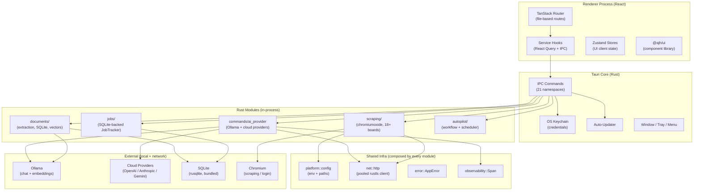
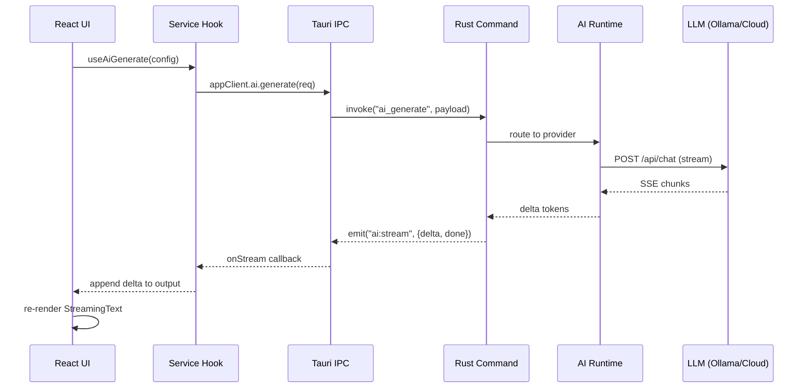
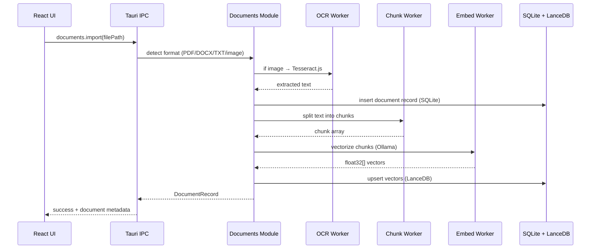
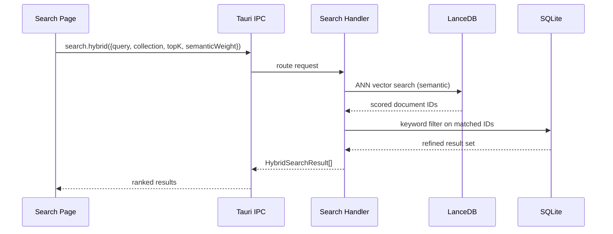
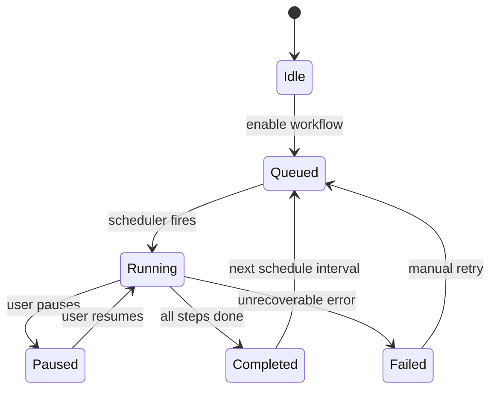
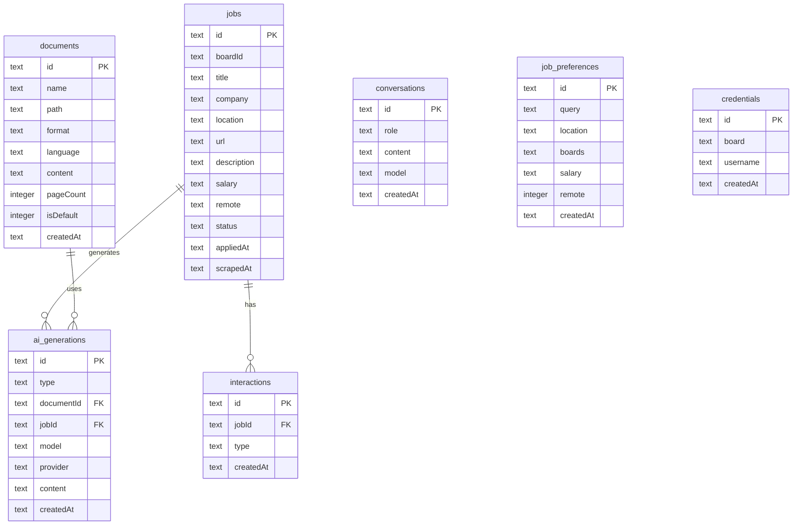
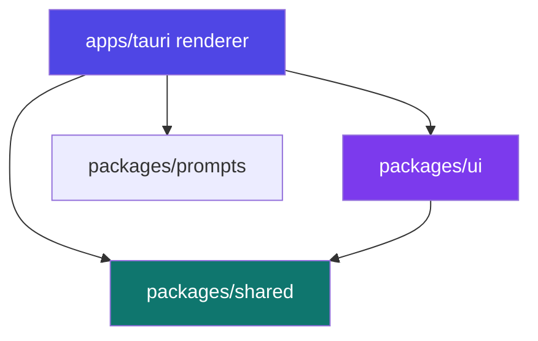

# Architecture — AI Job Hunter

## High-Level Overview

AI Job Hunter is a **local-first desktop application** built on Tauri 2. There is no cloud backend, no telemetry endpoint, and no remote database. Every computation — AI inference, web scraping, vector search, document parsing — runs on the user's machine.

The architecture follows a **ports-and-adapters** model: the React renderer communicates exclusively through typed IPC contracts, and the Rust core handles everything else — command routing plus the heavy work (scraping, document processing, embeddings) natively, without a separate process.

---

## System Architecture



---

## Component Breakdown

### `apps/tauri` — Desktop Shell

The Tauri app is split into two processes:

**Rust core (`src-tauri/`)** — thin orchestration layer:

| Module               | Responsibility                                                                                                            |
| -------------------- | ------------------------------------------------------------------------------------------------------------------------- |
| `commands/`          | IPC endpoint handlers; routes invocations to the appropriate runtime                                                      |
| `platform::config`   | **Sole owner** of env vars + data-dir / filesystem path resolution                                                        |
| `net::http`          | **Sole owner** of `reqwest::Client` construction — one pooled rustls client; per-request timeouts                         |
| `error` (`AppError`) | Unified typed error hierarchy (`AppResult`); serializes to its message string                                             |
| `observability`      | Shared timed trace `Span`s (`→`/`←` + duration) for AI, scraping, apply, autopilot                                        |
| `scraping/`          | Board scrapers (chromiumoxide for browser boards, HTTP for API boards) via a single `SCRAPERS` registry + `Scraper` trait |
| `documents/`         | Document import, OCR dispatch, SQLite storage                                                                             |
| `jobs/`              | Job tracker state machine (queued → running → done/failed)                                                                |
| `credentials/`       | OS keychain CRUD via Tauri keychain plugin                                                                                |
| `conversations/`     | Chat history persistence                                                                                                  |
| `autopilot/`         | Workflow engine + step scheduler                                                                                          |
| `apply_helpers/`     | Form-filling logic for auto-apply                                                                                         |
| `ai_generations/`    | Metadata tracking for generated documents                                                                                 |
| `export/`            | DOCX/PDF rendering using docx + jsPDF                                                                                     |
| `updater/`           | Auto-update state (check, download, install)                                                                              |
| `browser/`           | System browser detection and launch                                                                                       |
| `data_store.rs`      | `DataStore` trait (export/import) implemented by every persistent store                                                   |
| `commands/data.rs`   | Full backup/restore — one versioned bundle across all stores                                                              |

**React renderer (`src/renderer/`)** — feature-scoped UI:

| Directory            | Responsibility                                                   |
| -------------------- | ---------------------------------------------------------------- |
| `routes/`            | TanStack Router file-based pages (9 routes)                      |
| `features/`          | Feature-scoped component trees (never cross-import)              |
| `services/`          | React Query hooks wrapping every IPC namespace                   |
| `lib/`               | Pure utilities: motion tokens, i18n, state machine, `cn()`       |
| `store/`             | Zustand stores for persistent UI state                           |
| `providers/`         | React context providers (AppClient, Capability, PerformanceMode) |
| `hooks/`             | Shared React hooks (`useMachine`, `useMouseParallax`)            |
| `components/layout/` | Sidebar, Titlebar, StatusBar, PageShell                          |

---

### `packages/shared` — Contract Layer

The single source of truth for renderer ↔ Rust communication:

```
packages/shared/src/
├── ipc/
│   ├── contracts/          # 21 typed namespace definitions
│   │   ├── ai.ts
│   │   ├── aiGenerations.ts
│   │   ├── apply.ts
│   │   ├── autopilot.ts
│   │   ├── boards.ts
│   │   ├── conversations.ts
│   │   ├── credentials.ts
│   │   ├── dialog.ts
│   │   ├── documents.ts
│   │   ├── geocode.ts
│   │   ├── jobPreferences.ts
│   │   ├── jobs.ts
│   │   ├── linkedin.ts
│   │   ├── match.ts
│   │   ├── privacy.ts
│   │   ├── resume.ts
│   │   ├── scrape.ts
│   │   ├── search.ts
│   │   ├── shortcuts.ts
│   │   ├── support.ts
│   │   ├── system.ts
│   │   └── updater.ts
│   └── contracts.ts        # Re-exports all namespaces
├── schemas/                # Zod validation schemas
├── types/                  # JobRecord, DocumentRecord, MatchScore, etc.
├── language-detection.ts   # franc.js language detection
├── ai-models.ts            # Model registry per provider
└── utils.ts
```

---

### `packages/ui` — Component Library (`@ajh/ui`)

A standalone React component library with no routing, IPC, or state management dependencies. Consumed only from the renderer.

### `packages/prompts` — Prompt Templates

Pure-TypeScript AI prompt templates (zero dependencies). Builds prompt strings and repairs model output; it never calls an LLM or the network. Imported by the renderer's generation helpers.

It is **provider-aware** and **locale-driven**:

- **`provider.ts`** — `ProviderProfile` (`{ kind: 'ollama' | 'cloud' | 'cli', model?, contextWindow?, supportsStructuredOutput?, sizeHint? }`) and `resolveProfile()`. Every builder accepts this **additively** (a legacy `'large' | 'medium' | 'small'` tier string still works). It picks prompt **depth** (`brief` / `full` / `task` brief), schema variant, truncation budget, and structured-output metadata per provider class: ollama → shortest imperative prompts + compact schema + aggressive truncation; cloud → full multi-perspective prompt + rich schema + native JSON-schema metadata (`structuredOutputFor`) + minimal truncation; cli agents → a self-verifying **task brief** with explicit acceptance checks.
- **`locale.ts`** — section-header lexicons, resume conventions (headers + date format), and per-locale token factors. All market behaviour follows the **job-ad's detected locale**, not a fixed US/German style.
- **Modular folders** — every concern (`analyze/`, `generate/`, `context-manager/`, `provider/`, `locale/`, `workspace/`) is a folder with an `index.ts` barrel (the `@ajh/prompts/<name>` subpath entry) plus focused submodules and a colocated test. `context-manager/model-size.ts` parses a model's parameter size generically from its tag and defaults unknown local models to the smaller/safer prompt; CLI-agent / hosted model names (sonnet/opus/haiku/codex/gpt/claude/gemini) are treated as capable.
- **Validators** (`validateAndRepair`, `validateMetadata`) remain the universal fallback for every provider.

> The heavy work (scraping, document extraction, AI generation, embeddings) runs natively in the Rust core under `apps/tauri/src-tauri/` — see the Component Breakdown above. Earlier Node packages (`@ajh/core`, `@ajh/ai`, `@ajh/data`, `@ajh/workers`) implemented this for a now-removed sidecar and have been deleted.

---

## Data Flow

### AI Generation Request



### Document Import Pipeline



### Hybrid Search



### Autopilot Execution



---

## IPC Contract Model

Every renderer ↔ Rust interaction is defined in `packages/shared/src/ipc/contracts/`. The pattern:

```typescript
// packages/shared/src/ipc/contracts/ai.ts
export interface AiContract {
  generate(req: GenerateRequest): Promise<GenerateResponse>;
  listModels(): Promise<ModelInfo[]>;
  pullModel(name: string): Promise<void>;
  embed(text: string): Promise<number[]>;
  setProviderKey(provider: string, key: string): Promise<void>;
  onStream(handler: (chunk: StreamChunk) => void): Unsubscribe;
}
```

The renderer accesses contracts exclusively through `AppClient`:

```typescript
// apps/tauri/src/renderer/lib/app-client.ts
const client = useAppClient();
const result = await client.ai.generate(req);
```

`AppClient` is backed by `createTauriInvokeClient()` in production, and `createMockClient()` in tests — making the UI completely portable.

---

## Database Schema

### SQLite (Drizzle ORM)



### LanceDB Collections

| Collection      | Schema                                              | Purpose                |
| --------------- | --------------------------------------------------- | ---------------------- |
| `jobs`          | `{id, vector[1024], text, boardId, title, company}` | Semantic job search    |
| `resumes`       | `{id, vector[1024], text, documentId, chunkIndex}`  | Resume similarity      |
| `skills`        | `{id, vector[1024], text, category}`                | Skill taxonomy lookup  |
| `conversations` | `{id, vector[1024], text, role, timestamp}`         | Conversation retrieval |

---

## Key Design Decisions

### 1. Local-First Architecture

All data lives on the user's machine — SQLite, LanceDB, credential keychain. No account signup, no cloud sync. This is a deliberate product decision: the target user is privacy-conscious and may be searching confidentially.

### 2. IPC Contract as Single Source of Truth

`packages/shared` is the only place where renderer ↔ Rust interaction is defined. This prevents drift between frontend expectations and backend implementation, and enables mock-based testing without Tauri.

### 3. Ports & Adapters for AppClient

The renderer never calls `window.__TAURI_INVOKE__` directly. It uses `AppClient` which can be swapped to a mock, enabling UI-only development (`pnpm dev:frontend`) and Vitest tests without the full Tauri runtime.

### 4. Native Rust Runtimes

Heavy work (scraping, OCR, embeddings) runs natively in the Rust core on Tauri's async runtime and `tokio` tasks — there is no separate Node.js process. Long operations are spawned as background tasks so they don't block command handling, and OCR runs in the renderer via Tesseract.js (its own Web Worker).

### 5. Streaming as First-Class Concern

AI generation, scraping progress, and autopilot step events all use Tauri's `emit` mechanism to push server-sent events to the renderer. This drives a reactive UI without polling.

### 6. Feature-Scoped Components

The renderer uses a `features/` directory where each feature owns its components and can only import from `packages/ui`, `services/`, and `lib/`. Cross-feature imports are ESLint-forbidden, keeping boundaries explicit.

### 7. Minimal State Machine Library

Rather than XState, the app uses a micro state machine implementation (`lib/machine.ts`, ~80 lines) with a `useMachine` hook. This keeps bundle size minimal and the mental model simple for flows with ≤ 10 states.

### 8. Uniform Data Layer + Backup/Restore

Every persistent store (documents, AI generations, job preferences, autopilots, conversations, interactions) is store-per-domain and implements a single `DataStore` trait (`data_store.rs`): `export() -> Value` and `import(&Value)` with REPLACE semantics. `commands/data.rs` assembles one versioned bundle (`{ version, exportedAt, stores }`) for backup and restores it on import. Secrets (OS-keychain credentials), ephemeral caches, and the transient job log are intentionally excluded. **Cloud sync is deferred** — there is no remote backend; this bundle and trait are the substrate a future sync feature would build on.

### 9. Shared Platform Infrastructure

The Rust core composes a small set of **single-owner** infrastructure modules instead of re-rolling cross-cutting logic per feature: `platform::config` (env + paths), `net::http` (one pooled rustls client; per-request timeouts), `error::AppError` / `AppResult` (typed errors that serialize to their message string), and `observability::Span` (timed `→`/`←` trace logging). Expandable subsystems use registries that derive dispatch + catalogs from one list via traits — `commands::ai_provider` (`ProviderId` → `resolve`), `scraping::boards` (`SCRAPERS`), `applying::registry` (`APPLIERS`). A versioned architecture test (`apps/tauri/src-tauri/tests/architecture.rs`, run by CI) keeps ownership intact — e.g. `#[tauri::command]` only in the shell layer, `std::env::var` only in `platform/**`, `reqwest::Client::new/builder` only in `net/http.rs`, no `Result<_, String>` outside `error.rs`, and no upward cross-layer imports. Paginated scrapers isolate per-page failures (partial results instead of aborting the board). See [PATTERNS.md](PATTERNS.md) §13 for the principles and module-ownership table, [architecture-analysis.md](architecture-analysis.md) for the layered structure (L0–L3) + discovered weaknesses, and [architecture-rules.md](architecture-rules.md) for the enforced rules.

---

## External Integrations

All HTTP goes through the shared `net::http` client (rustls).

| Integration     | Protocol                                           | Auth                         | Purpose                      |
| --------------- | -------------------------------------------------- | ---------------------------- | ---------------------------- |
| Ollama          | HTTP (`net::http`, local)                          | None (local)                 | Chat generation + embeddings |
| OpenAI          | HTTPS (REST)                                       | API key (keychain)           | Cloud generation fallback    |
| Anthropic       | HTTPS (REST)                                       | API key (keychain)           | Extended thinking generation |
| Google Gemini   | HTTPS (REST)                                       | API key (keychain)           | Multilingual generation      |
| LM Studio       | HTTP (OpenAI-compatible)                           | Optional                     | Local cloud-replacement      |
| Job boards (20) | chromiumoxide (browser) / `net::http` (API boards) | Board credentials (keychain) | Scraping                     |
| OS Keychain     | Tauri plugin                                       | OS auth                      | Credential encryption        |

---

## Package Dependency Rules



**Hard rules:**

- `packages/shared` — no React, no Node APIs, no UI
- `packages/ui` — no Zustand, no IPC, no routing
- `packages/prompts` — no UI, no `window`
- The renderer imports only `@ajh/shared`, `@ajh/ui`, `@ajh/prompts`
