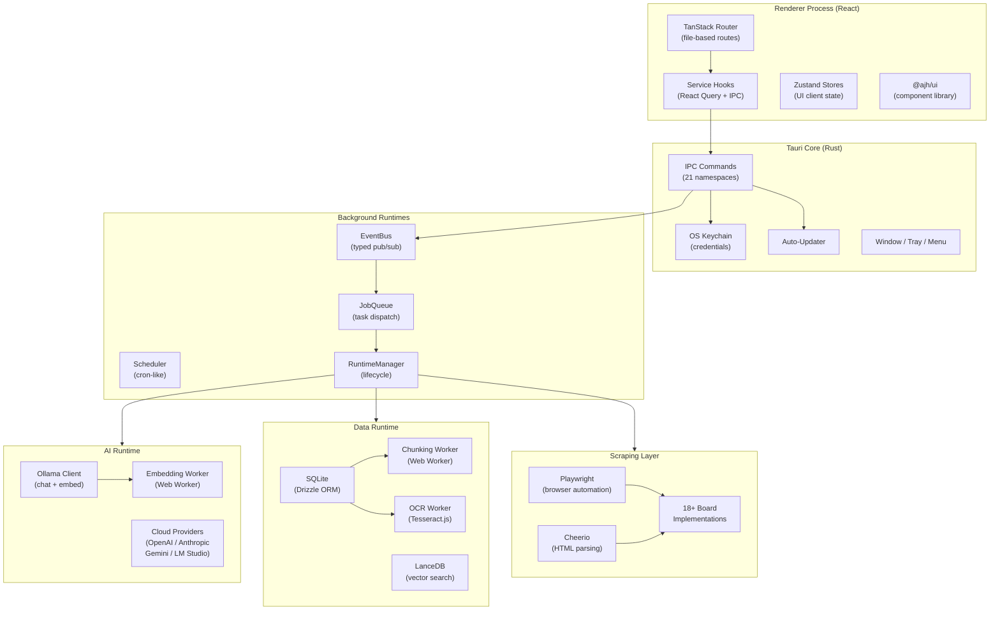
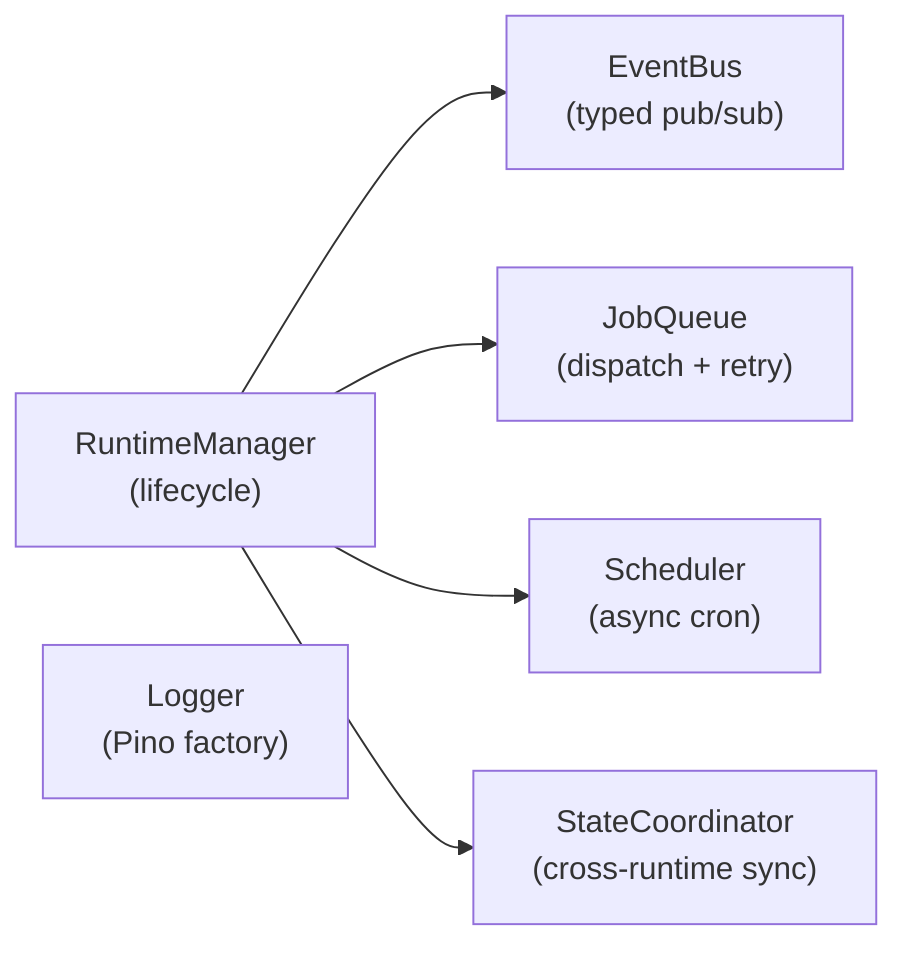
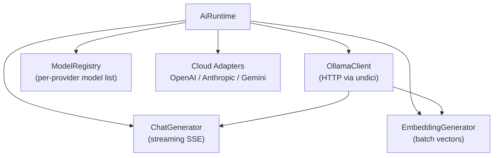
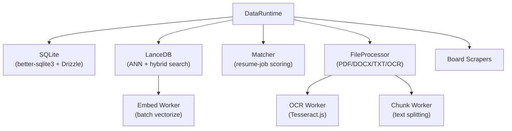
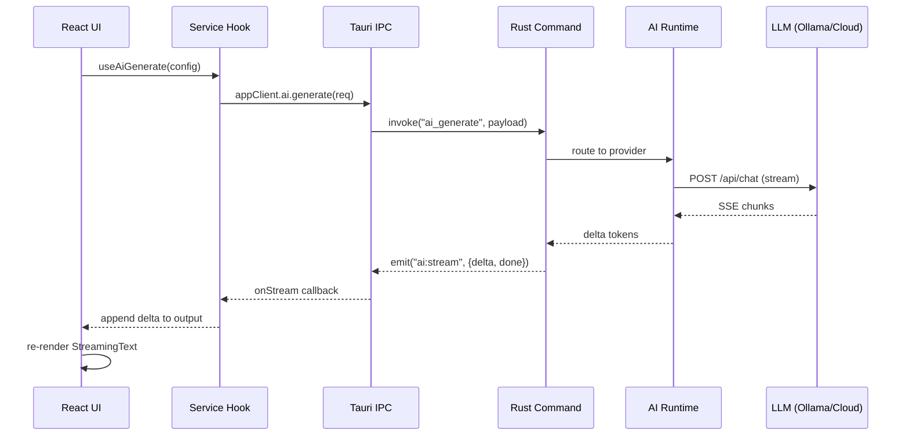
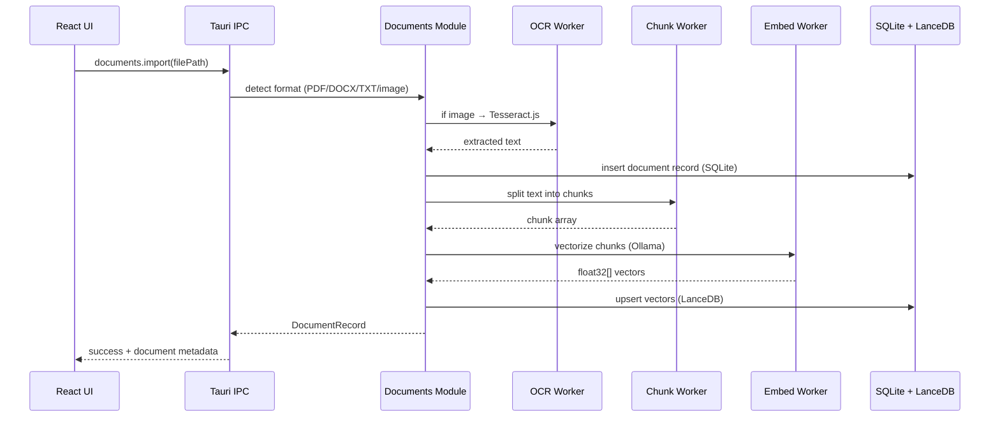
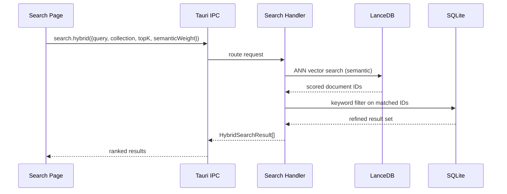
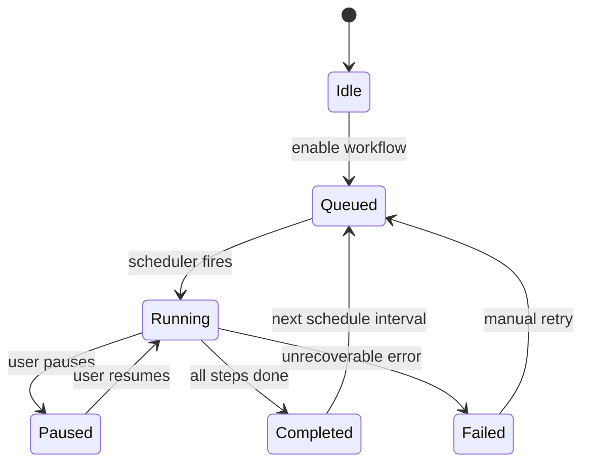
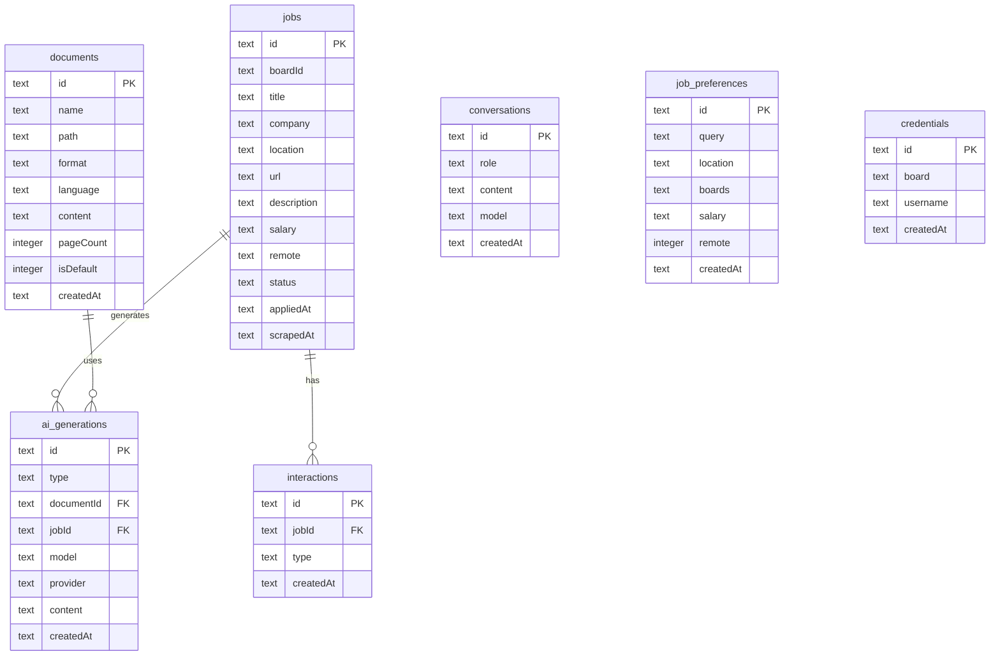
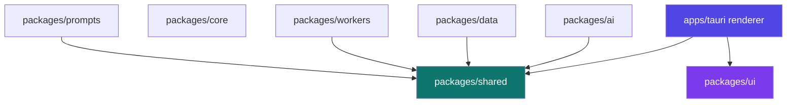

# Architecture — AI Job Hunter

## High-Level Overview

AI Job Hunter is a **local-first desktop application** built on Tauri 2. There is no cloud backend, no telemetry endpoint, and no remote database. Every computation — AI inference, web scraping, vector search, document parsing — runs on the user's machine.

The architecture follows a **ports-and-adapters** model: the React renderer communicates exclusively through typed IPC contracts, and the Rust core handles everything else — command routing plus the heavy work (scraping, document processing, embeddings) natively, without a separate process.

---

## System Architecture



---

## Component Breakdown

### `apps/tauri` — Desktop Shell

The Tauri app is split into two processes:

**Rust core (`src-tauri/`)** — thin orchestration layer:

| Module            | Responsibility                                                       |
| ----------------- | -------------------------------------------------------------------- |
| `commands/`       | IPC endpoint handlers; routes invocations to the appropriate runtime |
| `scraping/`       | 18 board-specific Playwright scrapers                                |
| `documents/`      | Document import, OCR dispatch, SQLite storage                        |
| `jobs/`           | Job tracker state machine (queued → running → done/failed)           |
| `credentials/`    | OS keychain CRUD via Tauri keychain plugin                           |
| `conversations/`  | Chat history persistence                                             |
| `autopilot/`      | Workflow engine + step scheduler                                     |
| `apply_helpers/`  | Form-filling logic for auto-apply                                    |
| `ai_generations/` | Metadata tracking for generated documents                            |
| `export/`         | DOCX/PDF rendering using docx + jsPDF                                |
| `updater/`        | Auto-update state (check, download, install)                         |
| `browser/`        | System browser detection and launch                                  |

**React renderer (`src/renderer/`)** — feature-scoped UI:

| Directory            | Responsibility                                                   |
| -------------------- | ---------------------------------------------------------------- |
| `routes/`            | TanStack Router file-based pages (9 routes)                      |
| `features/`          | Feature-scoped component trees (never cross-import)              |
| `services/`          | React Query hooks wrapping every IPC namespace                   |
| `lib/`               | Pure utilities: motion tokens, i18n, state machine, `cn()`       |
| `store/`             | Zustand stores for persistent UI state                           |
| `providers/`         | React context providers (AppClient, Capability, PerformanceMode) |
| `hooks/`             | Shared React hooks (`useMachine`, `useMouseParallax`)            |
| `components/layout/` | Sidebar, Titlebar, StatusBar, PageShell                          |

---

### `packages/shared` — Contract Layer

The single source of truth for renderer ↔ Rust communication:

```
packages/shared/src/
├── ipc/
│   ├── contracts/          # 21 typed namespace definitions
│   │   ├── ai.ts
│   │   ├── aiGenerations.ts
│   │   ├── apply.ts
│   │   ├── autopilot.ts
│   │   ├── boards.ts
│   │   ├── conversations.ts
│   │   ├── credentials.ts
│   │   ├── dialog.ts
│   │   ├── documents.ts
│   │   ├── geocode.ts
│   │   ├── jobPreferences.ts
│   │   ├── jobs.ts
│   │   ├── linkedin.ts
│   │   ├── match.ts
│   │   ├── privacy.ts
│   │   ├── resume.ts
│   │   ├── scrape.ts
│   │   ├── search.ts
│   │   ├── shortcuts.ts
│   │   ├── support.ts
│   │   ├── system.ts
│   │   └── updater.ts
│   └── contracts.ts        # Re-exports all namespaces
├── schemas/                # Zod validation schemas
├── types/                  # JobRecord, DocumentRecord, MatchScore, etc.
├── language-detection.ts   # franc.js language detection
├── ai-models.ts            # Model registry per provider
└── utils.ts
```

---

### `packages/core` — Runtime Infrastructure



- **EventBus** — typed publish/subscribe within the Node process; decouples producers from consumers
- **JobQueue** — enqueues tasks by kind, dispatches to handler, supports retry with backoff
- **Scheduler** — cron-like recurring tasks (Autopilot runs, model health checks)
- **RuntimeManager** — starts/stops AI and Data runtimes, coordinates graceful shutdown
- **StateCoordinator** — synchronizes state changes across AI, Data, and Worker runtimes

---

### `packages/ai` — AI Runtime



Supports providers: **Ollama** (default, local), **OpenAI**, **Anthropic** (with extended thinking blocks), **Gemini**, **OpenAI-compatible** (LM Studio, remote Ollama).

---

### `packages/data` — Data Runtime



---

### `packages/ui` — Component Library (`@ajh/ui`)

A standalone React component library with no routing, IPC, or state management dependencies. Consumed only from the renderer.

---

## Data Flow

### AI Generation Request



### Document Import Pipeline



### Hybrid Search



### Autopilot Execution



---

## IPC Contract Model

Every renderer ↔ Rust interaction is defined in `packages/shared/src/ipc/contracts/`. The pattern:

```typescript
// packages/shared/src/ipc/contracts/ai.ts
export interface AiContract {
  generate(req: GenerateRequest): Promise<GenerateResponse>;
  listModels(): Promise<ModelInfo[]>;
  pullModel(name: string): Promise<void>;
  embed(text: string): Promise<number[]>;
  setProviderKey(provider: string, key: string): Promise<void>;
  onStream(handler: (chunk: StreamChunk) => void): Unsubscribe;
}
```

The renderer accesses contracts exclusively through `AppClient`:

```typescript
// apps/tauri/src/renderer/lib/app-client.ts
const client = useAppClient();
const result = await client.ai.generate(req);
```

`AppClient` is backed by `createTauriInvokeClient()` in production, and `createMockClient()` in tests — making the UI completely portable.

---

## Database Schema

### SQLite (Drizzle ORM)



### LanceDB Collections

| Collection      | Schema                                              | Purpose                |
| --------------- | --------------------------------------------------- | ---------------------- |
| `jobs`          | `{id, vector[1024], text, boardId, title, company}` | Semantic job search    |
| `resumes`       | `{id, vector[1024], text, documentId, chunkIndex}`  | Resume similarity      |
| `skills`        | `{id, vector[1024], text, category}`                | Skill taxonomy lookup  |
| `conversations` | `{id, vector[1024], text, role, timestamp}`         | Conversation retrieval |

---

## Key Design Decisions

### 1. Local-First Architecture

All data lives on the user's machine — SQLite, LanceDB, credential keychain. No account signup, no cloud sync. This is a deliberate product decision: the target user is privacy-conscious and may be searching confidentially.

### 2. IPC Contract as Single Source of Truth

`packages/shared` is the only place where renderer ↔ Rust interaction is defined. This prevents drift between frontend expectations and backend implementation, and enables mock-based testing without Tauri.

### 3. Ports & Adapters for AppClient

The renderer never calls `window.__TAURI_INVOKE__` directly. It uses `AppClient` which can be swapped to a mock, enabling UI-only development (`pnpm dev:frontend`) and Vitest tests without the full Tauri runtime.

### 4. Native Rust Runtimes

Heavy work (scraping, OCR, embeddings) runs natively in the Rust core on Tauri's async runtime and `tokio` tasks — there is no separate Node.js process. Long operations are spawned as background tasks so they don't block command handling, and OCR runs in the renderer via Tesseract.js (its own Web Worker).

### 5. Streaming as First-Class Concern

AI generation, scraping progress, and autopilot step events all use Tauri's `emit` mechanism to push server-sent events to the renderer. This drives a reactive UI without polling.

### 6. Feature-Scoped Components

The renderer uses a `features/` directory where each feature owns its components and can only import from `packages/ui`, `services/`, and `lib/`. Cross-feature imports are ESLint-forbidden, keeping boundaries explicit.

### 7. Minimal State Machine Library

Rather than XState, the app uses a micro state machine implementation (`lib/machine.ts`, ~80 lines) with a `useMachine` hook. This keeps bundle size minimal and the mental model simple for flows with ≤ 10 states.

---

## External Integrations

| Integration      | Protocol                 | Auth                         | Purpose                      |
| ---------------- | ------------------------ | ---------------------------- | ---------------------------- |
| Ollama           | HTTP (undici)            | None (local)                 | Chat generation + embeddings |
| OpenAI           | HTTPS (REST)             | API key (keychain)           | Cloud generation fallback    |
| Anthropic        | HTTPS (REST)             | API key (keychain)           | Extended thinking generation |
| Google Gemini    | HTTPS (REST)             | API key (keychain)           | Multilingual generation      |
| LM Studio        | HTTP (OpenAI-compatible) | Optional                     | Local cloud-replacement      |
| Job boards (18+) | Playwright browser       | Board credentials (keychain) | Scraping                     |
| OS Keychain      | Tauri plugin             | OS auth                      | Credential encryption        |

---

## Package Dependency Rules



**Hard rules:**

- `packages/shared` — no React, no Node APIs, no UI
- `packages/ui` — no Zustand, no IPC, no routing
- `packages/prompts` — no UI, no `window`
- Renderer **never** imports from `@ajh/core`, `@ajh/ai`, `@ajh/data`, `@ajh/workers`
