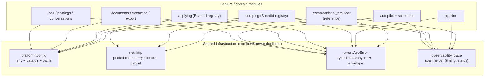

# Architecture Standardization Roadmap — AI Job Hunter

Status: **Proposed** · Owner: core · Last updated: 2026-05-28

This document is the source of truth for transforming the codebase from a set of
independently-built features into a **platform architecture**: centralized
infrastructure, isolated modules, strict boundaries, observable flows.

It extends — does not replace — [ARCHITECTURE.md](ARCHITECTURE.md) (current
system shape) and [PATTERNS.md](PATTERNS.md) (recurring patterns). Where this
roadmap and those docs disagree, those docs describe _today_; this one describes
_where we are going_ and the sequence to get there.

> **No code changes are made by this document.** Each phase below ships as its
> own reviewed PR, validated independently, in plan-mode (edits approved before
> they are written).

---

## 1. North Star — the reference pattern

The AI provider layer is the proven template every other subsystem should
converge toward:

- [`commands/ai_provider/mod.rs`](../apps/tauri/src-tauri/src/commands/ai_provider/mod.rs)
- [`pipeline/mod.rs`](../apps/tauri/src-tauri/src/pipeline/mod.rs)

It already embodies all ten principles:

| Principle             | How the reference does it                                                       |
| --------------------- | ------------------------------------------------------------------------------- |
| Single responsibility | one client module per provider (`ollama`/`openai`/`anthropic`/`gemini`)         |
| Centralized infra     | one `resolve()` routing point; one trait; shared auth/trace                     |
| Strict boundaries     | Ollama host/`/api/*` assumptions isolated in `ollama.rs`                        |
| No hidden fallbacks   | unknown provider/model = hard error, never a silent default                     |
| Strong typing         | `ProviderId` enum, `TokenParam` enum, `ModelCapabilities` struct                |
| Registry              | add a provider = 1 module + 1 enum arm + 1 `resolve` arm                        |
| Capability-driven     | `capabilities(model).supports_*` gates features, not `model.starts_with(...)`   |
| Unified flows         | `chat_stream` / `complete` / `embed` lifecycle is identical per provider        |
| Observability         | `RequestTrace` emits `→`/`←` lines with provider/model/endpoint/status/duration |
| Isolated failure      | one provider failing returns its own error; others unaffected                   |

And [`pipeline/mod.rs`](../apps/tauri/src-tauri/src/pipeline/mod.rs) composes it:
`Completer` (bound provider+model+auth), `Stage`/`Pipeline` (ordered steps over a
shared context), `StageTrace` (per-stage timing). Multi-step generators are
_workflows on shared infra_, not bespoke feature code.

**Goal of this program:** make the rest of the Rust core look like this.

---

## 2. The principles, mapped to enforcement

Principles only hold if a machine enforces them. Each principle below names the
mechanism that will keep it true (built incrementally in the phases that follow).

| #   | Principle                  | Enforcement mechanism                                                                                               |
| --- | -------------------------- | ------------------------------------------------------------------------------------------------------------------- |
| 1   | Single responsibility      | module-ownership convention + review checklist                                                                      |
| 2   | Centralized infrastructure | shared crates/modules (`platform::config`, `net::http`, `observability`) + clippy/grep lint for banned constructors |
| 3   | Strict module boundaries   | `pub(crate)` discipline; path/schema/endpoint knowledge confined to owning module                                   |
| 4   | No hidden fallbacks        | typed errors; `parse()`-style hard-fail constructors; lint banning `unwrap_or_default()` on config                  |
| 5   | Strong typing over strings | enums + discriminated unions + capability structs; lint banning `.starts_with(` provider/board sniffing             |
| 6   | Registry-based systems     | one registration site per registry (no parallel catalog + match)                                                    |
| 7   | Capability-driven          | `*Capabilities` structs; features gate on flags, not identity                                                       |
| 8   | Unified flows              | shared HTTP / retry / cancellation / trace primitives composed everywhere                                           |
| 9   | Observability              | `RequestTrace`/`StageTrace` generalized into a shared trace-span helper                                             |
| 10  | Isolated failure domains   | per-subsystem `Result`; one board/provider/parser failure never aborts the batch                                    |

---

## 3. Current-state gap analysis (grounded)

The renderer and IPC layer are already mature and **not** the priority. Drift
lives almost entirely in the **Rust core outside AI**.

### Already good ✅

- **Frontend state / IPC.** Per-namespace Zod contracts in
  [`packages/shared/src/ipc/contracts/`](../packages/shared/src/ipc/contracts/)
  mirrored as Rust structs in
  [`ipc_contracts/`](../apps/tauri/src-tauri/src/ipc_contracts/); ports-and-adapters
  service hooks in [`renderer/services/`](../apps/tauri/src/renderer/services/);
  state machines in `renderer/lib/machines/`; Zustand stores for UI state.
- **Logging transport.** Uses the `log` crate everywhere; zero `println!`/`eprintln!`.
- **AI + pipeline.** The reference pattern (§1).

### Drift, with evidence 🚧 / ❌

| Area              | Principle | State                                                                                                                                                       | Evidence                                                                                                                                                     |
| ----------------- | --------- | ----------------------------------------------------------------------------------------------------------------------------------------------------------- | ------------------------------------------------------------------------------------------------------------------------------------------------------------ |
| Config + paths    | P2, P3    | ❌ `AJH_DATA_DIR → USERPROFILE/HOME → .ajh` resolution copy-pasted in 6+ files                                                                              | scrape_url:669, boards/xing:163, boards/linkedin:125, boards/indeed:205, applying/boards/shared:141, applying/boards/linkedin:250, plus main.rs:162          |
| HTTP networking   | P2, P8    | 🚧 A scraping HTTP layer exists but builds a fresh `Client` per request (no pooling); AI / geocoding / profile-import / scrape_url each construct their own | 27 client constructions across 12 files; [`scraping/http/mod.rs:55`](../apps/tauri/src-tauri/src/scraping/http/mod.rs#L55)                                   |
| Error model       | P4, P5    | ❌ `Result<_, String>` pervasive (~68 sites / 29 files); only 2 typed enums                                                                                 | [`ApplyError`](../apps/tauri/src-tauri/src/applying/error_handler.rs#L6), [`ExtractionError`](../apps/tauri/src-tauri/src/extraction/types.rs#L40)           |
| Scraping registry | P5, P6    | 🚧 Hardcoded `catalog()` array **and** a separate `match board { "x" => ... }` dispatch — two edit sites per board, magic strings, no capability model      | [`engine/mod.rs:46`](../apps/tauri/src-tauri/src/scraping/engine/mod.rs#L46), [`engine/mod.rs:114`](../apps/tauri/src-tauri/src/scraping/engine/mod.rs#L114) |
| Observability     | P9        | 🚧 `RequestTrace`/`StageTrace` are excellent but AI-only; scraping/applying/autopilot/jobs have no equivalent span                                          | AI-only in ai_provider + pipeline                                                                                                                            |
| Failure isolation | P10       | 🚧 Mixed; scraping engine isolates per-job, but batch flows (autopilot, multi-board search) need an explicit per-unit failure boundary audit                | engine isolates per `job_id`; batch policy unconfirmed elsewhere                                                                                             |

---

## 4. Target platform architecture

Introduce a thin set of **shared infrastructure modules** that every feature
composes. Ownership is explicit: only the named module may know the named detail.



### Ownership boundaries (target)

| Concern                                                           | Sole owner (target module)                 | Today                                 |
| ----------------------------------------------------------------- | ------------------------------------------ | ------------------------------------- |
| env vars, data dir, file paths, storage keys                      | `platform::config`                         | scattered across 6+ files + `main.rs` |
| HTTP client, headers, retry, timeout, abort                       | `net::http` (generalize `scraping::http`)  | per-feature `reqwest::Client::new()`  |
| error types + user-facing message + IPC `{code,message}` envelope | `error::AppError`                          | `Result<_, String>` + ad-hoc strings  |
| request/stage spans (timing, status, context)                     | `observability::trace`                     | `RequestTrace`/`StageTrace` (AI-only) |
| provider routing + capabilities                                   | `commands::ai_provider`                    | ✅ already                            |
| board routing + capabilities                                      | `scraping::registry`, `applying::registry` | string `match` + parallel catalog     |
| SQLite schema + migrations                                        | `db` + per-domain stores                   | mostly ✅ (audit for leaks)           |

---

## 5. Phased roadmap

Foundational-first: build the layers everything composes onto, then migrate
features onto them, then lock with guardrails. Each phase is **one PR**, ordered
so later phases depend on earlier ones. Effort is rough (S/M/L); risk reflects
blast radius.

### Phase 0 — Guardrails scaffold (S, low risk)

- **Goal:** make regression visible before refactoring starts.
- **Deliver:** this roadmap; a `module-ownership` section in
  [PATTERNS.md](PATTERNS.md); a CI grep/clippy check skeleton (initially
  warn-only) for the banned constructs introduced in later phases.
- **Validate:** doc review; CI job runs and is green (no rules active yet).

### Phase 1 — Centralized config + paths (M, low risk) ⭐ recommended start

> **Status: in review** (branch `refactor/phase1-centralized-config`). Introduced
> `platform::config` as sole owner of the data-dir env var + path fallback;
> removed the 6 duplicated `resolve_data_dir()` copies (`env::var("AJH_DATA_DIR")`
> sites: 9 → 1); added the CI grep guardrail. `OLLAMA_HOST`/`CHROME` deferred.

- **Pain:** the `AJH_DATA_DIR → USERPROFILE/HOME → .ajh` block is duplicated 6+
  times; storage-path knowledge leaks into scrapers and appliers (violates P2/P3).
- **Target:** a `platform::config` module owning **all** env reads and path
  resolution, exposed as a typed, validated `AppPaths` / `AppConfig` resolved
  once at startup and threaded through managed state.

  ```rust
  // platform/config.rs (sketch)
  pub struct AppPaths { data_dir: PathBuf, /* sessions, cache, db ... */ }
  impl AppPaths {
      pub fn resolve() -> Result<Self, ConfigError> { /* the ONE copy */ }
      pub fn session_dir(&self) -> PathBuf { ... }
  }
  ```

- **Migration:** introduce module → replace the 6 duplicated blocks with calls →
  delete the dead helpers. No behavior change (same precedence order).
- **Validate:** `cargo build` + `cargo test`; manual smoke that data dir resolves
  identically with/without `AJH_DATA_DIR`.
- **Guardrail:** lint bans `std::env::var(` outside `platform::config`.

### Phase 2 — Shared HTTP infrastructure (M, medium risk)

> **Status: in review** (branch `refactor/phase2-shared-http`). Introduced
> `net::http` as the sole owner of `reqwest::Client` construction: one pooled
> `shared()` client (unified on rustls, no global timeout — callers set
> per-request timeouts) + `build_client()` for the per-session cookie-jar case.
> Migrated all 27 constructions across AI providers, scrapers, geocoding,
> profile-import, and research; added the CI grep guardrail. `native-tls` Cargo
> feature is now unused (left in place; drop in a later phase).

- **Pain:** 27 client constructions / 12 files; `scraping::http` rebuilds a
  `Client` per request (no connection reuse); AI/geocoding/profile-import roll
  their own (P2/P8).
- **Target:** generalize `scraping::http` into `net::http` — one pooled
  `reqwest::Client` (built once, stored in managed state), typed `FetchOptions`
  (retry/timeout/cancel), size caps, and a `RequestTrace` hook. Providers and
  scrapers compose it instead of constructing clients.
- **Migration:** stand up `net::http` with a shared client → migrate
  `scraping::http` to delegate → migrate AI provider clients → migrate
  geocoding/profile-import/scrape_url. One provider/scraper per commit inside the PR.
- **Validate:** build/test; live smoke of one HTTP scraper + one cloud provider
  call; confirm cancellation still aborts mid-request.
- **Guardrail:** lint bans `reqwest::Client::new()` / `::builder()` outside `net::http`.

### Phase 3 — Unified typed error hierarchy (L, medium risk)

> **Status: in review** (branch `refactor/phase3-typed-errors`). Introduced
> `error::AppError` (thiserror, `code()`/`retriable()`, broad `From` set) that
> serializes to its message string — behavior-preserving on the wire. Migrated
> **all internal `Result<_, String>` → `AppResult`** (sites: 68 → 0 outside
> `error.rs`/tests); domain enums (`ExtractionError`) compose via `From`; CI grep
> guardrail added. Deferred (renderer-coupled): the structured `{code,message,
retriable}` IPC envelope + normalizing the `-> Value`+`{error}` command contract.

- **Pain:** ~68 `Result<_, String>` sites; only `ApplyError`/`ExtractionError`
  typed; no stable error codes to the renderer (P4/P5).
- **Target:** an `error::AppError` (via `thiserror`) with variants per failure
  class (Config, Network, Provider, Parse, Storage, Validation, Cancelled, …),
  each mapping to a stable IPC envelope `{ code, message, retriable }`. Generalize
  the existing `friendly_api_error` mapping. Subsystem errors become typed and
  convert into `AppError` at the command boundary.
- **Migration:** define `AppError` + `From` impls → migrate command-by-command
  (boundary first, then internals) → fold `ApplyError`/`ExtractionError` in.
  Incremental; `Result<_, String>` count is the burn-down metric.
- **Validate:** build/test per subsystem; renderer still renders error states
  (error envelope shape is additive/back-compatible).
- **Guardrail:** new commands must return `Result<_, AppError>`; lint warns on new
  `Result<_, String>` in `commands/`.

### Phase 4 — Shared observability (M, low risk)

> **Status: in review** (branch `refactor/phase4-observability`). Extracted
> `observability::Span` (timed `→`/`←` structured logging); refactored
> `RequestTrace` (AI) and `StageTrace` (pipeline) to compose it — no parallel
> trace types, log formats unchanged. Adopted in `scrape_board`, `apply_start`,
> and `autopilot_run` (previously had no timing/outcome spans). No CI grep
> guardrail (no clean banned token); enforced structurally + module-ownership table.

- **Pain:** `RequestTrace`/`StageTrace` are AI-only; scraping/applying/autopilot
  debugging is guesswork (P9).
- **Target:** an `observability::trace` span helper (begin/end, timing, status,
  structured fields) that AI keeps using and that scraping engine, applying
  runtime, autopilot scheduler, and long jobs adopt.
- **Migration:** extract the shared helper from the AI/pipeline traces (no
  behavior change there) → add spans to scraping `scrape_board`, applying
  `runtime`, autopilot scheduler.
- **Validate:** build/test; confirm log lines appear for a scrape + an autopilot run.

### Phase 5 — Registry + capability elevation (L, medium risk)

> **Status: in review** (branch `refactor/phase5-board-registry`). Replaced the
> scraping 20-arm string `match` + hardcoded `catalog()` ROWS, and the applier
> hardcoded `catalog()` vec + `get()` match, with a single registry-of-trait-objects
> per domain (`scraping::boards::{SCRAPERS,get,all}`, `applying::registry::APPLIERS`):
> dispatch + catalog both derive from one list via the existing `Scraper`/`Applier`
> trait metadata (`id`/`display_name`/`mode`). Behavior-preserving (catalog
> ids/names/modes/order unchanged). Used registry-of-trait-objects rather than a
> `BoardId` enum — the board id is the string wire format and the trait already
> carries capabilities. No CI grep guardrail (board dispatch never used `.starts_with`
> sniffing); the single registry list is the structural guarantee.

- **Pain:** scraping/applying dispatch via string `match` + a parallel hardcoded
  `catalog()`; adding a board touches ≥2 sites; no capability model (P5/P6/P7).
- **Target:** `BoardId` enum + `BoardCapabilities` (`mode: Http|Browser`,
  `requires_session`, `supports_apply`, …) + a single `resolve(BoardId) ->
&dyn Scraper` registry, exactly mirroring `ProviderId`/`resolve()`. `catalog()`
  derives from the registry — one registration site.
- **Migration:** introduce `BoardId` + registry → derive `catalog()` from it →
  delete the `match` dispatch → repeat for `applying`.
- **Validate:** build/test; smoke a representative HTTP board, a browser board,
  and one apply flow.
- **Guardrail:** lint bans board/provider `.starts_with(` sniffing; adding a board
  must compile-fail until registered (exhaustive match on `BoardId`).

### Phase 6 — Failure-domain isolation audit (M, medium risk)

- **Goal:** guarantee one unit failing never aborts a batch (P10).
- **Scope:** audit multi-board search, autopilot batch apply, ingestion/parsing
  loops; ensure per-unit `Result` with collected partial results + per-unit error
  reporting (not early-return on first failure).
- **Validate:** targeted tests injecting a single-unit failure; confirm the batch
  completes with that unit marked failed.

### Sequencing summary

```
Phase 0 (guardrail scaffold)
   └─> Phase 1 (config/paths)  ──┐
                                 ├─> Phase 3 (errors) ──┐
   ┌──> Phase 2 (http) ─────────┘                       ├─> Phase 5 (registries)
   │                                                     │
   └──> Phase 4 (observability) ─────────────────────────┘ ──> Phase 6 (failure domains)
```

Phases 1, 2, 4 are largely independent and can interleave; 3 benefits from 1+2
landing first; 5 benefits from 3; 6 is last.

---

## 6. Guardrails — preventing regression

Built up across phases; each rule lands with the phase that makes it safe.

- **Lint / grep rules (CI, warn → error):**
  - `std::env::var(` only in `platform::config` (Phase 1)
  - `reqwest::Client::new()` / `::builder()` only in `net::http` (Phase 2)
  - new `Result<_, String>` in `commands/` (Phase 3)
  - provider/board `.starts_with(` identity sniffing (Phase 5)
- **Type-level:** discriminated-union enums (`ProviderId`, `BoardId`) with
  exhaustive `match` so adding a variant fails to compile until handled.
- **Convention:** a "module ownership" table in [PATTERNS.md](PATTERNS.md) — one
  owner per cross-cutting concern; PR review checklist references it.
- **Tests:** each shared module ships unit tests; failure-isolation tests in Phase 6.

---

## 7. Per-refactor documentation template

Every phase PR description must include:

1. **Architecture summary** — what the target module owns.
2. **Data/flow diagram** — request or data lifecycle (Mermaid or ASCII).
3. **Ownership boundaries** — what moved in, what was deleted.
4. **Migration notes** — order of operations, back-compat stance.
5. **Anti-patterns removed** — with before/after counts (e.g. "env::var sites: 9 → 1").
6. **Tech debt remaining** — what this phase deliberately left.
7. **Future extension strategy** — how to add the next provider/board/etc.

---

## 8. Out of scope / tech debt acknowledged

- **Renderer refactor.** Already mature; no changes planned beyond consuming the
  new error envelope (Phase 3).
- **Cloud sync / remote backend.** Remains backlog (see [ARCHITECTURE_STATUS.md](ARCHITECTURE_STATUS.md)).
- **Prompt content.** Stays authored in `packages/prompts` (TS); never ported to Rust.
- **No big-bang rewrite.** Every phase preserves behavior and ships independently.

---

## 9. Future extension strategy

After this program, adding capability is uniform and cheap:

- **New AI provider:** 1 client module + 1 `ProviderId` arm + 1 `resolve` arm (already true).
- **New job board:** 1 scraper module + 1 `BoardId` arm + capabilities row (Phase 5).
- **New exporter / parser / integration:** register in its registry; compose
  `net::http`, `AppError`, `observability::trace`, `platform::config`.
- **New IPC capability:** unchanged 5-step checklist in [PATTERNS.md](PATTERNS.md),
  now returning `AppError`.

The test for success: a new feature requires **one implementation file + one
registration**, composes shared infra, and adds **zero** duplicated config / HTTP
/ error / trace logic.
