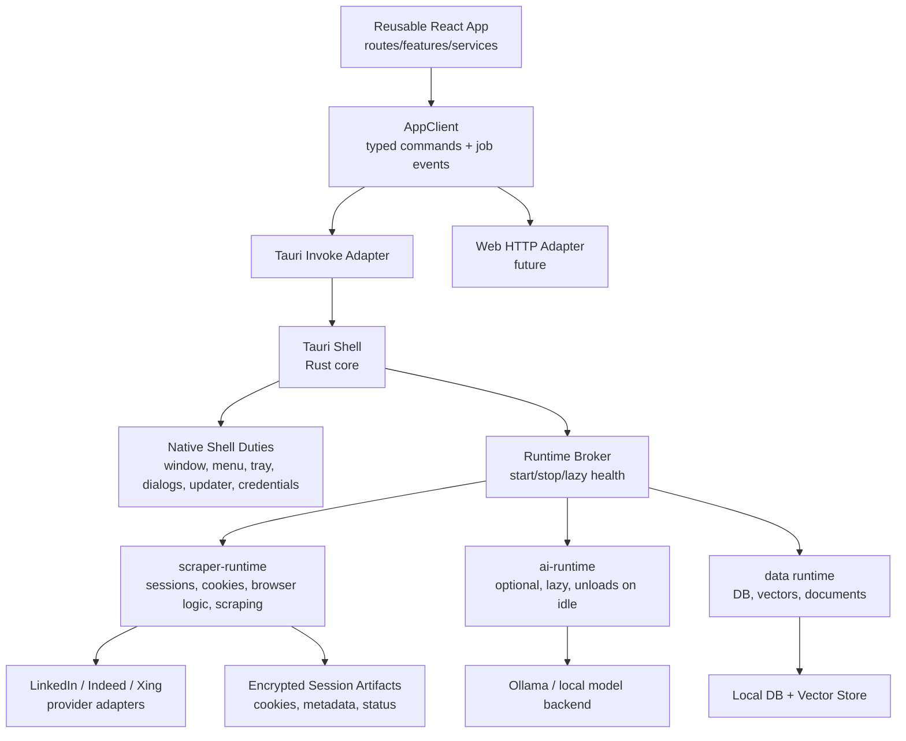

# Architecture Status

Maps every node in the target architecture to its concrete code location and current implementation state.

**Legend:** ✅ done · ⚠️ partial / stubbed · 🔲 future

---

## Architecture Diagram



---

## Node Status

### UI — Reusable React App

**Status:** ✅

**Where:**

- Routes: `apps/tauri/src/renderer/routes/`
- Features: `apps/tauri/src/renderer/features/`
- Service hooks: `apps/tauri/src/renderer/services/`
- UI primitives: `packages/ui/src/`

**Notes:** All feature code is transport-neutral. No direct invoke calls in
routes/features — every backend call goes through a service hook.

---

### AppClient — typed commands + job events

**Status:** ✅

**Where:**

- Type definition: `apps/tauri/src/renderer/lib/app-client.ts`
- Provider: `apps/tauri/src/renderer/providers/AppClientProvider.tsx`
- IPC channels: `packages/shared/src/ipc/contracts.ts`

**Notes:** `AppClientProvider` accepts an optional `client` prop so any adapter can be
injected without touching service hooks or feature components.

---

### Tauri Invoke Adapter

**Status:** ✅ production

**Where:** `apps/tauri/src/tauri-client.ts` → `createTauriInvokeClient()`

**Notes:** Full `AppClient` implementation over `@tauri-apps/api` `invoke` /
`listen`. Real commands: `system_*`, `scrape_board`/`scrape_url` (proxy
to sidecar), `dialog_open_files`. Parity built incrementally.

---

### Web HTTP Adapter

**Status:** ⚠️ skeleton / documented

**Where:** `apps/tauri/src/renderer/lib/web-http-client.ts` →
`createWebHttpClient({ baseUrl, token })`

**Notes:** Full `AppClient` implementation over `fetch` + `EventSource`.
Not yet wired to a live backend — use `createMockClient()` in tests until the server is deployed.

---

### Test / Mock Adapter

**Status:** ✅

**Where:** `apps/tauri/src/renderer/lib/mock-client.ts` → `createMockClient(overrides?)`

**Notes:** Fully-stubbed `AppClient` for Vitest / Storybook. Accepts a
deep-partial override so individual methods can be replaced per test.

---

### Tauri Shell

**Status:** ✅ production

**Where:** `apps/tauri/src-tauri/src/`

**Notes:** Native menu, system tray, file dialog, clipboard, updater all
wired. Sidecar launched and port-discovered via stdout. `pnpm dev` / `pnpm package` target Tauri.

---

### Native Shell Duties

| Duty               | Tauri                              |
| ------------------ | ---------------------------------- |
| Window management  | ✅ `main.rs`                       |
| App menu           | ✅ `main.rs` `build_app_menu`      |
| System tray        | ✅ `main.rs` `build_tray`          |
| Native dialogs     | ✅ `IPC_CHANNELS.dialog.openFiles` |
| Auto-update        | ✅ `updater.ts`                    |
| Credential storage | ✅ `credentials.ts` (keyring)      |

---

### Runtime Broker

**Status:** ⚠️ stub (Tauri)

**Where:** `packages/core/src/RuntimeManager` — registers runtimes (`ai`, `data`),
starts them on-demand, stops all on shutdown.

---

### scraper-runtime — sessions, cookies, browser logic, scraping

**Status:** ✅ HTTP sidecar

**Where:**

- HTTP sidecar entry: `apps/scraper-runtime/src/` → `POST /command` SSE protocol
- Sidecar protocol: `apps/scraper-runtime/src/protocol.ts`

---

### Provider Adapters (LinkedIn / Indeed / Xing)

**Status:** ✅ HTTP scrapers · ✅ browser-based scrapers

**Where:** `apps/tauri/src-tauri/src/scraping/boards/`

---

### Encrypted Session Artifacts (cookies, metadata, status)

**Status:** ✅

**Where:** `apps/scraper-runtime/src/`

**Notes:** `CredentialStore` encrypts credentials via OS keyring (keyring crate).

---

### ai-runtime — optional, lazy, unloads on idle

**Status:** ✅

**Where:** `packages/ai/src/` → `AiRuntime`

---

### Data runtime — DB, vectors, documents

**Status:** ✅

**Where:** `apps/tauri/src-tauri/src/` (Rust implementation)

---

### Storage — Local DB + Vector Store

**Status:** ✅

**Where:**

- SQLite: `apps/tauri/src-tauri/src/db/`
- LanceDB: `apps/tauri/src-tauri/src/vector/`

---

### Ollama — local model backend

**Status:** ✅

**Where:** `packages/ai/src/` → `AiRuntime` → Ollama client

---

## Current State

```
✅  UI transport-neutral, reusable across adapters
✅  AppClient abstraction — Tauri invoke adapter + web HTTP skeleton
✅  Tauri shell — menu, tray, file dialogs, clipboard, window drag
✅  Scraper runtime sidecar — 19 boards, login, apply, documents, vector search
✅  AI streaming via direct Ollama HTTP (chat, embed, pull, list models)
✅  Credential storage — OS keychain via keyring crate
✅  Auto-updater — tauri-plugin-updater with GitHub release endpoint
✅  Release pipeline — Windows NSIS/MSI + macOS universal DMG, signed
⚠️  Web HTTP adapter: skeleton ready, web backend server not yet deployed
⚠️  11 support panel actions: stubs in Tauri (TODO)
⚠️  Conversations persistence: no-op (TODO)
🔲  apps/web/ entry using createWebHttpClient()
```
