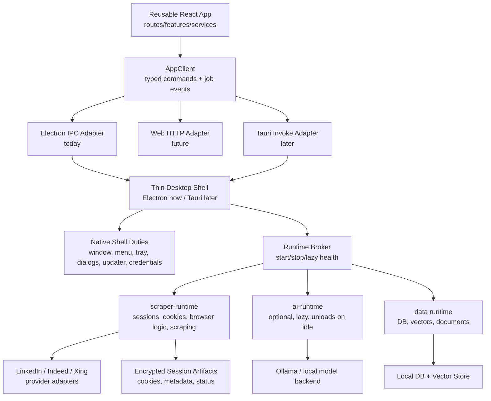

# Architecture Status

Maps every node in the final target architecture diagram
(`low-resource-electron-tauri-architecture.md §20`) to its concrete code
location and current implementation state.

**Legend:** ✅ done · ⚠️ partial / stubbed · 🔲 future

---

## Architecture Diagram



---

## Node Status

### UI — Reusable React App

**Status:** ✅

**Where:**

- Routes: `apps/desktop/src/renderer/routes/`
- Features: `apps/desktop/src/renderer/features/`
- Service hooks: `apps/desktop/src/renderer/services/`
- UI primitives: `packages/ui/src/`

**Notes:** All feature code is transport-neutral. No `window.api` calls in
routes/features — every backend call goes through a service hook. The renderer
source is reused verbatim by the Tauri spike via a Vite alias (`apps/tauri/`).

---

### AppClient — typed commands + job events

**Status:** ✅

**Where:**

- Type definition: `apps/desktop/src/renderer/lib/app-client.ts`
- Provider: `apps/desktop/src/renderer/providers/AppClientProvider.tsx`
- IPC channels: `packages/shared/src/ipc/contracts.ts`

**Notes:** `AppClient = Api` from the preload. Three adapters exist (see below).
`AppClientProvider` accepts an optional `client` prop so any adapter can be
injected without touching service hooks or feature components.

---

### Electron IPC Adapter

**Status:** ✅

**Where:** `apps/desktop/src/renderer/lib/app-client.ts` →
`createDesktopIpcClient()` — returns `window.api` (set by the Electron preload)

**Notes:** Production path. All IPC channels validated by Zod in
`apps/desktop/src/main/ipc/router.ts`.

---

### Web HTTP Adapter

**Status:** ⚠️ skeleton / documented

**Where:** `apps/desktop/src/renderer/lib/web-http-client.ts` →
`createWebHttpClient({ baseUrl, token })`

**Notes:** Full `AppClient` implementation over `fetch` + `EventSource`.
Every command routes to `POST /api/<namespace>/<method>`. Streaming channels
use Server-Sent Events. The runtime server (`apps/scraper-runtime/` +
future `apps/ai-runtime/`) exposes this REST surface. Not yet wired to a live
backend — use `createMockClient()` in tests until the server is deployed.

---

### Tauri Invoke Adapter

**Status:** ✅ (spike)

**Where:** `apps/tauri/src/tauri-client.ts` → `createTauriInvokeClient()`

**Notes:** Full `AppClient` implementation over `@tauri-apps/api` `invoke` /
`listen`. Used by `apps/tauri/src/main.tsx` which loads the same React renderer
via Vite alias. Real commands: `system_*`, `scrape_board`/`scrape_url` (proxy
to sidecar), `dialog_open_files`. All other commands: stubs returning empty
state. Parity built incrementally.

---

### Test / Mock Adapter

**Status:** ✅

**Where:** `apps/desktop/src/renderer/lib/mock-client.ts` → `createMockClient(overrides?)`

**Notes:** Fully-stubbed `AppClient` for Vitest / Jest / Storybook. Accepts a
deep-partial override so individual methods can be replaced per test.

---

### Thin Desktop Shell (Electron)

**Status:** ✅

**Where:** `apps/desktop/src/main/`

**Notes:** Main entry in `index.ts` is intentionally thin — no AI, scraping,
or indexing in main. GPU/rendering flags are guarded by `rollbackFlags.lowEndMode`
(`rollback-flags.ts`). Window creation in `window.ts` supports low-end mode
(disables vibrancy/transparency).

---

### Thin Desktop Shell (Tauri — production)

**Status:** ✅ production

**Where:** `apps/tauri/src-tauri/src/`

**Notes:** Native menu, system tray, file dialog, clipboard, updater all
wired. Sidecar launched and port-discovered via stdout. Uses the same React
renderer as the Electron shell via Vite alias. **Tauri is now the default
shell** (`pnpm dev` / `pnpm package`). Electron is kept for one release cycle
as `pnpm dev:electron` / `pnpm package:electron`.

---

### Native Shell Duties

| Duty               | Tauri (production)                 | Electron (legacy)              |
| ------------------ | ---------------------------------- | ------------------------------ |
| Window management  | ✅ `main.rs`                       | ✅ `window.ts`                 |
| App menu           | ✅ `main.rs` `build_app_menu`      | ✅ `menus.ts`                  |
| System tray        | ✅ `main.rs` `build_tray`          | —                              |
| Native dialogs     | ✅ `IPC_CHANNELS.dialog.openFiles` | ✅ `dialog_open_files` command |
| Auto-update        | ✅ `updater.ts`                    | 🔲 Tauri updater plugin        |
| Credential storage | ✅ `credentials.ts` (keytar)       | 🔲 Tauri stronghold plugin     |

---

### Runtime Broker

**Status:** ✅ (Electron) · ⚠️ stub (Tauri)

**Where:** `packages/core/src/RuntimeManager` — registers runtimes (`ai`, `data`),
starts them on-demand, stops all on shutdown.

In `apps/desktop/src/main/bootstrap.ts`:

- `runtimes.register(ai)` / `runtimes.register(data)`
- `runtimes.start('data')` at bootstrap
- `runtimes.start('ai')` on first AI job (lazy) or at startup when `AJH_EAGER_BOOT=1`
- `runtimes.stop()` on `before-quit`

**Rollback:** `AJH_EAGER_BOOT=1` forces all runtimes to start immediately.

---

### scraper-runtime — sessions, cookies, browser logic, scraping

**Status:** ✅ in-process (Electron) · ⚠️ HTTP sidecar (stub, Tauri)

**Where:**

- Interface: `apps/desktop/src/main/scraper-runtime.ts` → `ScraperRuntimeClient`
- In-process: `InProcessScraperRuntime` (default, production path)
- HTTP sidecar entry: `apps/scraper-runtime/src/` → `POST /command` SSE protocol
- Session managers: `apps/desktop/src/main/board-sessions/PersistentBoardSession.ts`
- Browser controller: `apps/desktop/src/main/electron-browser-controller.ts`

**Rollback:** `AJH_SCRAPER_MODE=in-process` forces the in-process fallback
even when a utility-process or sidecar runtime becomes the default.

---

### Provider Adapters (LinkedIn / Indeed / Xing)

**Status:** ✅ HTTP scrapers · ✅ browser-based scrapers

**Where:** `packages/data/src/scraping/boards/`

**Notes:** Each board has a scraper adapter. HTTP scrapers work in the
standalone Node.js sidecar. Browser-based scrapers require the
`ElectronBrowserController` and stay in-process or in a dedicated browser
sidecar.

---

### Encrypted Session Artifacts (cookies, metadata, status)

**Status:** ✅

**Where:** `apps/desktop/src/main/board-sessions/PersistentBoardSession.ts`

**Notes:** One `PersistentBoardSession` per board using Electron's
`session.fromPartition("persist:<boardId>")`. Chromium stores cookies on disk.
`CredentialStore` (`credentials.ts`) encrypts credentials via `keytar`.

---

### ai-runtime — optional, lazy, unloads on idle

**Status:** ✅

**Where:** `packages/ai/src/` → `AiRuntime`

**Notes:**

- Registered with `RuntimeManager` but not started at bootstrap.
- Started on first `ai.generate` or `ai.embed` job (`runtimes.start('ai')`).
- Idle timeout: 10 min (balanced), 30 min (performance), 3 min (low-memory).
  Controlled via `setPerformanceMode` IPC → `router.ts`.
- `AJH_EAGER_BOOT=1` starts AI at bootstrap for debugging.

---

### Data runtime — DB, vectors, documents

**Status:** ✅

**Where:** `packages/data/src/` → `DataRuntime`

**Notes:**

- Opened at bootstrap (SQLite needed immediately for autopilot scheduler).
- LanceDB (vector store) opened lazily on first search/embed.
- `AJH_LOW_END_MODE=1` sets job concurrency to 1, reducing DB write pressure.

---

### Storage — Local DB + Vector Store

**Status:** ✅

**Where:**

- SQLite (NeDB): `packages/data/src/db/` — job postings, interactions,
  autopilots, conversations
- LanceDB: `packages/data/src/vector/lancedb.ts` — embeddings + vector search

---

### Ollama — local model backend

**Status:** ✅

**Where:** `packages/ai/src/` → `AiRuntime` → Ollama client

**Notes:** Ollama runs as an independent OS process. `AiRuntime` connects to
`http://127.0.0.1:11434`. Models are pulled on demand via `ai.pullModel` IPC.
Idle unload is triggered by the `AiRuntime` idle timer.

---

## Verdict: Phase F — Tauri is the default shell

```
✅  UI transport-neutral, reusable across all three shells
✅  AppClient abstraction — three adapters (IPC, Tauri invoke, web HTTP skeleton)
✅  Electron shell thin — no AI/scraping/indexing in main process
✅  Rollback flags for every phase (rollback-flags.ts)
✅  Scraper runtime sidecar — 19 boards, login, apply, documents, vector search
✅  AI streaming via direct Ollama HTTP (chat, embed, pull, list models)
✅  Credential storage — OS keychain via keyring crate
✅  Auto-updater — tauri-plugin-updater with GitHub release endpoint
✅  Native shell — menu, tray, file dialogs, clipboard, window drag
✅  Release pipeline — Windows NSIS/MSI + macOS universal DMG, signed
✅  Tauri is production shell — pnpm dev / pnpm package target Tauri
✅  Electron legacy — pnpm dev:electron / pnpm package:electron for one cycle
⚠️  Web HTTP adapter: skeleton ready, web backend server not yet deployed
⚠️  11 support panel actions: stubs in both Tauri and Electron (TODO)
⚠️  Conversations persistence: no-op in both shells (TODO)
🔲  apps/web/ entry using createWebHttpClient()
🔲  Electron fully removed (after one legacy release cycle)
```

The architectural goal from the document is achieved:

> Keep Electron for now, but make it boring. The highest-value move is making
> Electron a replaceable host around runtimes that start late, stop when idle,
> and can eventually run as Tauri sidecars or web backends.

Electron is now boring — replaceable by `pnpm dev:electron`. Tauri is the
production shell. Each remaining item above is independent and reversible.
