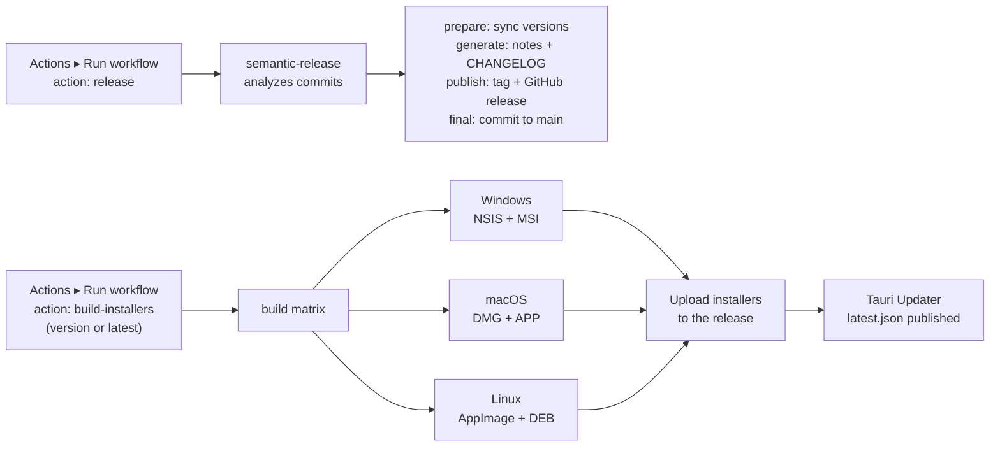

# Deployment — AI Job Hunter

Last updated: 2026-07-16

AI Job Hunter is distributed as a native desktop installer built by [Tauri][tauri]. There is no server to deploy — the entire app runs on the end user's machine.

---

## Build Targets

| Platform | Output Format                          | Location                                    |
| -------- | -------------------------------------- | ------------------------------------------- |
| Windows  | NSIS installer (`.exe`) + MSI (`.msi`) | `src-tauri/target/release/bundle/nsis/`     |
| macOS    | App bundle (`.app`) + DMG (`.dmg`)     | `src-tauri/target/release/bundle/macos/`    |
| Linux    | AppImage (`.AppImage`) + DEB (`.deb`)  | `src-tauri/target/release/bundle/appimage/` |

---

## Windows Installer Configuration

`bundle.windows` in `apps/desktop/src-tauri/tauri.conf.json` pins the Windows install behavior:

```json
{
  "bundle": {
    "windows": {
      "nsis": { "installMode": "currentUser" },
      "webviewInstallMode": { "type": "downloadBootstrapper" }
    }
  }
}
```

### `nsis.installMode: "currentUser"` — pinned per-user scope (root-cause fix)

The NSIS installer is pinned to **per-user** scope (installs into the user profile, no UAC/Administrator prompt).

**Why it matters.** Previously `bundle.windows` was absent, so the NSIS installer fell back to Tauri's default `installMode`. Because the repo also builds an **MSI** (per-machine) while the in-app updater only ever applies the **NSIS** artifact, an install and a later update could land at **different scopes / paths** (per-user vs per-machine). When that happens:

- The in-app updater swaps in the new version at the NSIS/per-user path, so the **running** app is up to date.
- The user's pinned taskbar/Start shortcuts still point at the **old** exe at the **old** (e.g. per-machine) path, which is never replaced.
- Relaunching from a pin runs the **stale** version, and the update banner reappears every launch.

Pinning `installMode: currentUser` guarantees every install **and** every update use the same installer type and the same path, so the shortcut target stays valid after an update. (Valid `installMode` values: `currentUser`, `perMachine`, `both` — we use `currentUser` as the no-UAC, auto-update-friendly choice.)

`webviewInstallMode.type: downloadBootstrapper` is the standard/stable WebView2 provisioning mode (downloads the bootstrapper at install time).

### Migration note — existing per-machine / MSI installs need a one-time clean reinstall

This config change cannot retroactively move an existing install's pinned-shortcut target. A user who **currently** has a per-machine (or MSI) install must do a **one-time clean reinstall**:

1. Uninstall the existing app (Settings ▸ Apps, or the MSI/per-machine entry).
2. Remove any stale pinned taskbar/Start shortcuts pointing at the old path.
3. Install the new per-user NSIS build and re-pin from it.

After that one reinstall, all future in-app updates apply in place and pins stay valid.

> **Maintainer recommendation (not actioned here):** the in-app updater only consumes the **NSIS** artifact, so a coexisting **MSI** target is the remaining source of "two installs on disk" / scope drift on Windows. Consider **dropping the MSI from user-facing Windows downloads** (keep NSIS as the single Windows distribution). This is a release-policy decision for the maintainer — `release.yml` targets and the `bundle.targets` MSI entry are intentionally left unchanged in this config fix.

---

## Building Locally

### Prerequisites

Same as [DEVELOPMENT.md](DEVELOPMENT.md), plus platform-specific:

**Windows**: Visual Studio Build Tools + WebView2 Runtime  
**macOS**: Xcode Command Line Tools (`xcode-select --install`)  
**Linux**: `libwebkit2gtk-4.1-dev`, `libssl-dev`, `libayatana-appindicator3-dev`

```bash
# Ubuntu/Debian
sudo apt-get install libwebkit2gtk-4.1-dev libssl-dev libayatana-appindicator3-dev librsvg2-dev
```

### Linux AppImage — Wayland + Mesa safeguard

On Wayland + Mesa (common on Steam Deck and modern Linux), the bundled `libwayland-client` in the AppImage can shadow the host's WebGL/EGL stack and crash at startup. Mitigations (environment-aware, idempotent, applied at boot) are implemented in `apps/desktop/src-tauri/src/platform/linux_appimage.rs`; the app detects the AppImage/Wayland environment automatically and requires no user configuration.

### Build all packages then package

```bash
# 1. Build all workspace packages
pnpm build

# 2. Create platform-specific installers
pnpm package
```

Or combined:

```bash
pnpm build && pnpm package
```

Outputs land in `apps/desktop/src-tauri/target/release/bundle/`.

### Debug vs Release

```bash
# Debug build (faster, larger, unoptimized — for testing only)
cd apps/desktop
pnpm tauri build --debug

# Release build (optimized, signed if certificates configured)
pnpm tauri build
```

---

## Release Pipeline

Releases are **manually triggered** via [semantic-release][semantic-release]: go to **Actions ▸ "🚀 Release" ▸ "Run workflow"**, choose `action: release`, and semantic-release will compute the version from conventional commits, sync version files, draft the notes, and create the tag + GitHub Release. Nothing runs automatically on push to `main`. Building the cross-platform **installers is a separate manual step** — run the same workflow with `action: build-installers` (the default) for a tag (see [CI/CD Pipeline](#cicd-pipeline)).

### Commit → Version mapping

| Commit prefix                                  | Version bump    | Release notes |
| ---------------------------------------------- | --------------- | ------------- |
| `feat:`                                        | minor (`1.x.0`) | Yes           |
| `fix:`, `perf:`                                | patch (`1.0.x`) | Yes           |
| `BREAKING CHANGE` footer                       | minor (`0.x.0`) | Yes           |
| `refactor:`, `docs:`, `chore:`, `ci:`, `test:` | none            | No            |

While the project stays on `0.x`, a `BREAKING CHANGE` bumps the **minor** (not major) — `.releaserc.json` maps `{ "breaking": true, "release": "minor" }` to keep the pre-1.0 line. Revisit when declaring a stable `1.0` API.

### Release configuration

`.releaserc.json` controls semantic-release behavior. Releases execute these plugins in order:

1. `@semantic-release/commit-analyzer` — analyzes commits to determine version bump
2. `@semantic-release/release-notes-generator` — drafts release notes
3. `@semantic-release/exec` — runs `scripts/sync-tauri-version.cjs ${nextRelease.version}` to sync 7 version files
4. `@semantic-release/changelog` — writes/updates `CHANGELOG.md` at repo root
5. `@semantic-release/github` — creates GitHub Release with notes and assets
6. `@semantic-release/git` — commits the synced version files + `CHANGELOG.md` to `main` with message `chore(release): <version> [skip ci]`

See `.releaserc.json` for full plugin options.

### Version sync

Version files are synced atomically as part of the release commit, executed by semantic-release's `@semantic-release/exec` plugin during the `prepare` phase.

**Synced files** (7 total):

- `package.json` (root)
- `apps/desktop/package.json`
- `apps/extension/package.json`
- `apps/desktop/src-tauri/Cargo.toml`
- `apps/desktop/src-tauri/Cargo.lock` (the `ajh-tauri` package entry — kept in lockstep so local builds don't drift)
- `apps/desktop/src-tauri/tauri.conf.json`
- `README.md` (release badge version)

Plus `CHANGELOG.md` is generated in the same commit. The release commit (tagged at `v*`) contains all synced versions consistently.

**Never manually bump versions.** Commit with the correct prefix and the pipeline handles it.

---

## CI/CD Pipeline



### GitHub Actions workflow

`.github/workflows/release.yml`. Nothing runs automatically on push to `main` — both the release and the installer builds require a manual **Run workflow** dispatch with the appropriate `action` input.

Every uploadable installer artifact (`.exe`, `.msi`, `.dmg`, `.AppImage`, `.deb`, `.rpm`) is prefixed with its OS (`windows-`, `macos-`, or `linux-`) so the GitHub Release asset list clusters by platform; `latest.json` and the extension zips are not prefixed.

**`action: release`** — single `release` job:

1. semantic-release analyzes commits
2. If a release is warranted: exec syncs version files → changelog generates `CHANGELOG.md` → GitHub publishes release + assets → git commits the synced versions + CHANGELOG to `main` with tag `v*`
3. The tag points to the commit that contains consistent, synced versions

### Changelog

`CHANGELOG.md` is an in-repo mirror generated and maintained by semantic-release's `@semantic-release/changelog` plugin. It contains every release's version + conventional-commits-derived notes grouped by type (Features, Bug Fixes, etc.). **GitHub Releases** remain canonical — they carry the per-platform **Downloads** table and signed assets; `CHANGELOG.md` is for offline / quick-reference access.

**`action: build-installers`** — run via **Actions ▸ "🚀 Release" ▸ "Run workflow"** (macOS Intel + Apple Silicon build as two parallel matrix legs, so wall-clock is roughly the slowest single platform rather than the sum of all three):

1. Resolve the version (the `version` input, or the latest tag if left blank), then checkout that tag
2. Install pnpm + Node + Rust stable; `pnpm build:packages`
3. `pnpm tauri build` — compiles Rust + bundles installers for Windows / macOS / Linux
4. Upload installers to the release, then generate + upload `latest.json` (the auto-updater manifest)

> Manual dispatch is for **rebuilding an existing tag** (e.g. a runner flaked, or you want to re-attach assets) — it does not create a new release. Leave the version blank for the latest tag, or pass one like `0.62.0`.

### Pull-request checks & review

PRs to `main` run multiple layers (all under [`.github/workflows/`](../.github/workflows/)). **Two are required** (must pass to merge):

- **Gating: ✅ CI OK** — `ci-pipeline.yml` umbrella check encompassing lint, type-check, tests, build, Rust quality + architecture R1–R8, `cargo-deny`, dependency-review, and gitleaks secret-scan. The required functional gate.
- **Gating: 🤖 AI Review OK** — `claude-review.yml` ai-review-gate job runs automatic semantic review on every PR (unless draft) with deterministic verdict: HIGH/CRITICAL findings at confidence ≥ 0.8 block merge; fails open on infra (no outage freeze). See [`docs/adr/0008-ai-review-enforcement.md`](adr/0008-ai-review-enforcement.md). **Manual setup step after this PR merges:** add "🤖 AI Review OK" to the required status checks in the branch protection ruleset (same UI where "✅ CI OK" is required).

Additional advisory layers:

- **CodeRabbit** (external SaaS, free on this public repo; config in [`.coderabbit.yaml`](../.coderabbit.yaml)). Posts a PR summary + walkthrough + line-by-line review, applies area labels, and runs ESLint / Clippy / Semgrep / secret-scan / actionlint inline. **Advisory only — never blocks merge**. Its `path_instructions` mirror `.claude/review-routes.json` ownership + the `CLAUDE.md` conventions; the former `pr-review.yml` (reviewdog ESLint/Clippy + `dangerfile.ts`) and `labeler.yml` were retired in its favor.
- **Advisory checks** — `quality.yml` (typos/links/knip/i18n/a11y + Rust cargo-hack/cargo-mutants + the export-render benchmark) and `ui-checks.yml` (Playwright e2e + Lighthouse + Lost Pixel). Never block.
- **Security → Security tab** — `security.yml` consolidates CodeQL + Semgrep + OpenSSF Scorecard + the weekly npm/cargo audit (each job event-gated + least-privilege).
- **On-demand deep review — Claude** — comment `@claude review` on a PR (repo owner only) to run `claude-review.yml` tag-mode job, an agent-routed deep dive as the `.claude/agents` owner. Inert until invoked. Requires the `CLAUDE_CODE_OAUTH_TOKEN` repo secret (from `claude setup-token`); do **not** also set `ANTHROPIC_API_KEY`.

> CodeRabbit reviews **fork** PRs too (it's a GitHub App, not a `GITHUB_TOKEN` job); fork PRs hit ✅ CI OK + CodeRabbit, and 🤖 AI Review OK fail-opens on forks (no secret access) — consistent with ADR-0008's fail-open list. CodeQL **Default setup** must stay off; the advanced CodeQL job in `security.yml` conflicts with it. See [`docs/adr/0003-consolidate-ci-workflows.md`](adr/0003-consolidate-ci-workflows.md).

---

## Auto-Update

The app checks for updates on launch via Tauri's updater plugin. The update manifest is published to GitHub Releases automatically.

### How it works

1. App starts → calls `updater.check()` via IPC
2. Tauri updater fetches the release manifest from GitHub
3. If a newer version exists → `UpdateBanner` appears in the UI
4. User clicks "Update" → `updater.downloadAndInstall()` → app restarts

### Disabling auto-update check

In `apps/desktop/src-tauri/tauri.conf.json`:

```json
{
  "plugins": {
    "updater": {
      "active": false
    }
  }
}
```

### Updater signing keys

Every release artifact the updater consumes (NSIS `.exe`, Linux `.AppImage`, macOS `.app.tar.gz`) is signed with a **minisign** key. The shipped app verifies each downloaded update against the public key baked into it.

There are exactly two halves of **one** key pair, and they must always match:

| Half        | Where it lives                                                     | Secret? |
| ----------- | ------------------------------------------------------------------ | ------- |
| Private key | GitHub secret `TAURI_SIGNING_PRIVATE_KEY` (+ `…_PASSWORD`) — signs | Yes     |
| Public key  | `plugins.updater.pubkey` in `tauri.conf.json` — verifies           | No      |

The public key is **committed in `tauri.conf.json` as the single source of truth.** CI does not inject it — `scripts/sync-tauri-version.cjs` only syncs version numbers. If the committed public key ever stops matching `TAURI_SIGNING_PRIVATE_KEY`, every shipped update fails at download with `invalid encoding in minisign data` (or a signature error), because the app cannot verify an artifact signed by an unknown key.

`scripts/verify-updater-key.cjs` runs in the release build and **fails the build before publishing** if a freshly-signed artifact's key id does not match the committed public key — so this can never silently regress.

#### Rotating the key

1. Generate a new pair: `bash scripts/generate-tauri-signing-key.sh`
2. Set the GitHub secrets `TAURI_SIGNING_PRIVATE_KEY` and `TAURI_SIGNING_PRIVATE_KEY_PASSWORD` to the new private key + password.
3. Put the matching public key (contents of `~/.tauri/ajh.key.pub`) into `plugins.updater.pubkey` in `tauri.conf.json` and commit it.
4. Cut a release. The CI guard confirms the pair matches.

> **One-time break across a rotation:** users on a build signed by the _old_ key cannot auto-update to a release signed by the _new_ key — their app only trusts the old public key. They must download and reinstall once. Every release after that auto-updates normally.

---

## Code Signing

### Windows

Signing requires a code signing certificate. Set these env vars in CI:

```
TAURI_SIGNING_PRIVATE_KEY      base64-encoded private key
TAURI_SIGNING_PRIVATE_KEY_PASSWORD
```

### macOS

Requires Apple Developer certificate:

```
APPLE_CERTIFICATE           base64-encoded .p12
APPLE_CERTIFICATE_PASSWORD
APPLE_ID                    Apple ID for notarization
APPLE_PASSWORD              App-specific password
APPLE_TEAM_ID
```

### Linux

No signing required for AppImage/DEB.

---

## App Identifier

The app identifier is set in `apps/desktop/src-tauri/tauri.conf.json`:

```json
{
  "identifier": "com.ajh.desktop"
}
```

This identifier is used for:

- OS keychain credential namespacing
- App data directory location
- macOS bundle ID
- Windows registry entries

**Do not change this** in a released app — it will cause users to lose their stored data and credentials.

---

## Data Directory

The app stores all user data in the OS app data directory:

| Platform | Path                                             |
| -------- | ------------------------------------------------ |
| Windows  | `%APPDATA%\com.ajh.desktop\`                     |
| macOS    | `~/Library/Application Support/com.ajh.desktop/` |
| Linux    | `~/.local/share/com.ajh.desktop/`                |

Contents:

```
com.ajh.desktop/
├── documents.db    ← imported docs + embedding vectors (vectors/posting_vectors/match_scores tables)
├── jobs.db         ← scraped/tracked jobs  (+ applications.db, ai_generations.db, job_preferences.db,
│                     contact_profile.db, referrals.db, pipeline_cache.db — one SQLite file per domain)
└── logs/           ← log files
```

There is **no** single `app.db` and **no** LanceDB `vectors/` store — vectors live in the
`vectors` table of `documents.db` (in-process cosine in Rust).

---

## Diagnostics in Production

The app includes built-in diagnostic tools accessible from Settings → Support:

- **Log export**: Downloads a ZIP of recent log files
- **Health check**: Tests Ollama connectivity, DB integrity
- **Reset tools**: Clear cache, reimport documents, factory reset

These are useful for end-user support without needing a remote logging system.

[tauri]: https://tauri.app
[semantic-release]: https://github.com/semantic-release/semantic-release
