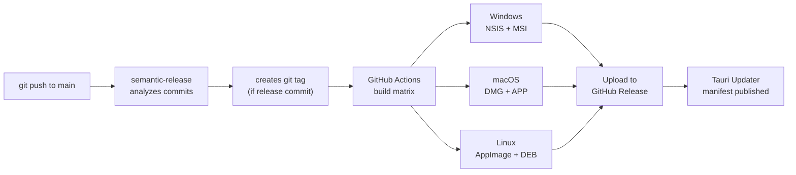

# Deployment — AI Job Hunter

AI Job Hunter is distributed as a native desktop installer built by Tauri. There is no server to deploy — the entire app runs on the end user's machine.

---

## Build Targets

| Platform | Output Format                          | Location                                    |
| -------- | -------------------------------------- | ------------------------------------------- |
| Windows  | NSIS installer (`.exe`) + MSI (`.msi`) | `src-tauri/target/release/bundle/nsis/`     |
| macOS    | App bundle (`.app`) + DMG (`.dmg`)     | `src-tauri/target/release/bundle/macos/`    |
| Linux    | AppImage (`.AppImage`) + DEB (`.deb`)  | `src-tauri/target/release/bundle/appimage/` |

---

## Building Locally

### Prerequisites

Same as [DEVELOPMENT.md](DEVELOPMENT.md), plus platform-specific:

**Windows**: Visual Studio Build Tools + WebView2 Runtime  
**macOS**: Xcode Command Line Tools (`xcode-select --install`)  
**Linux**: `libwebkit2gtk-4.1-dev`, `libssl-dev`, `libayatana-appindicator3-dev`

```bash
# Ubuntu/Debian
sudo apt-get install libwebkit2gtk-4.1-dev libssl-dev libayatana-appindicator3-dev librsvg2-dev
```

### Build all packages then package

```bash
# 1. Build all workspace packages
pnpm build

# 2. Create platform-specific installers
pnpm package
```

Or combined:

```bash
pnpm build && pnpm package
```

Outputs land in `apps/tauri/src-tauri/target/release/bundle/`.

### Debug vs Release

```bash
# Debug build (faster, larger, unoptimized — for testing only)
cd apps/tauri
pnpm tauri build --debug

# Release build (optimized, signed if certificates configured)
pnpm tauri build
```

---

## Release Pipeline

Releases are **fully automated** via [semantic-release](https://semantic-release.gitbook.io/) on push to `main`.

### Commit → Version mapping

| Commit prefix                                  | Version bump    | Changelog entry |
| ---------------------------------------------- | --------------- | --------------- |
| `feat:`                                        | minor (`1.x.0`) | Yes             |
| `fix:`, `perf:`                                | patch (`1.0.x`) | Yes             |
| `BREAKING CHANGE` footer                       | major (`x.0.0`) | Yes             |
| `refactor:`, `docs:`, `chore:`, `ci:`, `test:` | none            | No              |

### Release configuration

`.releaserc.json` controls semantic-release behavior:

```json
{
  "branches": ["main"],
  "plugins": [
    "@semantic-release/commit-analyzer",
    "@semantic-release/release-notes-generator",
    "@semantic-release/changelog",
    "@semantic-release/github"
  ]
}
```

### Version sync

When semantic-release creates a new tag, a CI step automatically syncs the version to:

- `package.json` (root)
- `apps/tauri/package.json`
- `apps/tauri/src-tauri/Cargo.toml`
- `apps/tauri/src-tauri/tauri.conf.json`

**Never manually bump versions.** Commit with the correct prefix and the pipeline handles it.

---

## CI/CD Pipeline



### GitHub Actions workflow

The workflow triggers on `push` to `main` with a tag (`v*`):

1. Checkout + install pnpm + Node
2. Install Rust stable
3. `pnpm build` — builds all packages
4. `pnpm tauri build` — compiles Rust + bundles app
5. Upload artifacts to GitHub Release

---

## Auto-Update

The app checks for updates on launch via Tauri's updater plugin. The update manifest is published to GitHub Releases automatically.

### How it works

1. App starts → calls `updater.check()` via IPC
2. Tauri updater fetches the release manifest from GitHub
3. If a newer version exists → `UpdateBanner` appears in the UI
4. User clicks "Update" → `updater.downloadAndInstall()` → app restarts

### Disabling auto-update check

In `apps/tauri/src-tauri/tauri.conf.json`:

```json
{
  "plugins": {
    "updater": {
      "active": false
    }
  }
}
```

### Updater signing keys

Every release artifact the updater consumes (NSIS `.exe`, Linux `.AppImage`, macOS `.app.tar.gz`) is signed with a **minisign** key. The shipped app verifies each downloaded update against the public key baked into it.

There are exactly two halves of **one** key pair, and they must always match:

| Half        | Where it lives                                                     | Secret? |
| ----------- | ------------------------------------------------------------------ | ------- |
| Private key | GitHub secret `TAURI_SIGNING_PRIVATE_KEY` (+ `…_PASSWORD`) — signs | Yes     |
| Public key  | `plugins.updater.pubkey` in `tauri.conf.json` — verifies           | No      |

The public key is **committed in `tauri.conf.json` as the single source of truth.** CI does not inject it — `scripts/sync-tauri-version.cjs` only syncs version numbers. If the committed public key ever stops matching `TAURI_SIGNING_PRIVATE_KEY`, every shipped update fails at download with `invalid encoding in minisign data` (or a signature error), because the app cannot verify an artifact signed by an unknown key.

`scripts/verify-updater-key.cjs` runs in the release build and **fails the build before publishing** if a freshly-signed artifact's key id does not match the committed public key — so this can never silently regress.

#### Rotating the key

1. Generate a new pair: `bash scripts/generate-tauri-signing-key.sh`
2. Set the GitHub secrets `TAURI_SIGNING_PRIVATE_KEY` and `TAURI_SIGNING_PRIVATE_KEY_PASSWORD` to the new private key + password.
3. Put the matching public key (contents of `~/.tauri/ajh.key.pub`) into `plugins.updater.pubkey` in `tauri.conf.json` and commit it.
4. Cut a release. The CI guard confirms the pair matches.

> **One-time break across a rotation:** users on a build signed by the _old_ key cannot auto-update to a release signed by the _new_ key — their app only trusts the old public key. They must download and reinstall once. Every release after that auto-updates normally.

---

## Code Signing

### Windows

Signing requires a code signing certificate. Set these env vars in CI:

```
TAURI_SIGNING_PRIVATE_KEY      base64-encoded private key
TAURI_SIGNING_PRIVATE_KEY_PASSWORD
```

### macOS

Requires Apple Developer certificate:

```
APPLE_CERTIFICATE           base64-encoded .p12
APPLE_CERTIFICATE_PASSWORD
APPLE_ID                    Apple ID for notarization
APPLE_PASSWORD              App-specific password
APPLE_TEAM_ID
```

### Linux

No signing required for AppImage/DEB.

---

## App Identifier

The app identifier is set in `apps/tauri/src-tauri/tauri.conf.json`:

```json
{
  "identifier": "com.ajh.desktop"
}
```

This identifier is used for:

- OS keychain credential namespacing
- App data directory location
- macOS bundle ID
- Windows registry entries

**Do not change this** in a released app — it will cause users to lose their stored data and credentials.

---

## Data Directory

The app stores all user data in the OS app data directory:

| Platform | Path                                           |
| -------- | ---------------------------------------------- |
| Windows  | `%APPDATA%\ai-job-hunter\`                     |
| macOS    | `~/Library/Application Support/ai-job-hunter/` |
| Linux    | `~/.local/share/ai-job-hunter/`                |

Contents:

```
ai-job-hunter/
├── app.db          ← SQLite database
├── vectors/        ← LanceDB vector store
└── logs/           ← Pino log files
```

---

## Diagnostics in Production

The app includes built-in diagnostic tools accessible from Settings → Support:

- **Log export**: Downloads a ZIP of recent log files
- **Health check**: Tests Ollama connectivity, DB integrity
- **Reset tools**: Clear cache, reimport documents, factory reset

These are useful for end-user support without needing a remote logging system.
