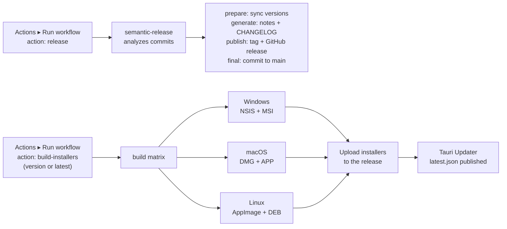

# Deployment — AI Job Hunter

Last updated: 2026-09-10

AI Job Hunter is distributed as a native desktop installer built by [Tauri][tauri]. There is no server to deploy — the entire app runs on the end user's machine.

---

## Build Targets

| Platform | Output Format                          | Location                                    |
| -------- | -------------------------------------- | ------------------------------------------- |
| Windows  | NSIS installer (`.exe`) + MSI (`.msi`) | `src-tauri/target/release/bundle/nsis/`     |
| macOS    | App bundle (`.app`) + DMG (`.dmg`)     | `src-tauri/target/release/bundle/macos/`    |
| Linux    | AppImage (`.AppImage`) + DEB (`.deb`)  | `src-tauri/target/release/bundle/appimage/` |

---

## Windows Installer Configuration

`bundle.windows` in `apps/desktop/src-tauri/tauri.conf.json` pins the Windows install behavior:

```json
{
  "bundle": {
    "windows": {
      "nsis": { "installMode": "currentUser" },
      "webviewInstallMode": { "type": "downloadBootstrapper" }
    }
  }
}
```

### `nsis.installMode: "currentUser"` — pinned per-user scope (root-cause fix)

The NSIS installer is pinned to **per-user** scope (installs into the user profile, no UAC/Administrator prompt).

**Why it matters.** Previously `bundle.windows` was absent, so the NSIS installer fell back to Tauri's default `installMode`. Because the repo also builds an **MSI** (per-machine) while the in-app updater only ever applies the **NSIS** artifact, an install and a later update could land at **different scopes / paths** (per-user vs per-machine). When that happens:

- The in-app updater swaps in the new version at the NSIS/per-user path, so the **running** app is up to date.
- The user's pinned taskbar/Start shortcuts still point at the **old** exe at the **old** (e.g. per-machine) path, which is never replaced.
- Relaunching from a pin runs the **stale** version, and the update banner reappears every launch.

Pinning `installMode: currentUser` guarantees every install **and** every update use the same installer type and the same path, so the shortcut target stays valid after an update. (Valid `installMode` values: `currentUser`, `perMachine`, `both` — we use `currentUser` as the no-UAC, auto-update-friendly choice.)

`webviewInstallMode.type: downloadBootstrapper` is the standard/stable WebView2 provisioning mode (downloads the bootstrapper at install time).

### Migration note — existing per-machine / MSI installs need a one-time clean reinstall

This config change cannot retroactively move an existing install's pinned-shortcut target. A user who **currently** has a per-machine (or MSI) install must do a **one-time clean reinstall**:

1. Uninstall the existing app (Settings ▸ Apps, or the MSI/per-machine entry).
2. Remove any stale pinned taskbar/Start shortcuts pointing at the old path.
3. Install the new per-user NSIS build and re-pin from it.

After that one reinstall, all future in-app updates apply in place and pins stay valid.

> **Maintainer recommendation (not actioned here):** the in-app updater only consumes the **NSIS** artifact, so a coexisting **MSI** target is the remaining source of "two installs on disk" / scope drift on Windows. Consider **dropping the MSI from user-facing Windows downloads** (keep NSIS as the single Windows distribution). This is a release-policy decision for the maintainer — `release.yml` targets and the `bundle.targets` MSI entry are intentionally left unchanged in this config fix.

---

## Building Locally

### Prerequisites

Same as [DEVELOPMENT.md](DEVELOPMENT.md), plus platform-specific:

**Windows**: Visual Studio Build Tools + WebView2 Runtime  
**macOS**: Xcode Command Line Tools (`xcode-select --install`)  
**Linux**: `libwebkit2gtk-4.1-dev`, `libssl-dev`, `libayatana-appindicator3-dev`

```bash
# Ubuntu/Debian
sudo apt-get install libwebkit2gtk-4.1-dev libssl-dev libayatana-appindicator3-dev librsvg2-dev
```

### Linux AppImage — Wayland + Mesa safeguard

On Wayland + Mesa (common on Steam Deck and modern Linux), the bundled `libwayland-client` in the AppImage can shadow the host's WebGL/EGL stack and crash at startup. Mitigations (environment-aware, idempotent, applied at boot) are implemented in `apps/desktop/src-tauri/src/platform/linux_appimage.rs`; the app detects the AppImage/Wayland environment automatically and requires no user configuration.

### Build all packages then package

```bash
# 1. Build all workspace packages
pnpm build

# 2. Create platform-specific installers
pnpm package
```

Or combined:

```bash
pnpm build && pnpm package
```

Outputs land in `apps/desktop/src-tauri/target/release/bundle/`.

### Debug vs Release

```bash
# Debug build (faster, larger, unoptimized — for testing only)
cd apps/desktop
pnpm tauri build --debug

# Release build (optimized, signed if certificates configured)
pnpm tauri build
```

---

## Release Pipeline

Releases are **manually triggered** via [semantic-release][semantic-release]: go to **Actions ▸ "🚀 Release" ▸ "Run workflow"**, choose `action: release`, and semantic-release will compute the version from conventional commits, sync version files, draft the notes, and create the tag + GitHub Release. Nothing runs automatically on push to `main`. Building the cross-platform **installers is a separate manual step** — run the same workflow with `action: build-installers` (the default) for a tag (see [CI/CD Pipeline](#cicd-pipeline)).

### Commit → Version mapping

| Commit prefix                                  | Version bump    | Release notes |
| ---------------------------------------------- | --------------- | ------------- |
| `feat:`                                        | minor (`1.x.0`) | Yes           |
| `fix:`, `perf:`                                | patch (`1.0.x`) | Yes           |
| `BREAKING CHANGE` footer                       | minor (`0.x.0`) | Yes           |
| `refactor:`, `docs:`, `chore:`, `ci:`, `test:` | none            | No            |

While the project stays on `0.x`, a `BREAKING CHANGE` bumps the **minor** (not major) — `release.config.mjs` maps `{ "breaking": true, "release": "minor" }` to keep the pre-1.0 line. Revisit when declaring a stable `1.0` API.

### Release configuration

`release.config.mjs` controls semantic-release behavior (ESM, so the release-notes `writerOpts.transform` can wrap the preset's transform with top-level `await` — used to append `(@login)` contributor credit for non-owner, non-bot commits). Releases execute these plugins in order:

1. `@semantic-release/commit-analyzer` — analyzes commits to determine version bump
2. `@semantic-release/release-notes-generator` — drafts release notes
3. `@semantic-release/exec` — runs `scripts/sync-tauri-version.cjs ${nextRelease.version}` to sync 7 version files
4. `@semantic-release/changelog` — writes/updates `CHANGELOG.md` at repo root
5. `@semantic-release/github` — creates GitHub Release with notes and assets
6. `@semantic-release/git` — commits the synced version files + `CHANGELOG.md` to `main` with message `chore(release): <version> [skip ci]`

See `release.config.mjs` for full plugin options.

### Version sync

Version files are synced atomically as part of the release commit, executed by semantic-release's `@semantic-release/exec` plugin during the `prepare` phase.

**Synced files** (7 total):

- `package.json` (root)
- `apps/desktop/package.json`
- `apps/extension/package.json`
- `apps/desktop/src-tauri/Cargo.toml`
- `apps/desktop/src-tauri/Cargo.lock` (the `ajh-tauri` package entry — kept in lockstep so local builds don't drift)
- `apps/desktop/src-tauri/tauri.conf.json`
- `README.md` (release badge version)

Plus `CHANGELOG.md` is generated in the same commit. The release commit (tagged at `v*`) contains all synced versions consistently.

**Never manually bump versions.** Commit with the correct prefix and the pipeline handles it.

---

## CI/CD Pipeline


```mermaid
graph LR
    Trigger1["Actions ▸ Run workflow\naction: release"] --> Analysis["semantic-release\nanalyzes commits"]
    Analysis --> Release["prepare: sync versions\ngenerate: notes + CHANGELOG\npublish: tag + GitHub release\nfinal: commit to main"]
    Trigger2["Actions ▸ Run workflow\naction: build-installers\n(version or latest)"] --> Build["build matrix"]
    Build --> Windows["Windows\nNSIS + MSI"]
    Build --> Mac["macOS\nDMG + APP"]
    Build --> Linux["Linux\nAppImage + DEB"]
    Windows & Mac & Linux --> Upload["Upload installers\nto the release"]
    Upload --> UpdateServer["Tauri Updater\nlatest.json published"]
```

### GitHub Actions workflow

`.github/workflows/release.yml`. Nothing runs automatically on push to `main` — both the release and the installer builds require a manual **Run workflow** dispatch with the appropriate `action` input.

Every uploadable installer artifact (`.exe`, `.msi`, `.dmg`, `.AppImage`, `.deb`, `.rpm`) is prefixed with its OS (`windows-`, `macos-`, or `linux-`) so the GitHub Release asset list clusters by platform; `latest.json` and the extension zips are not prefixed.

**`action: release`** — single `release` job:

1. semantic-release analyzes commits
2. If a release is warranted: exec syncs version files → changelog generates `CHANGELOG.md` → GitHub publishes release + assets → git commits the synced versions + CHANGELOG to `main` with tag `v*`
3. The tag points to the commit that contains consistent, synced versions

### Changelog

`CHANGELOG.md` is an in-repo mirror generated and maintained by semantic-release's `@semantic-release/changelog` plugin. It contains every release's version + conventional-commits-derived notes grouped by type (Features, Bug Fixes, etc.). **GitHub Releases** remain canonical — they carry the per-platform **Downloads** table and signed assets; `CHANGELOG.md` is for offline / quick-reference access.

**`action: build-installers`** — run via **Actions ▸ "🚀 Release" ▸ "Run workflow"** (macOS Intel + Apple Silicon build as two parallel matrix legs, so wall-clock is roughly the slowest single platform rather than the sum of all three):

1. Resolve the version (the `version` input, or the latest tag if left blank), then checkout that tag
2. Install pnpm + Node + Rust stable; `pnpm build:packages`
3. `pnpm tauri build` — compiles Rust + bundles installers for Windows / macOS / Linux
4. Upload installers to the release, then generate + upload `latest.json` (the auto-updater manifest)

> Manual dispatch is for **rebuilding an existing tag** (e.g. a runner flaked, or you want to re-attach assets) — it does not create a new release. Leave the version blank for the latest tag, or pass one like `0.62.0`.

### Pull-request checks & review

PRs to `main` run multiple layers (all under [`.github/workflows/`](../.github/workflows/)). **Two are required** (must pass to merge):

- **Gating: ✅ CI OK** — `ci-pipeline.yml` umbrella check encompassing lint, type-check, tests, build, Rust quality + architecture R1–R8, `cargo-deny`, dependency-review, and gitleaks secret-scan. The required functional gate.
- **Gating: 🤖 AI Review OK** — `claude-review.yml` ai-review-gate job runs automatic semantic review on every PR (unless draft) with deterministic verdict: HIGH/CRITICAL findings at confidence ≥ 0.8 block merge; fails open on infra (no outage freeze). See [`docs/knowledge/decision-records/0008-ai-review-enforcement.md`](knowledge/decision-records/0008-ai-review-enforcement.md). **Manual setup step after this PR merges:** add "🤖 AI Review OK" to the required status checks in the branch protection ruleset (same UI where "✅ CI OK" is required).

Additional advisory layers:

- **CodeRabbit** (external SaaS, free on this public repo; config in [`.coderabbit.yaml`](../.coderabbit.yaml)). Posts a PR summary + walkthrough + line-by-line review, applies area labels, and runs ESLint / Clippy / Semgrep / secret-scan / actionlint inline. **Advisory only — never blocks merge**. Its `path_instructions` mirror `.claude/review-routes.json` ownership + the `CLAUDE.md` conventions; the former `pr-review.yml` (reviewdog ESLint/Clippy + `dangerfile.ts`) and `labeler.yml` were retired in its favor.
- **Advisory checks** — `quality.yml` (typos/links/knip/i18n/a11y + Rust cargo-hack/cargo-mutants + the export-render benchmark) and `ui-checks.yml` (Playwright e2e + Lighthouse + Lost Pixel). Never block.
- **Security → Security tab** — `security.yml` consolidates CodeQL + Semgrep + OpenSSF Scorecard + the weekly npm/cargo audit (each job event-gated + least-privilege).
- **On-demand deep review — Claude** — comment `@claude review` on a PR (repo owner only) to run `claude-review.yml` tag-mode job, an agent-routed deep dive as the `.claude/agents` owner. Inert until invoked. Requires the `CLAUDE_CODE_OAUTH_TOKEN` repo secret (from `claude setup-token`); do **not** also set `ANTHROPIC_API_KEY`.

> CodeRabbit reviews **fork** PRs too (it's a GitHub App, not a `GITHUB_TOKEN` job); fork PRs hit ✅ CI OK + CodeRabbit, and 🤖 AI Review OK fail-opens on forks (no secret access) — consistent with ADR-0008's fail-open list. CodeQL **Default setup** must stay off; the advanced CodeQL job in `security.yml` conflicts with it. See [`docs/knowledge/decision-records/0003-consolidate-ci-workflows.md`](knowledge/decision-records/0003-consolidate-ci-workflows.md).

---

## Browser extension store publishing

The MV3 extension is already listed on both stores, so every release **submits a new version to an existing listing** — never creates one. Two jobs in `release.yml` do it automatically after `package-extension`, on the same `action: build-installers` dispatch (and one at a time via `action: publish-chrome` / `publish-firefox` with the tag's version, for when a single store's submission failed):

| Job               | Store            | What it submits                                                                                                 |
| ----------------- | ---------------- | --------------------------------------------------------------------------------------------------------------- |
| `publish-chrome`  | Chrome Web Store | The chrome zip `package-extension` built, uploaded **and** published (= submitted for review)                   |
| `publish-firefox` | Firefox AMO      | The firefox zip, plus the mandatory reviewable **source archive** (`apps/extension/scripts/source-archive.mjs`) |

Both consume the zips as a workflow artifact from `package-extension`, so what reaches a store is built from the same files as what is attached to the GitHub Release, never a rebuild. (Chrome gets that zip verbatim; `web-ext` re-zips the directory for AMO, so the submitted xpi is file-for-file rather than byte-for-byte identical.) They are independent of each other and nothing else `needs:` them — one store failing blocks neither the other store nor the rest of the release fan-out.

**A green job means "submitted for review", never "live".** Approval is a human step at Google/Mozilla that lands hours to days later; the jobs deliberately do not wait for it.

Before submitting, `publish-firefox` unpacks the source archive it just built, runs the archive's own documented build commands and byte-compares the result against the shipped package. AMO reviewers do exactly this and pull add-ons that fail it, so a mismatch fails the job **before** anything is uploaded. If it ever goes red, fix the non-determinism in the build (a leaked absolute path or timestamp is the usual cause) — do not loosen the comparison.

Both submission CLIs are lockfile-pinned, and neither is **installed** in a step that carries a store credential: the Chrome one is a devDependency of `@ajh/extension`, and `web-ext` lives in its own isolated npm project at `apps/extension/tools/amo/`, pinned by a lockfile outside the pnpm workspace and tracked by its own Dependabot entry.

Be plain about the boundary: **running either CLI executes its whole third-party dependency tree with the matching store credential in that step's environment.** `web-ext sign` is the sharper case — the AMO key it carries can publish a Mozilla-signed version of every add-on on the account. Nothing here removes that exposure and nothing can, short of a first-party uploader; it is an **accepted residual risk**. What the setup bounds is its shape: one credential-carrying step per store, a tree pinned by integrity hash so it cannot change under us between releases, and lifecycle scripts disabled at install. `apps/extension/tools/amo/README.md` is the full statement, along with which advisories are accepted and how to bump the pin.

### Repository secrets

All required; each job's first step (`🔐 Check … credentials` in `release.yml`, which owns the authoritative list) checks its own set and fails naming the missing one, so a misconfiguration never surfaces as an opaque 401. The Chrome **item id** is deliberately not a secret — it is public, and is an `env` constant in the job.

| Secret                                                    | Where it comes from                      |
| --------------------------------------------------------- | ---------------------------------------- |
| `CWS_CLIENT_ID`, `CWS_CLIENT_SECRET`, `CWS_REFRESH_TOKEN` | One-time OAuth setup, below              |
| `CWS_PUBLISHER_ID`                                        | Chrome Developer Dashboard → **Account** |
| `AMO_JWT_ISSUER`, `AMO_JWT_SECRET`                        | AMO → **Manage API Keys**                |

#### One-time Chrome Web Store credential setup

1. Create (or reuse) a Google Cloud project and **enable the Chrome Web Store API** on it.
2. Add an **OAuth client** of type **Desktop app**.
3. Run `npx chrome-webstore-upload-keys` **signed in as the Google account that owns the listing** (2-step verification must be on) and paste the client id/secret; it returns the refresh token.
4. The OAuth **consent screen must not be left in "Testing"** — a testing-mode refresh token dies after **7 days**. Set it to Internal, or External + Production.
5. Copy the **Publisher ID** from the Developer Dashboard's Account page (the v2 API addresses items as `publishers/<id>/items/<item id>`; the extension id alone is not enough).

#### One-time AMO credential setup

Generate a JWT issuer + secret on the AMO **Manage API Keys** page with the account that owns the add-on. The secret is shown once.

### Known failure modes

- **An open manual draft blocks Chrome.** The API refuses to act while an unsubmitted draft edit is pending in the dashboard. Submit or discard it, then re-run.
- **The version must increase.** Chrome rejects an upload whose manifest version is not higher than the published one. The extension version is bumped for every app release by `scripts/sync-tauri-version.cjs`, so this only bites when re-running a release for an already-submitted tag — which is why a failed single store is re-run with its own `publish-*` action rather than the whole `build-installers`.
- **A Chrome refresh token expires after 6 months unused** (and after 7 days if the consent screen was left in Testing). Symptom: `invalid_grant`. Re-run the key generator.
- **An AMO source-archive mismatch is a rejection**, and a repeat offence gets the add-on taken down. The reproducibility gate exists to catch it in CI instead.
- **Missing secrets fail the job by design.** Until all six exist, every release run shows two red jobs and no submission happens. Nothing else in the release is affected.
- **Both jobs run the tag's own code**, so re-running `build-installers` against a tag cut _before_ store publishing existed fails them (the publish tooling is not in that tag's lockfile or scripts). Expected; ignore it, or dispatch only for tags from this feature onward.

---

## Microsoft Store (MSIX)

A second **flavour** of the Windows build, not a second build: the MSIX wraps the very same `ajh-tauri.exe` the NSIS installer ships. Tauri has no MSIX bundle target, so the packaging is ours — manifest template in [`apps/desktop/src-tauri/windows/msix/AppxManifest.xml`](../apps/desktop/src-tauri/windows/msix/AppxManifest.xml) (commented element by element: every capability and extension carries its own WHY), packer in [`apps/desktop/scripts/pack-msix.mjs`](../apps/desktop/scripts/pack-msix.mjs) (its header comment documents the inputs, the staging layout and the output naming), wired into the Windows leg of `release.yml` by the MSIX pack + upload steps. Why the flavour exists at all, and what was rejected on the way: [ADR-049](knowledge/decision-records/adr-049-microsoft-store-msix-flavour.md).

Which container is running is a **runtime** question, not a build flag — one binary, two containers. `platform::msix` owns that decision and the closed set of behaviours that follow from it; the module's own doc comment is that list, with the reasoning at each symbol. In outline: the Store owns updating (a packaged build never checks and never polls — `updater::…`), the manifest owns protocol registration and launch-at-login (the runtime equivalents are skipped in `lib.rs` / `commands::system`), and the path this build publishes about itself comes from `platform::msix::published_exe_path` rather than `current_exe()` — consumed by `extension_bridge::register` for the browser native-messaging host and by `platform::config::agent_cli_exe_path` for the agent-CLI pointer.

That last one has a third answer worth knowing operationally. `current_exe()` inside a package is a `…\WindowsApps\` path a normal user cannot execute from, whose name carries the package **version**, so anything that RECORDS it dangles after the next Store update; the execution-alias shim is the stable substitute. **When no usable shim exists** — a user can switch an execution alias off in Settings ▸ Apps ▸ App execution aliases — the packaged build publishes **nothing**: the native-messaging registration and the agent-CLI pointer are **skipped**, not written with `current_exe()` and not deleted (existing manifests may belong to a working non-Store install on the same machine). Symptom: on that install the extension's native-messaging path and `ajh-tauri agent` discovery stop working until the alias is re-enabled, and `platform::msix` logs a warning saying so.

Everything else is deliberately identical. The manifest disables registry and file-system write virtualization — what the restricted capability it declares buys — so the native-messaging registration under HKCU and the app data directory are the same real locations a non-Store install uses, and a user can switch flavours and keep their data. The corollary of those real writes is that the packaged build must NOT re-register what the manifest already owns, which is what the skips above are for.

> **WebView2 is a certification risk, not just a note.** The MSIX cannot run the Evergreen bootstrapper the NSIS installer uses. Windows 11 has the runtime built in, but a clean Windows 10 at the manifest's `MinVersion` floor (`TargetDeviceFamily` in `AppxManifest.xml`) without it launches the app into a dead webview — which is exactly what a certification tester on a fresh VM would see. Say so in the Partner Center **tester notes**.

### Package identity (repository variables)

Identity is assigned by Partner Center, so it is **not committed**. It reaches the packer as environment variables — read from Partner Center ▸ **Product management ▸ Product identity**, supplied in CI as repository variables (Settings ▸ Secrets and variables ▸ Actions ▸ Variables). The names, which Partner Center field each one carries and the validation applied to them are `IDENTITY_VARS` / `readIdentity` in `apps/desktop/scripts/pack-msix.mjs`; a missing or malformed one is a named error, not a silent bad package.

The MSIX steps in `release.yml` are gated on **all** of the identity variables being set, so the pipeline is unaffected until the listing exists — a partial set means "no MSIX this release", never "no release".

### Local test loop

1. `pnpm --filter @ajh/desktop package` (or any `tauri build`) so the exe exists.
2. Set the identity variables and run `node apps/desktop/scripts/pack-msix.mjs`. It needs `makeappx.exe` from the Windows SDK; its header comment lists the env overrides (SDK discovery, the staged executable, the output root) and it prints where it staged and wrote.
3. Enable **Developer Mode**, then register the staged layout directly — faster than installing, and it exercises the manifest: `Add-AppxPackage -Register <staging>\AppxManifest.xml`.
4. `Get-AppxPackage *<identity name>*` to confirm, `Remove-AppxPackage <full-name>` to clean up.

Registering the staged app is the only way to see the packaged-identity code path locally: `platform::msix::is_packaged()` answers "not packaged" for every normally-launched build.

**Verify these three while it is registered — they are the parts nothing in CI can prove** (they need a real registered package, so treat them as unverified until someone runs them):

1. **Native messaging.** Launch the registered app, then open the browser extension and let it connect. It reaches the app through the manifest written from the alias path; if that path were wrong the browser would fail to spawn the host.
2. **The CLI alias.** From a plain shell, `cd` into an empty scratch directory and run `ajh-tauri agent --help`, then a real verb. Two things are under test: that the alias resolves at all, and that the shim preserves the console and the working directory — anything the CLI writes relative to `.` must land in that scratch directory, not somewhere under the package.
3. **Launch at login.** Toggle it in Settings, then check **Settings ▸ Apps ▸ Startup** shows the app; toggle it off there and confirm the app's own toggle reports the refusal instead of silently flipping back on.

### Automated submission

The `.msix` is **unsigned on purpose** — the Store signs it during submission — which is why it is a workflow **artifact** of the `build-installers` run and never a GitHub Release asset.

The `publish-msstore` job in `release.yml` uploads it and submits it for review via the [`msstore` CLI](https://learn.microsoft.com/windows/apps/publish/msstore-dev-cli/overview), authenticating with a Microsoft Entra app registration (Manager role, required by the CLI) linked to the Partner Center account. Credentials are repository secrets — `MSSTORE_TENANT_ID`, `MSSTORE_CLIENT_ID`, `MSSTORE_CLIENT_SECRET`, `MSSTORE_SELLER_ID` — missing any of them fails the job by name rather than the release. There is no single-store re-run action for this one (see the job's own comment for why); a failed submission is retried by re-running `build-installers`.

**One-time setup**, if the app registration or its secret ever needs recreating:

1. Entra admin center ▸ **App registrations** ▸ New registration (single tenant), then **Certificates & secrets** ▸ new client secret — copy the value immediately, it is shown once.
2. Partner Center ▸ **Account settings** ▸ **User management** ▸ **Microsoft Entra applications** ▸ add the app, role **Manager(Windows)** (not Developer — the CLI's `submission publish` needs it).
3. Partner Center ▸ **Account settings** ▸ **Legal info** ▸ **Publisher IDs** has the Seller ID.
4. Set the four secrets above from those values (tenant/client ID from the app registration's Overview page).

**Submission options and tester notes are one-time, set in the Partner Center listing itself**, not per-release: the restricted-capability justification (the app registers a browser **native-messaging host under HKCU**, read from the real hive rather than a virtualized copy, and shares its data directory with the non-Store install so users can move between flavours without losing data) and the WebView2 prerequisite note below. Certification for a full-trust desktop app is manual on Microsoft's side and can take a few days regardless of how the submission was filed.

> **Uninstall leaves per-user traces.** Removing the package removes the app, its `StartupTask` and its execution alias — but not the files and keys the app itself wrote outside the package: the browser native-messaging host manifests (JSON + their HKCU entries) and the agent-CLI pointer file. That is the direct consequence of disabling write virtualization, and it is the same behaviour the NSIS build has. They are inert once the app is gone (they name a path that no longer resolves) and are overwritten on the next launch of either flavour.

---

## Snap Store

A second **flavour** of the Linux build, not a second build: the Snap wraps the same `ajh-tauri` binary already built by the `build` job. Packaging manifest in [`apps/desktop/src-tauri/linux/snap/snapcraft.yaml`](../apps/desktop/src-tauri/linux/snap/snapcraft.yaml), the submission process is manual (one-time: `snapcraft register` + `snapcraft export-login` to set the `SNAPCRAFT_STORE_CREDENTIALS` secret).

Which container is running is a **runtime** question: `platform::snap::is_packaged()` checks whether the running exe lives under the `$SNAP` directory. A Snap build shares the same runtime detection and behaviour-difference pattern as the MSIX flavour — the Store owns updating (never checks), the app skips native-messaging-host registration (sandboxes have no usable solution even with breakaway processes), and launch-at-login is delegated to the manifest's `autostart` interface. See [ADR-049](knowledge/decision-records/adr-049-microsoft-store-msix-flavour.md) for the full decision; that ADR now covers all three packaged flavours.

### Submission and automation

The `publish-snap` job in `release.yml` publishes to the Snap Store's **`edge` channel only** — never auto-promoted to `stable`. Approval and promotion to `stable` remain manual, as the Store's own review process and versioning strategy require. The job is wired as a standalone dispatch option (the same model as `publish-chrome`/`publish-firefox` for store-specific re-runs); see the job's own comment and implementation in `.github/workflows/release.yml` for the full details. Before the job runs, `scripts/sync-snapcraft.cjs` (mirrors `sync-cask.cjs`'s job) bumps the Snap manifest's `version` field to match the release version.

### Local test loop

The Snap build requires snapcraft and a real `$SNAP` environment; it cannot be tested on the primary Windows dev machine. Testing must occur on Linux/WSL:

```bash
# 1. Build the .deb first (prerequisite)
pnpm --filter @ajh/desktop package

# 2. Build the snap (uses the .deb from above)
cd apps/desktop/src-tauri/linux/snap
snapcraft --use-lxd  # or --destructive-mode if lxd unavailable
```

The snapcraft manifest uses the `dump` plugin to reuse the built `.deb` rather than rebuilding from source — a deliberate deviation from Tauri's standard Snapcraft guide.

---

## Flathub

A third **flavour** of the Linux build, not a second build: the Flathub package wraps the same `ajh-tauri` binary. Packaging manifest in [`apps/desktop/src-tauri/linux/flatpak/io.github.saeedkolivand.AIJobHunter.yml`](../apps/desktop/src-tauri/linux/flatpak/io.github.saeedkolivand.AIJobHunter.yml), with companion files `.desktop`, `.metainfo.xml`, and auto-generated vendor sources (`cargo-sources.json`, `node-sources.json`).

Which container is running is a **runtime** question: `platform::flatpak::is_packaged()` checks for the `/.flatpak-info` file. A Flatpak build shares the same runtime detection and behaviour-difference pattern as MSIX/Snap — Store owns updating, native-messaging-host registration is skipped (no usable solution even with sandboxed helpers), and launch-at-login is delegated to the manifest's Background portal. See [ADR-049](knowledge/decision-records/adr-049-microsoft-store-msix-flavour.md) for the full decision; that ADR now covers all three packaged flavours.

### Submission and automation

The Flathub submission process requires a one-time manual step: the user must create a fork of the external `flathub/flathub` repository and file a pull request per Flathub's submission workflow. Do not hardcode stale submission steps as fact — verify against Flathub's current live documentation when that step is undertaken.

The `update-flathub` job in `release.yml` pins the Flatpak manifest's git tag, regenerates the two vendor-sources files (`cargo-sources.json`, `node-sources.json` — ~1.6MB combined, regenerated per-release by CI), syncs the AppStream release entry in the metainfo file, and pushes all three to the external fork, which must exist first (a GitHub-app-verified fork; the job skips quietly with a warning if `FLATHUB_DEPLOY_KEY` is unset, since the Flathub submission has not been reviewed/merged yet). `scripts/sync-snapcraft.cjs` is a separate tool used only by the `publish-snap` job to bump the Snap manifest's version.

### Known open risk — pnpm offline bootstrap

Flathub requires **fully offline, vendored builds** with no network access to package registries. Flathub's buildbot will have no network stack. The manifest mitigates pnpm's registry metadata fetches with `pnpm config set minimum-release-age 0` and `pnpm config set fetch-retries 0`, both confirmed necessary in a real local flatpak-builder test run. However:

- **Not fully verified end-to-end.** WSL testing proved core mechanics (git+tag source fetch, cargo vendoring, node-sources vendoring, GNOME 49 SDK/runtime resolution, pnpm bootstrapping via vendored tarball) individually, but a clean full build inside flathub-builder's truly absent network was **not achieved** — the WSL test with flaky/slow DNS eventually timed out rather than completing. The refusals Flathub's buildbot encounters (network genuinely absent, failing fast rather than slow-retrying) are unconfirmed.
- **Belongs in the manifest itself, not in code.** This is a build-system limitation with workarounds already in place; if it resurfaces, the fix stays in `flatpak/io.github.saeedkolivand.AIJobHunter.yml`.

Verify the build end-to-end on Flathub's actual buildbot once the submission reaches that stage.

### Local test loop

Flathub requires flatpak-builder and a Linux system; it cannot be tested on the primary Windows dev machine. Testing must occur on Linux/WSL:

```bash
# 1. Install flatpak and flatpak-builder
sudo apt-get install flatpak flatpak-builder

# 2. Add flathub remote
flatpak remote-add --if-not-exists flathub https://flathub.org/repo/flathub.flatpakrepo

# 3. Build the flatpak
cd apps/desktop/src-tauri/linux/flatpak
flatpak-builder --user --install build-dir io.github.saeedkolivand.AIJobHunter.yml
```

The build is fully offline once GNOME runtime/SDK are installed locally; network is only needed for their first-run fetch. The pnpm registry metadata problem (see "Known open risk" above) is mitigated with the config settings in the manifest, but a genuinely clean, zero-network end-to-end build is still pending verification against the real Flathub buildbot.

---

## Auto-Update

The app checks for updates on launch via Tauri's updater plugin. The update manifest is published to GitHub Releases automatically. **Not on a Microsoft Store install** — that flavour never reaches any of this; see § Microsoft Store (MSIX).

### How it works

1. App starts → calls `updater.check()` via IPC
2. Tauri updater fetches the release manifest from GitHub
3. If a newer version exists → `UpdateBanner` appears in the UI
4. User clicks "Update" → `updater.downloadAndInstall()` → app restarts

### Disabling auto-update check

In `apps/desktop/src-tauri/tauri.conf.json`:

```json
{
  "plugins": {
    "updater": {
      "active": false
    }
  }
}
```

### Updater signing keys

Every release artifact the updater consumes (NSIS `.exe`, Linux `.AppImage`, macOS `.app.tar.gz`) is signed with a **minisign** key. The shipped app verifies each downloaded update against the public key baked into it.

There are exactly two halves of **one** key pair, and they must always match:

| Half        | Where it lives                                                     | Secret? |
| ----------- | ------------------------------------------------------------------ | ------- |
| Private key | GitHub secret `TAURI_SIGNING_PRIVATE_KEY` (+ `…_PASSWORD`) — signs | Yes     |
| Public key  | `plugins.updater.pubkey` in `tauri.conf.json` — verifies           | No      |

The public key is **committed in `tauri.conf.json` as the single source of truth.** CI does not inject it — `scripts/sync-tauri-version.cjs` only syncs version numbers. If the committed public key ever stops matching `TAURI_SIGNING_PRIVATE_KEY`, every shipped update fails at download with `invalid encoding in minisign data` (or a signature error), because the app cannot verify an artifact signed by an unknown key.

`scripts/verify-updater-key.cjs` runs in the release build and **fails the build before publishing** if a freshly-signed artifact's key id does not match the committed public key — so this can never silently regress.

#### Rotating the key

1. Generate a new pair: `bash scripts/generate-tauri-signing-key.sh`
2. Set the GitHub secrets `TAURI_SIGNING_PRIVATE_KEY` and `TAURI_SIGNING_PRIVATE_KEY_PASSWORD` to the new private key + password.
3. Put the matching public key (contents of `~/.tauri/ajh.key.pub`) into `plugins.updater.pubkey` in `tauri.conf.json` and commit it.
4. Cut a release. The CI guard confirms the pair matches.

> **One-time break across a rotation:** users on a build signed by the _old_ key cannot auto-update to a release signed by the _new_ key — their app only trusts the old public key. They must download and reinstall once. Every release after that auto-updates normally.

---

## Code Signing

### Windows

Signing requires a code signing certificate. Set these env vars in CI:

```
TAURI_SIGNING_PRIVATE_KEY      base64-encoded private key
TAURI_SIGNING_PRIVATE_KEY_PASSWORD
```

### macOS

Requires Apple Developer certificate:

```
APPLE_CERTIFICATE           base64-encoded .p12
APPLE_CERTIFICATE_PASSWORD
APPLE_ID                    Apple ID for notarization
APPLE_PASSWORD              App-specific password
APPLE_TEAM_ID
```

### Linux

No signing required for AppImage/DEB.

---

## App Identifier

The app identifier is set in `apps/desktop/src-tauri/tauri.conf.json`:

```json
{
  "identifier": "com.ajh.desktop"
}
```

This identifier is used for:

- OS keychain credential namespacing
- App data directory location
- macOS bundle ID
- Windows registry entries

**Do not change this** in a released app — it will cause users to lose their stored data and credentials.

---

## Data Directory

The app stores all user data in the OS app data directory:

| Platform | Path                                             |
| -------- | ------------------------------------------------ |
| Windows  | `%APPDATA%\com.ajh.desktop\`                     |
| macOS    | `~/Library/Application Support/com.ajh.desktop/` |
| Linux    | `~/.local/share/com.ajh.desktop/`                |

Contents:

```
com.ajh.desktop/
├── documents.db    ← imported docs + embedding vectors (vectors/posting_vectors/match_scores tables)
├── jobs.db         ← scraped/tracked jobs  (+ applications.db, ai_generations.db, job_preferences.db,
│                     contact_profile.db, referrals.db, pipeline_cache.db — one SQLite file per domain)
└── logs/           ← log files
```

There is **no** single `app.db` and **no** LanceDB `vectors/` store — vectors live in the
`vectors` table of `documents.db` (in-process cosine in Rust).

---

## Diagnostics in Production

The app includes built-in diagnostic tools accessible from Settings → Support:

- **Log export**: Downloads a ZIP of recent log files
- **Health check**: Tests Ollama connectivity, DB integrity
- **Reset tools**: Clear cache, reimport documents, factory reset

These are useful for end-user support without needing a remote logging system.

[tauri]: https://tauri.app
[semantic-release]: https://github.com/semantic-release/semantic-release
