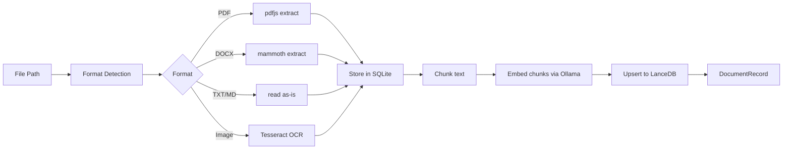

# Patterns — AI Job Hunter

Last updated: 2026-06-22

This document describes the recurring architectural and implementation patterns used throughout the codebase. Understanding these patterns is essential for contributing consistently.

---

## 1. IPC Pattern: Renderer → Rust

Every renderer ↔ Rust interaction follows a strict layered pattern.

### The Four Layers

```
React Component
    ↓
Service Hook (React Query)       apps/tauri/src/renderer/services/
    ↓
AppClient method                 apps/tauri/src/renderer/lib/app-client.ts
    ↓
IPC Contract                     packages/shared/src/ipc/contracts/
    ↓
Tauri Invoke / Listen            Tauri bridge
    ↓
Rust Command Handler             apps/tauri/src-tauri/src/commands/
```

### Adding a New IPC Capability

Follow this checklist in order:

**1. Define the contract** (`packages/shared/src/ipc/contracts/myfeature.ts`):

```typescript
export interface MyFeatureContract {
  getData(id: string): Promise<MyData>;
  onUpdate(handler: (data: MyData) => void): Unsubscribe;
}
```

**2. Implement the Rust command** (`apps/tauri/src-tauri/src/commands/`):

```rust
#[tauri::command]
pub async fn my_feature_get_data(id: String, state: State<'_, AppState>) -> Result<MyData, String> {
    state.my_feature.get_data(&id).await.map_err(|e| e.to_string())
}
```

**3. Wire the invoke call** (`apps/tauri/src/tauri-client.ts`):

```typescript
myFeature: {
  getData: (id) => invoke("my_feature_get_data", { id }),
  onUpdate: (handler) => listen("my_feature:update", (e) => handler(e.payload)),
}
```

**4. Create the service hook** (`apps/tauri/src/renderer/services/use-my-feature.ts`):

```typescript
export function useMyData(id: string) {
  return useQuery({
    queryKey: queryKeys.myFeature.data(id),
    queryFn: () => appClient.myFeature.getData(id),
  });
}
```

**5. Add query keys** (`services/query-client.ts`):

```typescript
myFeature: {
  data: (id: string) => ["myFeature", "data", id] as const,
}
```

---

## 2. React Query Service Hook Pattern

All server state (anything from IPC) goes through [TanStack Query][tanstack-query]. Never `useState + useEffect` for remote data.

### Query Hook

```typescript
// services/use-jobs.ts
export function useJobs(filters?: JobFilters) {
  const client = useAppClient();
  return useQuery({
    queryKey: queryKeys.jobs.list(filters),
    queryFn: () => client.jobs.list(filters),
    staleTime: 5 * 60 * 1000,
  });
}
```

### Mutation Hook

```typescript
export function useDeleteJob() {
  const client = useAppClient();
  const queryClient = useQueryClient();

  return useMutation({
    mutationFn: (id: string) => client.jobs.delete(id),
    onSuccess: () => {
      queryClient.invalidateQueries({ queryKey: queryKeys.jobs.lists() });
    },
  });
}
```

### Streaming / Subscription Hook

```typescript
export function useAiStream(generationId: string | null) {
  const client = useAppClient();
  const [delta, setDelta] = useState('');

  useEffect(() => {
    if (!generationId) return;
    const unsub = client.ai.onStream((chunk) => {
      if (chunk.id === generationId) {
        setDelta((prev) => prev + chunk.delta);
      }
    });
    return unsub;
  }, [generationId, client]);

  return delta;
}
```

---

## 3. State Machine Pattern

Flows with 3+ states use the minimal state machine from `lib/machine.ts`.

### Defining a Machine

```typescript
// lib/machines/generation-machine.ts
import { defineMachine } from '@/lib/machine';

export type GenerationState =
  | 'idle'
  | 'configuring'
  | 'generating'
  | 'extracting'
  | 'done'
  | 'error';
export type GenerationEvent = 'start' | 'generate' | 'extract' | 'complete' | 'fail' | 'reset';

export const generationMachine = defineMachine<GenerationState, GenerationEvent>({
  initial: 'idle',
  transitions: {
    idle: { start: 'configuring' },
    configuring: { generate: 'generating', reset: 'idle' },
    generating: { extract: 'extracting', fail: 'error', reset: 'idle' },
    extracting: { complete: 'done', fail: 'error' },
    done: { reset: 'idle' },
    error: { reset: 'idle' },
  },
  busyStates: ['generating', 'extracting'],
  errorStates: ['error'],
});
```

### Using a Machine in a Component

```typescript
import { useMachine } from "@/hooks/use-machine";
import { generationMachine } from "@/lib/machines/generation-machine";

function GenerationPanel() {
  const [state, send] = useMachine(generationMachine);

  return (
    <>
      {state === "idle" && <Button onClick={() => send("start")}>Configure</Button>}
      {state === "generating" && <StreamingText text={delta} />}
      {state === "error" && <ErrorState retry={() => send("reset")} />}
    </>
  );
}
```

**Rule**: Use a machine whenever you have 3+ distinct UI states that transition in a defined order.

---

## 4. AI Streaming Pattern

Streaming generation uses [Tauri][tauri]'s event system rather than a promise.

### Frontend Flow

```typescript
// 1. Start generation (returns a generationId immediately)
const { generationId } = await client.ai.generate(req);

// 2. Subscribe to stream events
const unsub = client.ai.onStream((chunk) => {
  if (chunk.id !== generationId) return;
  if (chunk.done) {
    unsub();
    send('extract'); // state machine transition
  } else {
    appendDelta(chunk.delta);
    if (chunk.thinking) {
      appendThinking(chunk.thinking);
    }
  }
});
```

### StreamChunk Type

```typescript
interface StreamChunk {
  id: string; // generationId
  delta: string; // text fragment
  done: boolean; // final chunk marker
  thinking?: string; // reasoning content — present for any provider that exposes it
}
```

### Thinking normalization at the boundary

`thinking` is normalized **at the provider-adapter boundary**, never in the renderer. Each adapter maps its provider-specific reasoning format (OpenAI `reasoning_content`/`reasoning`, Gemini `thought:true` parts, Ollama structured `message.thinking`) to the single `thinking` field. For providers that emit reasoning inline as `<think>…</think>` tags, the shared `createThinkSplitter` (`lib/generate/think-split.ts`) splits the stream — zero per-provider branching in rendering code.

### ThinkingBubble Component

When `chunk.thinking` is present, render it in a collapsible `ThinkingBubble` component (`features/ai-generate/components/ThinkingBubble/`) before the main output. The component is provider-agnostic.

### Generation-session store

All in-flight and completed generation sessions are held in a single [Zustand][zustand] store at `store/generation-store/`, keyed by a context id (e.g. autopilot job id). It survives navigation and panel close so the Apply modal can display an ongoing or finished generation without re-triggering it. This is the **sole** source of truth for generation state app-wide — do not duplicate this in local component state or React Query.

### Activity indicator (live job queue)

The dashboard footer and StatusBar render live-running and queued jobs via `useWorkerActivity()` (hook: `services/use-jobs/use-jobs.ts`). The hook derives activity state from two sources:

1. **`useJobs()`** — React Query list subscription
2. **`useJobsOnEvent()`** — real-time event listener (job started/completed)

The hook combines both to compute `running` and `queued` counts, emitting a live `ActivityStatus`. This replaced the static `CapabilityProvider` + `health.workers` pattern:

```typescript
// services/use-jobs/use-jobs.ts
export function useWorkerActivity() {
  const jobs = useJobs(); // TanStack Query subscription
  const events = useJobsOnEvent(); // live events from Tauri listener

  const running = jobs.data?.filter((j) => j.status === 'running').length ?? 0;
  const queued = jobs.data?.filter((j) => j.status === 'queued').length ?? 0;

  return { running, queued };
}
```

**Used in:**

- `components/layout/StatusBar/` — inline activity badge (HoverPopover shows details)
- `features/dashboard/components/AISystemStatus/` — activity panel

The pattern keeps activity derived and reactive, eliminating stale `system_health` reads.

---

## 5. Document Import Pattern

Document processing is a pipeline of async stages, each emitting progress events.



---

## 6. Hybrid Search Pattern

Search combines vector similarity (semantic) with SQL filters (keyword/metadata):

```typescript
// packages/shared/src/ipc/contracts/search.ts
interface HybridSearchRequest {
  query: string;
  collection: 'jobs' | 'resumes' | 'skills' | 'conversations';
  topK: number; // 1–200
  semanticWeight: number; // 0 = pure keyword, 1 = pure semantic
  filters?: Record<string, unknown>; // SQL WHERE conditions
}
```

**Implementation order:**

1. Embed the query via [Ollama][ollama]
2. Run ANN search in LanceDB (returns top-K × 2 candidates)
3. Apply SQL filters to narrow candidates
4. Re-rank using `semanticWeight × semanticScore + (1 - semanticWeight) × keywordScore`
5. Return top-K results

---

## 7. AppClient / Mock Pattern

`AppClient` is the renderer's only gateway to the Tauri process. It is injected via React context:

```typescript
// providers/AppClientProvider.tsx
const client = createTauriInvokeClient(); // or createMockClient() in tests
<AppClientContext.Provider value={client}>{children}</AppClientContext.Provider>
```

In tests:

```typescript
import { createMockClient } from "@/lib/mock-client";

renderWithProviders(<MyComponent />, {
  client: createMockClient({
    jobs: { list: async () => mockJobs },
  }),
});
```

---

## 8. Feature Isolation Pattern

Features in `renderer/features/` are fully isolated:

```
features/
  ai-generate/
    components/        # private to this feature
    hooks/             # private hooks
    index.tsx          # single public export
  jobs/
    components/
    hooks/
    index.tsx
```

**Rules:**

- Never import from `features/foo` inside `features/bar`
- Export only the top-level component from `index.tsx`
- Internal components stay private

---

## 9. i18n Pattern

Never import `react-i18next` directly — use the package entrypoint:

```typescript
// ✅ correct
import { useTranslation } from '@ajh/translations';

// ❌ wrong — ESLint error
import { useTranslation } from 'react-i18next';
```

The `@ajh/translations` package is the canonical source for all i18n adapters (`useTranslation`, `TFunction`, `i18n` instance re-export). It owns the generic i18next singleton, language detection, resource bundles, and extraction tooling. The renderer uses a thin shim (`@/i18n/index.ts`) to attach the app-coupled `languageChanged → getClient().system.setLocale(lng)` listener — this shim is imported once in `main.tsx` for its side-effect only, never for translation imports.

Translation keys follow dot notation by feature:

```json
{
  "jobs.emptyState.title": "No jobs found",
  "aiGenerate.config.language": "Output language",
  "autopilot.status.running": "Running workflow…"
}
```

---

## 10. Credential Storage Pattern

Never store API keys or passwords in localStorage, SQLite, or env vars. Always use the keychain.

**AI provider keys** are stored via `credentials.set` internally (the `ai:*` key namespace) and cleared via factory reset. Board login uses a separate session-auth path (`boards.*` / `linkedin.*`) — there is no board-level username/password CRUD.

To check whether the OS supports encrypted storage (shows an encryption-warning banner if `false`):

```typescript
const { data: available } = useCredentialsAvailable(); // services/use-credentials
```

The [Tauri][tauri] keychain plugin encrypts secrets using the OS credential store (Windows Credential Manager, macOS Keychain, libsecret on Linux).

---

## 11. Performance Mode Pattern

Some operations (batch embedding, OCR) can be expensive. The app has three performance modes that gate parallelism:

```typescript
type PerformanceMode = 'low' | 'balanced' | 'performance';
```

| Mode          | Worker threads | Model unload delay | Batch size |
| ------------- | -------------- | ------------------ | ---------- |
| `low`         | 1              | 30s                | 4          |
| `balanced`    | 2              | 2min               | 16         |
| `performance` | 4              | 10min              | 64         |

Access the current mode via `usePerformanceMode()` from `providers/PerformanceModeProvider`.

---

## 12. Error Boundary Pattern

Wrap every route and major feature in an `ErrorBoundary`:

```typescript
import { ErrorBoundary } from "@ajh/ui";

// In route file:
export default function JobsRoute() {
  return (
    <ErrorBoundary fallback={<ErrorState title="Jobs failed to load" />}>
      <PageShell title="Jobs">
        <JobsFeature />
      </PageShell>
    </ErrorBoundary>
  );
}
```

Never swallow errors silently. If caught by boundary, log via the Pino logger and surface a recovery action.

---

## 13. Architecture Principles & Module Ownership (Rust core)

The Rust core is a **platform architecture**, not a bag of features: shared
infrastructure exists once, each module owns one concern, and expandable systems
use registries. The reference is `commands::ai_provider` + `pipeline`. The ten
principles and how each is enforced:

| #   | Principle                  | Enforcement                                                                          |
| --- | -------------------------- | ------------------------------------------------------------------------------------ |
| 1   | Single responsibility      | one module owns one concern (table below) + review                                   |
| 2   | Centralized infrastructure | shared modules (`platform::config`, `net::http`, `observability`) + CI grep bans     |
| 3   | Strict module boundaries   | path / schema / endpoint knowledge stays inside the owning module                    |
| 4   | No hidden fallbacks        | typed errors; `parse()`-style hard-fail constructors; no silent defaults             |
| 5   | Strong typing over strings | enums / discriminated unions / capability structs over magic strings                 |
| 6   | Registry-based systems     | one registration site per registry (no parallel catalog + match)                     |
| 7   | Capability-driven          | gate on capability flags, not identity (`caps.supports_x`, not `id.starts_with(..)`) |
| 8   | Unified flows              | shared HTTP / retry / timeout / trace primitives composed everywhere                 |
| 9   | Observability              | one `observability::Span` for timed `→`/`←` logging                                  |
| 10  | Isolated failure domains   | per-unit `Result`; one board/provider/parser failure never aborts the batch          |

**Module ownership** — each cross-cutting concern has exactly **one** owner; no
other module may reconstruct its logic:

| Concern                              | Owner(s)                     | Use instead of rolling your own                                                                                                                                                                                                                                                                                                              |
| ------------------------------------ | ---------------------------- | -------------------------------------------------------------------------------------------------------------------------------------------------------------------------------------------------------------------------------------------------------------------------------------------------------------------------------------------- |
| env vars, data dir, filesystem paths | `platform::config`           | `platform::config::data_dir()` — never read `AJH_DATA_DIR` or rebuild `~/.ajh` yourself                                                                                                                                                                                                                                                      |
| SQLite connections + WAL policy      | `db::open`                   | `db::open(&path)` — never `Connection::open()` directly; sets busy_timeout + WAL                                                                                                                                                                                                                                                             |
| AI provider routing + capabilities   | `commands::ai_provider`      | `resolve(ProviderId, ..)`                                                                                                                                                                                                                                                                                                                    |
| HTTP clients (TLS, pool, user-agent) | `net::http`                  | `net::http::shared()` + per-request `.timeout()`, or `build_client()` for a cookie jar — never `reqwest::Client::new/builder`                                                                                                                                                                                                                |
| timed/structured trace spans         | `observability::Span`        | `Span::begin(target, fields)` + `end`/`end_with` — never reimplement begin/elapsed/end logging (RequestTrace/StageTrace wrap it)                                                                                                                                                                                                             |
| job board scrapers                   | `scraping::boards`           | register in the `SCRAPERS` list — dispatch + catalog derive from it via the trait; never a parallel match + hardcoded array. Catalog exposed via `boards.catalog()` IPC → frontend hook `useBoardsCatalog()` → board picker (sorted by registry order; filters boards where `listed=false`). Auth tiers from `Scraper::auth()` trait method. |
| error types                          | `error::AppError`            | return `AppResult<T>` from fallible internals — never `Result<_, String>` (domain enums like `ExtractionError` add `From`)                                                                                                                                                                                                                   |
| anti-abuse rate + concurrency        | `limits` + `scraping/engine` | apply `RateLimited` error on `ai_generate`/`scrape_*` commands via the limiter; per-provider daily ceiling + concurrent-op bounds. Multi-board `scrape_boards` enforces `MAX_BOARDS_PER_BATCH = 6` server-side cap in the engine (CWE-770 defense).                                                                                          |
| workflow orchestration               | `pipeline`                   | compose `Stage`/`Pipeline`                                                                                                                                                                                                                                                                                                                   |

**Adding capability is uniform** — one implementation file + one registration:

- New AI provider → 1 client module + 1 `ProviderId` arm + 1 `resolve` arm.
- New job board → 1 scraper module + 1 line in the `SCRAPERS` list.
- New exporter / parser / integration → register in its registry; compose
  `net::http`, `error::AppError`, `observability::Span`, `platform::config`.

These boundaries are **machine-enforced**. `apps/tauri/src-tauri/tests/architecture.rs`
(run by the `quality-checks` CI job, superseding the old grep guardrails) codifies the
layer model + ownership as versioned tests with explicit, dead-entry-guarded allowlists.
See [architecture-rules.md](architecture-rules.md) (the formal contract, rules R1–R8) and
[architecture-analysis.md](architecture-analysis.md) (the discovery report it derives
from). Among what it enforces: `#[tauri::command]` only in the shell layer; no Tauri below
it; `std::env::var` only in `platform/**`; `reqwest::Client::new/builder` only in
`net/http.rs`; no `Result<_, String>` outside `error.rs`; and no upward cross-layer imports.

---

## 14. Database Transactions & Atomicity (Rust core)

All multi-step SQLite operations must be wrapped in transactions to prevent partial writes and corruption on crash.

**Open connections via `db::open(path)` (defined in `src/db.rs`), never `Connection::open()`:**

```rust
// ✅ correct
let conn = db::open(&path)?;

// ❌ wrong
let conn = Connection::open(&path)?;
```

`db::open` ensures:

- WAL mode (`PRAGMA journal_mode = WAL`) for durability + fast reads during writes
- 5-second busy timeout (`PRAGMA busy_timeout = 5000`) to avoid "database is locked" on concurrent access
- Consistent policy across the codebase

**Wrap multi-step operations in transactions:**

```rust
// ✅ atomic import
let tx = conn.transaction()?;
{
    // pre-validate all data
    // clear table
    tx.execute("DELETE FROM applications", [])?;
    // re-populate
    for app in &data {
        tx.execute("INSERT INTO applications ...", [...])?;
    }
}
tx.commit()?;

// ✅ atomic status + history
let tx = conn.transaction()?;
tx.execute("UPDATE run SET status = ?1", params![status])?;
tx.execute("INSERT INTO run_history ...", params![...])?;
tx.commit()?;
```

This pattern applies to:

- `ai_generations::import` (clear + repopulate)
- `applications::import` (clear + repopulate)
- Any status-write that also records a history event
- Migrations (body + `PRAGMA user_version` bump)

**Map SQLite errors to `AppError::Storage`:**

```rust
// ✅ correct
let conn = db::open(&path).map_err(|e| AppError::Storage(e.to_string()))?;

// ❌ wrong
let conn = Connection::open(&path).map_err(|e| format!("db error: {}", e))?;
```

See ADR-022 for the full rationale.

---

## 15. Responsive Layout Conventions (Window Resize)

The app is a resizable desktop window with a hard floor of **900px × 600px** and no mobile breakpoints. The Tailwind breakpoints `sm` (640px) and `md` (768px) are always active, so **only `lg` (1024px), `xl` (1280px), and `2xl` (1536px)** plus **container queries** actually toggle layout on resize.

### Window Envelope

Set in `apps/tauri/src-tauri/tauri.conf.json`:

```json
{
  "app": {
    "windows": [
      {
        "width": 1280,
        "height": 800,
        "minWidth": 900,
        "minHeight": 600,
        "resizable": true
      }
    ]
  }
}
```

Default 1280×800, user-resizable from 900×600 floor to maximized. Sub-900px / phone layouts are out of scope.

### Container Queries vs. Viewport Breakpoints

**Two complementary tools:**

1. **Container queries** (`@container`) — used by **width-varying panels** (e.g. two-pane layouts, narrow sidebar + wide content, modal bodies). Mark the panel `@container` and use `@sm:` / `@lg:` / `@4xl:` (Tailwind v4 built-in sizes: `@3xs…@7xl`, driven by the container's computed width) to respond to the panel's own width, not the viewport.

2. **Viewport breakpoints** (`sm:` / `lg:` / `xl:` / `2xl:`) — used by **top-level, viewport-spanning grids** (e.g. monitoring dashboard page, full-width metric tiles). These have no `@container` ancestor, so container-query variants silently no-op; must use viewport breakpoints.

**Key gotcha:** A container-query `@`-variant without a `@container` ancestor silently never fires. Always check:

- Is this panel width-varying? → `@container` + `@`-variants.
- Is this viewport-spanning? → ordinary viewport `md:`/`lg:` breakpoints.

### Two-Panel Responsive Pattern

Two-column pages (ai-generate, analyze, jobs detail) shrink side-by-side rather than stacking:

```tsx
// Parent: flex row on medium+, col on small
<div className="flex h-full flex-col md:flex-row">
  {/* Fixed-width panel: shrinks with viewport */}
  <LeftPanel className="w-full md:w-[320px] lg:w-[380px] xl:w-[420px]" />

  {/* Fluid content: gets min-w-0 so flex doesn't overflow it */}
  <div className="min-w-0 flex-1 overflow-y-auto">{/* wide content takes available space */}</div>
</div>
```

The `min-w-0` on the flex child is **critical**: it overrides flex's default `min-width: auto` (which prevents shrinking below content width), letting the sibling compress without crushing the content.

### Container-Query Grid Example

Multi-section modal or panel content:

```tsx
<ModalShell open={open} onClose={onClose} header={<h2>Title</h2>}>
  {/* Modal body: marked @container, children respond to its width */}
  <div className="@container space-y-4">
    <section className="@sm:flex @sm:gap-4">
      {/* Single column under 28rem; two columns @ ≥28rem */}
      <div className="flex-1">Column 1</div>
      <div className="flex-1">Column 2</div>
    </section>
  </div>
</ModalShell>
```

On a 600px window with a 400px wide modal, the `@sm:` breakpoint (28rem ≈ 448px) doesn't fire, so the layout stays single-column. On a 900px window with the same modal, it fires and layout becomes two-column. This is **container-aware**, not viewport-aware.

### ModalShell Scroll Behavior

The `ModalShell` component (see DESIGN_SYSTEM.md) wraps header/body/footer with:

- **Header** (pinned, `shrink-0`) — title, close button
- **Body** (`overflow-y-auto`, `@container`, `min-h-0 flex-1`) — scrollable content
- **Footer** (pinned, `shrink-0`) — action buttons

The panel itself caps height: `max-h-[calc(100vh-2rem)] flex flex-col`. This ensures modals stay usable on a 600px window; tall forms scroll with buttons pinned.

### Scroll-to-Top on Navigation

Clicking a sidebar nav item smooth-scrolls the active page's scroll region to the top. The settings page does the same on section click, so re-clicking an already-active section also scrolls. See `apps/tauri/src/renderer/components/layout/Sidebar/index.tsx` and `apps/tauri/src/renderer/features/settings/components/SettingsPage/index.tsx` for the implementation.

---

## 16. Render Registries (Section/Stage Dispatch)

For 3+ way conditional rendering based on a discriminated union (section IDs, page stages, workflow steps), use a typed **render registry** — a `Record<Union, () => ReactNode>` object with lazy-evaluated thunks — instead of a chain of `x === 'literal' && <Component />` conditionals.

### Why

- **Compile-time exhaustiveness**: TypeScript enforces all union variants are keyed.
- **Single source of truth**: variant definitions (from constants) stay decoupled from render logic.
- **Testability**: registries are easily mockable; conditionals buried in JSX are not.

### Pattern

Define a `Record<Union, () => ReactNode>` keyed by the discriminated-union variants, where each value is a thunk that returns the section/stage content for that variant. Thunks are evaluated only on render; they can capture props/state via closure. Register anchors or data attributes in the thunk to co-locate layout hints with the rendered content.

```typescript
// Type shape (not a concrete implementation):
// Record<SectionId, () => ReactNode>
//
// Where SectionId is the discriminated union (e.g., 'general' | 'appearance' | 'contact' | …),
// and each thunk returns the ReactNode for that variant.

// Usage:
<div>{sectionRegistry[activeSection]()}</div>
```

### References

- `apps/tauri/src/renderer/features/settings/components/SettingsContent/index.tsx` (SectionId registry)
- `apps/tauri/src/renderer/features/documents/components/TailorFlow/index.tsx` (stage registry)
- `apps/tauri/src/renderer/features/analyze/components/AnalyzePage/index.tsx` (stage registry)

---

## Anti-Patterns to Avoid

| Anti-Pattern                                                     | Correct Approach                                                                                                                             |
| ---------------------------------------------------------------- | -------------------------------------------------------------------------------------------------------------------------------------------- |
| `useState + useEffect` for IPC data                              | React Query service hook                                                                                                                     |
| `window.__TAURI_INVOKE__` directly                               | `useAppClient()` service hook                                                                                                                |
| `import { useTranslation } from "react-i18next"`                 | `import { useTranslation } from "@ajh/translations"`                                                                                         |
| Cross-feature imports                                            | Only import from `@ajh/ui`, `services/`, `lib/`                                                                                              |
| `// eslint-disable` comment                                      | Fix the underlying issue or add a scoped `eslint.config.mjs` override                                                                        |
| Inline `{ duration: 0.2, ease: "easeOut" }`                      | `transition.fast` from `@ajh/ui`                                                                                                             |
| Hardcoded colors in className                                    | `text-brand`, `bg-brand`, etc.                                                                                                               |
| Storing credentials in SQLite                                    | OS keychain (AI keys via `credentials` module; board sessions via `boards.*`/`linkedin.*`)                                                   |
| Reading `AJH_DATA_DIR` / rebuilding `~/.ajh`                     | `platform::config::data_dir()`                                                                                                               |
| Per-page `?` that aborts a partial scrape                        | First-page error propagates as `Err`; a later page logs + `break`s, keeping the partial (P10)                                                |
| `reqwest::Client::new()` / `::builder()`                         | `net::http::shared()` or `net::http::build_client()`                                                                                         |
| `Result<_, String>` for fallible internals                       | `AppResult<_>` / `AppError` from `crate::error`                                                                                              |
| Folding web-fetched content directly into prompts                | Wrap in an untrusted-content fence (see `packages/prompts/src/emphasis.ts`); label the block so the model treats it as untrusted input       |
| Per-provider `thinking` handling in the renderer                 | Normalize at the adapter boundary; consume the unified `chunk.thinking` field everywhere                                                     |
| Raw `<a target="_blank">` or `window.open`                       | `<ExternalLink href={url}>` for hyperlinks; `useOpenExternal()` directly for button/actions with side effects (`components/ui/ExternalLink`) |
| `import { os } from "@tauri-apps/plugin-os"` in features/routes  | `useWindowControls()` service hook; exports OS platform checks (e.g. `isMacos`) alongside window actions                                     |
| `import { Store } from "@tauri-apps/plugin-store"` in features   | Dedicated store wrapper that allowlists keys via module-level constants (example: `renderer/lib/onboarding-mirror.ts`); never user input     |
| `section === 'foo' && <Foo /> \|\| section === 'bar' && <Bar />` | Render registry: `Record<SectionId, () => ReactNode>` with lazy thunks (§16)                                                                 |

---

## 17. Debounced Commit Pattern

When an expensive derived render (e.g. Typst preview recompile) must be refreshed on user edits, but per-keystroke updates are cost-prohibitive, use debounced commit to gate the expensive operation while keeping local edits live.

**Characteristics:**

- **Local edits are live** for copy/paste/export (the local state is unaffected).
- **Expensive operation (e.g. Typst recompile) is gated** behind ~700ms debounce per keystroke.
- **External changes (generation/regeneration) bypass debounce** and recompile immediately.
- **Flush on blur/doc-switch** ensures edits are committed before navigation.
- **Visual hint** (e.g. "Updating preview…") indicates a pending commit.

**Reference:** `useDebouncedCommit()` hook in `apps/tauri/src/renderer/hooks/use-debounced-commit/use-debounced-commit.ts`; integrated in `OutputPanelDone` for resume/cover-letter preview rendering. On each keystroke, `setLocalEditorText` captures the live state (unaffected by debounce), while `scheduleCommit` gates the expensive Typst recompile. On blur or doc-switch, `flush()` commits any pending edits immediately; external content generation (e.g. AI regeneration) bypasses the timer via replacement semantics.

[tauri]: https://tauri.app
[tanstack-query]: https://tanstack.com/query
[zustand]: https://github.com/pmndrs/zustand
[ollama]: https://ollama.com
