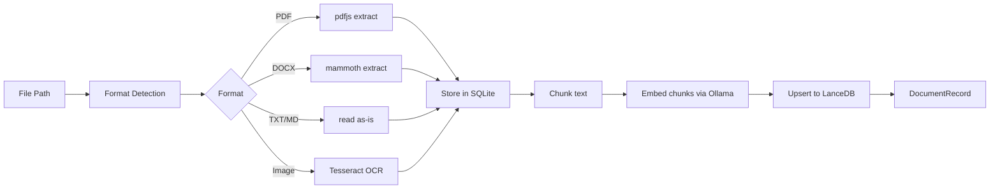

# Patterns — AI Job Hunter

This document describes the recurring architectural and implementation patterns used throughout the codebase. Understanding these patterns is essential for contributing consistently.

---

## 1. IPC Pattern: Renderer → Rust

Every renderer ↔ Rust interaction follows a strict layered pattern.

### The Four Layers

```
React Component
    ↓
Service Hook (React Query)       apps/tauri/src/renderer/services/
    ↓
AppClient method                 apps/tauri/src/renderer/lib/app-client.ts
    ↓
IPC Contract                     packages/shared/src/ipc/contracts/
    ↓
Tauri Invoke / Listen            Tauri bridge
    ↓
Rust Command Handler             apps/tauri/src-tauri/src/commands/
```

### Adding a New IPC Capability

Follow this checklist in order:

**1. Define the contract** (`packages/shared/src/ipc/contracts/myfeature.ts`):

```typescript
export interface MyFeatureContract {
  getData(id: string): Promise<MyData>;
  onUpdate(handler: (data: MyData) => void): Unsubscribe;
}
```

**2. Implement the Rust command** (`apps/tauri/src-tauri/src/commands/`):

```rust
#[tauri::command]
pub async fn my_feature_get_data(id: String, state: State<'_, AppState>) -> Result<MyData, String> {
    state.my_feature.get_data(&id).await.map_err(|e| e.to_string())
}
```

**3. Wire the invoke call** (`apps/tauri/src/tauri-client.ts`):

```typescript
myFeature: {
  getData: (id) => invoke("my_feature_get_data", { id }),
  onUpdate: (handler) => listen("my_feature:update", (e) => handler(e.payload)),
}
```

**4. Create the service hook** (`apps/tauri/src/renderer/services/use-my-feature.ts`):

```typescript
export function useMyData(id: string) {
  return useQuery({
    queryKey: queryKeys.myFeature.data(id),
    queryFn: () => appClient.myFeature.getData(id),
  });
}
```

**5. Add query keys** (`services/query-client.ts`):

```typescript
myFeature: {
  data: (id: string) => ["myFeature", "data", id] as const,
}
```

---

## 2. React Query Service Hook Pattern

All server state (anything from IPC) goes through React Query. Never `useState + useEffect` for remote data.

### Query Hook

```typescript
// services/use-jobs.ts
export function useJobs(filters?: JobFilters) {
  const client = useAppClient();
  return useQuery({
    queryKey: queryKeys.jobs.list(filters),
    queryFn: () => client.jobs.list(filters),
    staleTime: 5 * 60 * 1000,
  });
}
```

### Mutation Hook

```typescript
export function useDeleteJob() {
  const client = useAppClient();
  const queryClient = useQueryClient();

  return useMutation({
    mutationFn: (id: string) => client.jobs.delete(id),
    onSuccess: () => {
      queryClient.invalidateQueries({ queryKey: queryKeys.jobs.lists() });
    },
  });
}
```

### Streaming / Subscription Hook

```typescript
export function useAiStream(generationId: string | null) {
  const client = useAppClient();
  const [delta, setDelta] = useState('');

  useEffect(() => {
    if (!generationId) return;
    const unsub = client.ai.onStream((chunk) => {
      if (chunk.id === generationId) {
        setDelta((prev) => prev + chunk.delta);
      }
    });
    return unsub;
  }, [generationId, client]);

  return delta;
}
```

---

## 3. State Machine Pattern

Flows with 3+ states use the minimal state machine from `lib/machine.ts`.

### Defining a Machine

```typescript
// lib/machines/generation-machine.ts
import { defineMachine } from '@/lib/machine';

export type GenerationState =
  | 'idle'
  | 'configuring'
  | 'generating'
  | 'extracting'
  | 'done'
  | 'error';
export type GenerationEvent = 'start' | 'generate' | 'extract' | 'complete' | 'fail' | 'reset';

export const generationMachine = defineMachine<GenerationState, GenerationEvent>({
  initial: 'idle',
  transitions: {
    idle: { start: 'configuring' },
    configuring: { generate: 'generating', reset: 'idle' },
    generating: { extract: 'extracting', fail: 'error', reset: 'idle' },
    extracting: { complete: 'done', fail: 'error' },
    done: { reset: 'idle' },
    error: { reset: 'idle' },
  },
  busyStates: ['generating', 'extracting'],
  errorStates: ['error'],
});
```

### Using a Machine in a Component

```typescript
import { useMachine } from "@/hooks/use-machine";
import { generationMachine } from "@/lib/machines/generation-machine";

function GenerationPanel() {
  const [state, send] = useMachine(generationMachine);

  return (
    <>
      {state === "idle" && <Button onClick={() => send("start")}>Configure</Button>}
      {state === "generating" && <StreamingText text={delta} />}
      {state === "error" && <ErrorState retry={() => send("reset")} />}
    </>
  );
}
```

**Rule**: Use a machine whenever you have 3+ distinct UI states that transition in a defined order.

---

## 4. AI Streaming Pattern

Streaming generation uses Tauri's event system rather than a promise.

### Frontend Flow

```typescript
// 1. Start generation (returns a generationId immediately)
const { generationId } = await client.ai.generate(req);

// 2. Subscribe to stream events
const unsub = client.ai.onStream((chunk) => {
  if (chunk.id !== generationId) return;
  if (chunk.done) {
    unsub();
    send('extract'); // state machine transition
  } else {
    appendDelta(chunk.delta);
    if (chunk.thinking) {
      appendThinking(chunk.thinking);
    }
  }
});
```

### StreamChunk Type

```typescript
interface StreamChunk {
  id: string; // generationId
  delta: string; // text fragment
  done: boolean; // final chunk marker
  thinking?: string; // Anthropic extended thinking block
}
```

### ThinkingBubble Component

When `chunk.thinking` is present (Anthropic only), render it in a collapsible `ThinkingBubble` component before the main output.

---

## 5. Document Import Pattern

Document processing is a pipeline of async stages, each emitting progress events.



---

## 6. Hybrid Search Pattern

Search combines vector similarity (semantic) with SQL filters (keyword/metadata):

```typescript
// packages/shared/src/ipc/contracts/search.ts
interface HybridSearchRequest {
  query: string;
  collection: 'jobs' | 'resumes' | 'skills' | 'conversations';
  topK: number; // 1–200
  semanticWeight: number; // 0 = pure keyword, 1 = pure semantic
  filters?: Record<string, unknown>; // SQL WHERE conditions
}
```

**Implementation order:**

1. Embed the query via Ollama
2. Run ANN search in LanceDB (returns top-K × 2 candidates)
3. Apply SQL filters to narrow candidates
4. Re-rank using `semanticWeight × semanticScore + (1 - semanticWeight) × keywordScore`
5. Return top-K results

---

## 7. AppClient / Mock Pattern

`AppClient` is the renderer's only gateway to the Tauri process. It is injected via React context:

```typescript
// providers/AppClientProvider.tsx
const client = createTauriInvokeClient(); // or createMockClient() in tests
<AppClientContext.Provider value={client}>{children}</AppClientContext.Provider>
```

In tests:

```typescript
import { createMockClient } from "@/lib/mock-client";

renderWithProviders(<MyComponent />, {
  client: createMockClient({
    jobs: { list: async () => mockJobs },
  }),
});
```

---

## 8. Feature Isolation Pattern

Features in `renderer/features/` are fully isolated:

```
features/
  ai-generate/
    components/        # private to this feature
    hooks/             # private hooks
    index.tsx          # single public export
  jobs/
    components/
    hooks/
    index.tsx
```

**Rules:**

- Never import from `features/foo` inside `features/bar`
- Export only the top-level component from `index.tsx`
- Internal components stay private

---

## 9. i18n Pattern

Never import `react-i18next` directly — use the wrapper:

```typescript
// ✅ correct
import { useTranslation } from '@/lib/i18n';

// ❌ wrong — ESLint error
import { useTranslation } from 'react-i18next';
```

The wrapper ensures consistent namespace resolution and enables future provider swaps.

Translation keys follow dot notation by feature:

```json
{
  "jobs.emptyState.title": "No jobs found",
  "aiGenerate.config.language": "Output language",
  "autopilot.status.running": "Running workflow…"
}
```

---

## 10. Credential Storage Pattern

Never store API keys or passwords in localStorage, SQLite, or env vars. Always use the keychain:

```typescript
// Store
await client.credentials.set({ board: 'linkedin', username: 'user@email.com', password: '...' });

// Check
const has = await client.credentials.hasCredential('linkedin');

// Remove
await client.credentials.remove('linkedin');
```

The Tauri keychain plugin encrypts secrets using the OS credential store (Windows Credential Manager, macOS Keychain, libsecret on Linux).

---

## 11. Performance Mode Pattern

Some operations (batch embedding, OCR) can be expensive. The app has three performance modes that gate parallelism:

```typescript
type PerformanceMode = 'low' | 'balanced' | 'performance';
```

| Mode          | Worker threads | Model unload delay | Batch size |
| ------------- | -------------- | ------------------ | ---------- |
| `low`         | 1              | 30s                | 4          |
| `balanced`    | 2              | 2min               | 16         |
| `performance` | 4              | 10min              | 64         |

Access the current mode via `usePerformanceMode()` from `providers/PerformanceModeProvider`.

---

## 12. Error Boundary Pattern

Wrap every route and major feature in an `ErrorBoundary`:

```typescript
import { ErrorBoundary } from "@ajh/ui";

// In route file:
export default function JobsRoute() {
  return (
    <ErrorBoundary fallback={<ErrorState title="Jobs failed to load" />}>
      <PageShell title="Jobs">
        <JobsFeature />
      </PageShell>
    </ErrorBoundary>
  );
}
```

Never swallow errors silently. If caught by boundary, log via the Pino logger and surface a recovery action.

---

## 13. Architecture Principles & Module Ownership (Rust core)

The Rust core is a **platform architecture**, not a bag of features: shared
infrastructure exists once, each module owns one concern, and expandable systems
use registries. The reference is `commands::ai_provider` + `pipeline`. The ten
principles and how each is enforced:

| #   | Principle                  | Enforcement                                                                          |
| --- | -------------------------- | ------------------------------------------------------------------------------------ |
| 1   | Single responsibility      | one module owns one concern (table below) + review                                   |
| 2   | Centralized infrastructure | shared modules (`platform::config`, `net::http`, `observability`) + CI grep bans     |
| 3   | Strict module boundaries   | path / schema / endpoint knowledge stays inside the owning module                    |
| 4   | No hidden fallbacks        | typed errors; `parse()`-style hard-fail constructors; no silent defaults             |
| 5   | Strong typing over strings | enums / discriminated unions / capability structs over magic strings                 |
| 6   | Registry-based systems     | one registration site per registry (no parallel catalog + match)                     |
| 7   | Capability-driven          | gate on capability flags, not identity (`caps.supports_x`, not `id.starts_with(..)`) |
| 8   | Unified flows              | shared HTTP / retry / timeout / trace primitives composed everywhere                 |
| 9   | Observability              | one `observability::Span` for timed `→`/`←` logging                                  |
| 10  | Isolated failure domains   | per-unit `Result`; one board/provider/parser failure never aborts the batch          |

**Module ownership** — each cross-cutting concern has exactly **one** owner; no
other module may reconstruct its logic:

| Concern                              | Sole owner                                | Use instead of rolling your own                                                                                                          |
| ------------------------------------ | ----------------------------------------- | ---------------------------------------------------------------------------------------------------------------------------------------- |
| env vars, data dir, filesystem paths | `platform::config`                        | `platform::config::data_dir()` — never read `AJH_DATA_DIR` or rebuild `~/.ajh` yourself                                                  |
| AI provider routing + capabilities   | `commands::ai_provider`                   | `resolve(ProviderId, ..)`                                                                                                                |
| HTTP clients (TLS, pool, user-agent) | `net::http`                               | `net::http::shared()` + per-request `.timeout()`, or `build_client()` for a cookie jar — never `reqwest::Client::new/builder`            |
| timed/structured trace spans         | `observability::Span`                     | `Span::begin(target, fields)` + `end`/`end_with` — never reimplement begin/elapsed/end logging (RequestTrace/StageTrace wrap it)         |
| job board scrapers / appliers        | `scraping::boards` / `applying::registry` | register in the `SCRAPERS` / `APPLIERS` list — dispatch + catalog derive from it via the trait; never a parallel match + hardcoded array |
| error types                          | `error::AppError`                         | return `AppResult<T>` from fallible internals — never `Result<_, String>` (domain enums like `ExtractionError` add `From`)               |
| workflow orchestration               | `pipeline`                                | compose `Stage`/`Pipeline`                                                                                                               |

**Adding capability is uniform** — one implementation file + one registration:

- New AI provider → 1 client module + 1 `ProviderId` arm + 1 `resolve` arm.
- New job board → 1 scraper/applier module + 1 line in the `SCRAPERS` / `APPLIERS` list.
- New exporter / parser / integration → register in its registry; compose
  `net::http`, `error::AppError`, `observability::Span`, `platform::config`.

These boundaries are **machine-enforced**. `apps/tauri/src-tauri/tests/architecture.rs`
(run by the `quality-checks` CI job, superseding the old grep guardrails) codifies the
layer model + ownership as versioned tests with explicit, dead-entry-guarded allowlists.
See [architecture-rules.md](architecture-rules.md) (the formal contract, rules R1–R8) and
[architecture-analysis.md](architecture-analysis.md) (the discovery report it derives
from). Among what it enforces: `#[tauri::command]` only in the shell layer; no Tauri below
it; `std::env::var` only in `platform/**`; `reqwest::Client::new/builder` only in
`net/http.rs`; no `Result<_, String>` outside `error.rs`; and no upward cross-layer imports.

---

## Anti-Patterns to Avoid

| Anti-Pattern                                     | Correct Approach                                                                              |
| ------------------------------------------------ | --------------------------------------------------------------------------------------------- |
| `useState + useEffect` for IPC data              | React Query service hook                                                                      |
| `window.__TAURI_INVOKE__` directly               | `useAppClient()` service hook                                                                 |
| `import { useTranslation } from "react-i18next"` | `import { useTranslation } from "@/lib/i18n"`                                                 |
| Cross-feature imports                            | Only import from `@ajh/ui`, `services/`, `lib/`                                               |
| `// eslint-disable` comment                      | Fix the underlying issue or add a scoped `eslint.config.mjs` override                         |
| Inline `{ duration: 0.2, ease: "easeOut" }`      | `transition.fast` from `@/lib/motion`                                                         |
| Hardcoded colors in className                    | `text-brand`, `bg-brand`, etc.                                                                |
| Storing credentials in SQLite                    | OS keychain via `client.credentials`                                                          |
| Reading `AJH_DATA_DIR` / rebuilding `~/.ajh`     | `platform::config::data_dir()`                                                                |
| Per-page `?` that aborts a partial scrape        | First-page error propagates as `Err`; a later page logs + `break`s, keeping the partial (P10) |
| `reqwest::Client::new()` / `::builder()`         | `net::http::shared()` or `net::http::build_client()`                                          |
| `Result<_, String>` for fallible internals       | `AppResult<_>` / `AppError` from `crate::error`                                               |
