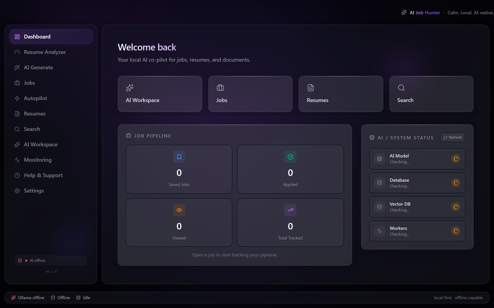
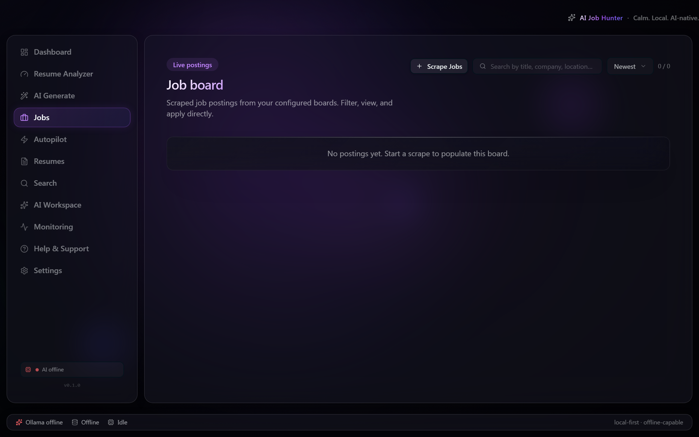
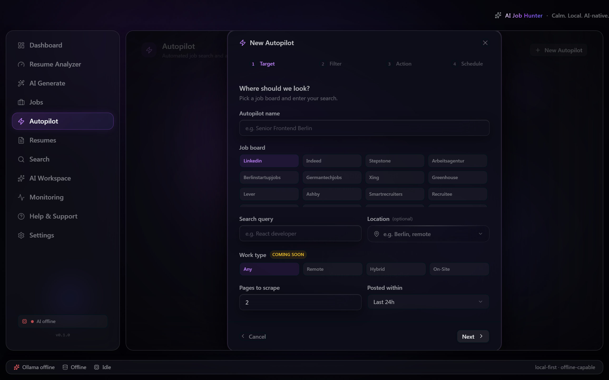

# Premium Glass UX/UI Audit — AI Job Hunter

**Status:** Audit only — analysis + proposals. No code changed. The owner greenlights items individually.
**Date:** 2026-06-03 · **Branch:** `feat/ux-audit-premium-glass`
**Bar:** production-grade, premium, on par with a polished native macOS/iOS app. macOS/iOS glassmorphism is the signature.

> **How this audit was produced.** I walked the running renderer (the real React app via the
> in-repo e2e mock harness in Chromium — the same engine as the Tauri WebView2 shell, so the CSS
> glass renders identically) and captured per-route screenshots, then orchestrated five domain
> reviewer agents over the code:
> `frontend-reviewer` (glass/consistency/a11y/friction/IA), `resume-export-expert` (Documents IA),
> `scraping-applier-expert` (Autopilot), `tauri-security-reviewer` (native notification/tray + a11y
> OS-pref wiring), `performance-profiler` (glass/animation cost). Findings below are synthesized and
> de-duplicated; each carries the **owning agent** for the eventual fix.
>
> **Two caveats to read first.**
>
> 1. **There is no Light theme.** `packages/ui/src/lib/theme.ts` ships only `default | reduced-glass | high-contrast` (all dark). `docs/DESIGN_SYSTEM.md` documents a `light | dark | system` theme that **does not exist in code**. Building a real **Light + Dark + System** system is the **#1 deliverable** (§7). Screenshots therefore show only the existing dark variants; Light is delivered as a spec + mockup.
> 2. **macOS native vibrancy can't render on Windows** (the dev box). The CSS `backdrop-filter` glass **does** render in WebView2/Chromium, so the captures are a faithful proxy for the CSS material — but the _native_ `NSVisualEffectView` window vibrancy (true desktop-behind-window translucency) is a macOS-only layer the app does not yet use. Noted again in §3.

---

## 1. Executive summary — top 5 opportunities (in priority order)

| #     | Opportunity                                                                                                                                                                                                                                                                     | Why it's the highest leverage                                                                                                                                                                                                                                                                                                 | Effort |
| ----- | ------------------------------------------------------------------------------------------------------------------------------------------------------------------------------------------------------------------------------------------------------------------------------- | ----------------------------------------------------------------------------------------------------------------------------------------------------------------------------------------------------------------------------------------------------------------------------------------------------------------------------- | ------ |
| **1** | **Rebuild the glass material on a token-driven, dual-theme model** — fix the flat `.glass-card`, unify vibrancy/border/radius/glow across the elevation ladder, add the missing inset specular highlight, and ship **Light + Dark + System** with a11y modifiers.               | The signature concern. Today the "primary card" (`.glass-card`) is a flat `rgba(255,255,255,0.1)` rectangle and the elevation ladder drifts per-surface, so cards read "cheap dark panel," not "frosted glass" (visible in every screenshot). One token refactor lifts **every** surface at once and unlocks the light theme. | **L**  |
| **2** | **Fix the accessibility foundation that the glass currently breaks** — global `:focus-visible{outline:none}` with no compensating ring, inputs with _zero_ focus indicator, `div[role=button]` nav that's keyboard-unreachable, and no `prefers-reduced-transparency` fallback. | Premium must stay readable/operable. These are WCAG AA failures that also make the app _look_ broken for users with OS accessibility settings on. Cheap, high-trust wins.                                                                                                                                                     | **M**  |
| **3** | **Consistency pass: kill primitive bypasses + a real silent bug** — ~20 raw `<button>`/toggles bypassing `@ajh/ui`, inline-style/token drift, and `bg-brand/08` (an invalid Tailwind opacity step that's **silently dropped**, so selected states have no fill) in 7 places.    | Removes the "AI-default / drifting" feel, fixes an actual invisible-selection bug, and makes every later change land consistently.                                                                                                                                                                                            | **M**  |
| **4** | **Make local-first feel instant + surface setup in context** — optimistic updates for delete/move/bookmark mutations, inline empty-state CTAs (every dead-end empty state), and inline "connect account"/"install browser"/"add provider" where a prerequisite blocks a flow.   | The app is local-first but several mutations wait for a round-trip, and multiple flows dead-end into Settings. Low-friction is an explicit goal.                                                                                                                                                                              | **M**  |
| **5** | **Re-aim Autopilot at "find & notify" and wire the native surface** — remove the auto-apply UI, send real OS notifications with deep-links, give the tray a job-count + pause-all, and catch up missed runs.                                                                    | Autopilot's UI implies auto-apply (contradicting the agreed target) and the installed notification/tray plugins are **unwired** — so the core "notify me" value isn't delivered.                                                                                                                                              | **L**  |

---

## 2. Per-route findings

Severity legend: **H** high · **M** med · **L** low. Owner = agent that owns the fix.

| Route                                              | Key issues                                                                                                                                                                                                                                                                                                                                                    | Sev | Owner                       |
| -------------------------------------------------- | ------------------------------------------------------------------------------------------------------------------------------------------------------------------------------------------------------------------------------------------------------------------------------------------------------------------------------------------------------------- | --- | --------------------------- |
| **Dashboard** (`features/dashboard`)               | `JobPipelineOverview` empty state is a bare `<p>` (dead-end, no icon/CTA); `AISystemStatus` has no `ErrorState` — a failed health fetch shows "Checking…" forever; nested pipeline tiles read as flat opaque panels (glass thesis).                                                                                                                           | H/M | frontend                    |
| **Analyze / Resume Analyzer** (`features/analyze`) | Error shown as plain inline `<div>` with no retry; prompt-quality segmented control is raw `<button>`×3 (no focus ring, no `aria-pressed`), duplicated with AI Workspace.                                                                                                                                                                                     | M   | frontend                    |
| **AI Generate** (`features/ai-generate`)           | `bg-brand/08` invalid opacity on the ATS toggle + raw `<button>` toggles without `role="switch"`; Preview/Edit + format/template pickers are raw `<button>`; generation error has no "Try again"; hardcoded English strings ("Prompt Quality", "Template", "Loading model…", step labels).                                                                    | H/M | frontend · resume-export    |
| **Jobs** (`features/jobs`)                         | Empty state is a bare `GlassCard` with text, **no "Scrape jobs" CTA** (dead-end); `PostingRow` hover glow uses `filter:'blur-xl'` (invalid value → broken); 500 un-virtualized rows each carrying `backdrop-filter`; partial-optimistic bookmark (badge flips, counters lag); icon-only copy button has no `aria-label`; ScrapeForm state lost on navigation. | H/M | frontend · performance      |
| **Autopilot** (`features/autopilot`)               | Wizard still presents `review`/`auto_apply` + a live `autoSubmit` toggle (contradicts find-&-notify); `· Applied {N}` counter is permanently 0; no inline board-auth hint; loading is text not `CardSkeleton`; no optimistic delete.                                                                                                                          | H   | scraping-applier · frontend |
| **Résumés** (`features/resumes`)                   | Misnamed (it's a job-interaction log + a "Generated" tab); Generated empty state has no "Generate" CTA; Generated tab has no loading skeleton (flash of empty); **delete fires with no `ConfirmModal`** (unrecoverable); cards use raw `glass-graphite` utility instead of `<GlassCard>`.                                                                     | H/M | resume-export               |
| **Search** (`features/search`)                     | Zero-results `EmptyState` has no CTA to scrape/index data first.                                                                                                                                                                                                                                                                                              | M   | frontend                    |
| **AI Workspace** (`features/ai-workspace`)         | Conceptually overlaps "Analyze" + "Generate"; raw `<button>` segmented control; unclear when to use vs Analyze (IA).                                                                                                                                                                                                                                          | M   | frontend                    |
| **Monitoring** (`features/monitoring`)             | Two dead-end empty states (`ActiveJobsSection`, `ActivityFeedSection`) are bare centered `<div>` text, no icon/`EmptyState`.                                                                                                                                                                                                                                  | H   | frontend                    |
| **Support** (`features/support`)                   | Mostly static/OK; large surface — verify glass consistency after the material refactor.                                                                                                                                                                                                                                                                       | L   | frontend                    |
| **Settings** (`features/settings`)                 | `SettingsSidebar` uses `div[role=button]` with no `tabIndex` → **keyboard-unreachable**; `DeveloperPreferences` toggle is raw `<button>` + `bg-brand/8` (invalid) + no switch semantics; settings active-pill styling diverges from main sidebar.                                                                                                             | H/M | frontend                    |
| **Onboarding** (`features/onboarding`)             | Solid coverage of prerequisites (AI provider, browser, résumé) but multiple inline `transition={{…}}` objects bypass motion tokens; see §6.                                                                                                                                                                                                                   | M   | frontend                    |

---

## 3. Lens 1 — Glass & premium polish _(deepest dive — priority #1)_

### 3.1 The core problem, in one picture

Open `docs/assets/ux-audit/default/dashboard.png`: the Job-Pipeline card and its four stat tiles render as **flat opaque dark rectangles**. That is the "cheap flat rectangle" failure mode, and it is structural, not incidental:

- **`.glass-card` is built wrong.** `packages/ui/src/css/utilities.css:55` fills with **bright white** `rgba(255,255,255,0.1)` + only `saturate(130%)`. On a dark substrate a bright-white translucent fill reads as opaque light-grey — the _opposite_ of macOS materials, which derive depth from a **dark** substrate + vibrancy. Meanwhile `.glass-surface`/`.glass-elevated` _do_ use dark fills + higher saturation. So the "primary card surface" is the weakest glass in the system. **[H]**
- **The elevation ladder drifts.** `.glass` has **no** `saturate()` at all (`:63`); `.glass-elevated`/`.glass-modal` omit `border-radius` (`:83`,`:90`) so every consumer re-adds `rounded-2xl` inline; tonal variants hardcode glow radii (`0 0 40px -10px rgba(139,92,246,.25)`) instead of the `--glow-*` tokens; the inset specular highlight (`--shadow-inset-top`) is applied to some surfaces, not others. The blur/saturate/border/shadow scales **exist as tokens** but are applied unevenly. **[H/M]**
- **Nested double-blur.** `__root.tsx:92` puts `glass-surface` (`backdrop-filter`) on the full main panel, and child `glass-card`/`glass-graphite` panels _also_ carry `backdrop-filter` — so child glass blurs the parent's already-blurred texture: muddy _and_ double-cost (perf §A). Glass should blur the layer directly above the cinematic background, and use opaque/semi-opaque fills for nested panels. **[M]**

### 3.2 Turnkey fix — a token-driven material (the foundation for Light/Dark too)

Replace per-surface hardcoded values with **per-mode CSS variables** so one set of recipes serves both themes (full light/dark token tables in §7). Concretely:

```css
/* tokens.css — material variables (dark shown; light in §7) */
:root,
[data-color-scheme='dark'] {
  --glass-fill: 20 20 28; /* dark substrate, NOT white */
  --glass-fill-card: 0.55;
  --glass-fill-surface: 0.62;
  --glass-fill-elevated: 0.72;
  --glass-hairline: 255 255 255 / 0.1; /* border */
  --glass-specular: 255 255 255 / 0.28; /* top inset highlight */
  --glass-sat: var(--sat-mid);
}
/* utilities.css — every elevation references the variables */
.glass-card {
  background: rgb(var(--glass-fill) / var(--glass-fill-card));
  backdrop-filter: blur(var(--blur-md)) saturate(var(--glass-sat));
  -webkit-backdrop-filter: blur(var(--blur-md)) saturate(var(--glass-sat));
  border: 1px solid rgb(var(--glass-hairline));
  border-radius: var(--radius);
  box-shadow: var(--shadow-md), var(--shadow-inset-top); /* specular sparkle */
}
```

Then: add `saturate(var(--sat-mid))` to `.glass`; add `border-radius: var(--radius)` to `.glass-surface/.glass-elevated/.glass-dropdown/.glass-modal`; replace tonal-variant hardcoded glows with `var(--glow-brand-md)`; remove `backdrop-filter` from the root `glass-surface` panel (use a flat `rgb(var(--glass-fill)/0.6)` + inset glow). **Owner: frontend-reviewer.**

### 3.3 Other polish findings (turnkey)

| Sev | File:line                 | Fix                                                                                                                                                                                                                           |
| --- | ------------------------- | ----------------------------------------------------------------------------------------------------------------------------------------------------------------------------------------------------------------------------- |
| M   | `Sidebar/index.tsx:82-88` | Active-pill inline gradient/shadow uses raw rgba bypassing tokens; glow weaker than `--glow-brand-sm`. → extract `.sidebar-pill` utility referencing `var(--color-brand-dim)`, `var(--border-clear)`, `var(--glow-brand-sm)`. |
| M   | `utilities.css:32-33`     | `.label-caps`/`.section-label` hardcode `rgba(255,255,255,.3/.4)` → `color: var(--color-muted-foreground)` so they respond to theme/contrast.                                                                                 |
| M   | `utilities.css:111-138`   | Tonal glow radii are magic numbers → `var(--glow-brand-md)`.                                                                                                                                                                  |
| L   | `utilities.css:170-175`   | `.toast-panel` is a bespoke glass → compose `@apply glass-elevated` so overlays share one material.                                                                                                                           |
| L   | `utilities.css:44-48`     | `.text-gradient` hardcodes `#a855f7`/`#6366f1` → `var(--aurora-violet)`/`var(--aurora-indigo)`.                                                                                                                               |
| L   | `utilities.css:499-511`   | Scrollbar thumb raw rgba → `var(--border-faint)`/`var(--border-dim)`.                                                                                                                                                         |

**Native-vibrancy note (macOS only, optional, M):** for true Apple-grade depth on macOS, set the window `WINDOW_EFFECT`/`vibrancy` (e.g. `NSVisualEffectMaterial::HudWindow/Sidebar`) via `tauri-plugin-window-vibrancy` so the desktop shows through the chrome behind the CSS glass. This is the one thing CSS `backdrop-filter` cannot do (it only blurs in-app content). Out of scope on Windows; recommended as a macOS-only enhancement. **Owner: rust-backend-architect + tauri-security-reviewer.**

---

## 4. Lens 2 — Consistency

### 4.1 The silent bug: `bg-brand/08`

`08` is **not** a valid Tailwind v4 opacity step (leading-zero), so the utility is **dropped at build** and the element gets **no fill** — selected states look identical to unselected. Found in **7 places**, incl. `autopilot/.../StepAction/index.tsx:64`, `settings/.../DeveloperPreferences/index.tsx`, `ai-generate/.../GenerationConfig/index.tsx`. → change every `bg-brand/08`→`bg-brand/10`. Add a lint guard (regex `/\/0\d\b/` on className) to prevent recurrence. **[H] frontend-reviewer.**

### 4.2 Primitive bypasses (raw `<button>` / toggles → `@ajh/ui`)

~20 instances bypass the design system and, because of the global `outline:none` (§5), most have **no visible focus**. Highest-value:

| Sev | File:line                                                             | Fix                                                                                                    |
| --- | --------------------------------------------------------------------- | ------------------------------------------------------------------------------------------------------ |
| H   | `settings/.../DeveloperPreferences:29-65`                             | toggle → `<Button role="switch" aria-checked aria-label>`; fix opacity.                                |
| H   | `ai-generate/.../GenerationConfig:208-244`                            | ATS-mode toggle → `<Button role="switch" aria-checked>`; fix opacity.                                  |
| H   | `settings/.../SettingsSidebar:34-46`                                  | `div[role=button]` (no `tabIndex`, keyboard-unreachable) → real `<button>`/`<Button variant="ghost">`. |
| M   | `ai-generate/.../OutputPanelDone:122-143`                             | Preview/Edit raw buttons → `<Button variant="ghost" size="sm" aria-pressed>`.                          |
| M   | `resumes/.../GenerationCard:205,224,317,350`                          | 4 raw buttons (pickers/expanders) → `<Button>` + `aria-expanded`.                                      |
| M   | `analyze/.../AnalyzeLeftPanel:96` + `ai-workspace/.../AIWorkspace:56` | duplicated segmented control → **extract `SegmentedControl` to `packages/ui`** (pattern repeats ≥4×).  |
| M   | `settings/.../ActiveProviderSwitcher:35`, `OllamaConfig:75-88`        | raw buttons → `<Button aria-pressed>` with ring.                                                       |
| L   | `jobs/.../PostingRow:162-168`                                         | raw `<a>`/copy `<button>` → focus ring + `aria-label`.                                                 |

### 4.3 Motion-token drift (inline `transition={{…}}` in feature files — ESLint rule 4)

`AutopilotCard:173` (`{duration:0.2}`), `SelectDropdown.tsx:163` (`{duration:0.13, ease:[…]}`), and **6+** onboarding states (`BrowserDetectedState`, `BrowserErrorState`, `BrowserLoadingState`, `OllamaCheckingState`) → map each to `transition.fast/normal/relaxed/spring` from `@ajh/ui`. These also currently ignore `prefers-reduced-motion`. **[M] frontend-reviewer.**

### 4.4 Component-vs-utility drift

`resumes/.../GenerationCard:113` and `InteractionRow:50` instantiate `glass-graphite glass-highlight` as raw classes on a `<div>` instead of `<GlassCard tone="graphite" highlight>` → future tone changes won't propagate. **[M] resume-export-expert.**

---

## 5. Lens 3 — Accessibility & legibility _(pragmatic — premium that stays readable)_

| Sev   | File:line                           | Finding → Fix                                                                                                                                                                                                                                                                                                                                                                                                                |
| ----- | ----------------------------------- | ---------------------------------------------------------------------------------------------------------------------------------------------------------------------------------------------------------------------------------------------------------------------------------------------------------------------------------------------------------------------------------------------------------------------------- |
| **H** | `utilities.css:515`                 | Global `:focus-visible{outline:none}` with no compensating ring → **every** element without an explicit ring class is keyboard-invisible (WCAG 2.4.7). **Fix:** scope it — only `.has-focus-ring:focus-visible{outline:none}` (applied inside Button/Input/SelectDropdown); let the browser default ring stand elsewhere. Or set a global fallback `:focus-visible{outline:2px solid var(--color-ring);outline-offset:2px}`. |
| **H** | `Input.tsx` + `utilities.css:191`   | `.input-field:focus-visible{box-shadow:none}` on top of global `outline:none` = inputs have **zero** focus indicator. **Fix:** base classes `focus-visible:ring-2 focus-visible:ring-brand/50 focus-visible:ring-offset-1`.                                                                                                                                                                                                  |
| **H** | `SettingsSidebar:34-46`             | `div[role=button]` no `tabIndex` → keyboard-unreachable settings nav. **Fix:** real `<button>`.                                                                                                                                                                                                                                                                                                                              |
| **H** | `PostingRow:166`                    | icon-only copy button, no `aria-label`. **Fix:** `aria-label={t('jobs.copyLink')}`.                                                                                                                                                                                                                                                                                                                                          |
| **M** | `theme.ts:91` + `utilities.css:519` | No `prefers-reduced-transparency` handling (only `reduced-motion`). **Fix:** add a CSS `@media (prefers-reduced-transparency: reduce)` block forcing `backdrop-filter:none` + opaque fills, **and** auto-apply the `reduced-glass` modifier from `matchMedia` in `restoreTheme` (§7).                                                                                                                                        |
| **M** | `ModalShell.tsx:79`                 | `role="dialog" aria-modal` but no `aria-labelledby`. **Fix:** add `aria-labelledby` prop wired to each modal's `<h2 id>`.                                                                                                                                                                                                                                                                                                    |
| **M** | `StepAction:109` / `ApplyDrawer:85` | auto-submit "switch" lacks `role="switch"`/`aria-checked`; checkbox+text not a `<label>`. **Fix:** switch ARIA / wrap in `<label htmlFor>`.                                                                                                                                                                                                                                                                                  |
| **M** | i18n                                | Hardcoded English: `GenerationConfig` ("Prompt Quality","Template"), `OllamaConfig` ("Currently active"), `OutputPanelGenerating` ("Loading model…","Step X of Y"). **Fix:** route through `t()` + add keys.                                                                                                                                                                                                                 |

> Contrast over glass: after the §3.2 material refactor (dark substrate + scrim) text contrast improves; for any translucent surface where text sits directly over the cinematic background, add a 1-layer legibility scrim (`background: rgb(var(--glass-fill)/0.72)`) behind the text block — keeps the look, restores AA.

---

## 6. Lens 4 — Friction & accelerators _(also covers in-scope accelerators)_

### 6.1 Optimistic updates (make local-first feel instant) — **frontend-reviewer**

These mutations wait for a round-trip; add `onMutate` + rollback via TanStack Query:

- `use-ai-generations.ts:26` delete generation — card lingers ~200ms. **H**
- `use-autopilot.ts:44` delete autopilot — same. **H**
- `PostingRow` bookmark/applied — badge is optimistic but the **counters** (Pipeline/Résumés) aren't → stale numbers; add `onMutate` `setQueryData` on the interactions list. **H**
- Add board-move/toggle/save the same treatment.

### 6.2 Contextual-setup catalog (surface the prerequisite where the flow blocks) — **frontend-reviewer + scraping-applier-expert**

| Prerequisite missing          | Today                                   | Recommend inline                                                                                                                                                    |
| ----------------------------- | --------------------------------------- | ------------------------------------------------------------------------------------------------------------------------------------------------------------------- |
| No AI provider                | Generate/Analyze fail or sit idle       | Inline "Set up AI provider" card on Generate/Analyze (reuse onboarding's `AISelectionStep` panel)                                                                   |
| Not connected to a board      | Autopilot/Jobs run silently degraded    | Reuse Jobs' `AuthHint`/`AuthModeBadge` inline on the **Autopilot wizard `StepTarget`** and on the **Autopilot card** when board ∈ `AUTH_BENEFITS` and not connected |
| No browser (Chrome)           | "New Autopilot" → wizard → fails at run | Guard the button: inline "Chrome required → Install" banner before wizard                                                                                           |
| Empty Jobs / Search / Résumés | Dead-end empty states                   | `EmptyState action=` CTA on every one (Jobs→Scrape, Search→Scrape first, Résumés→Generate, Monitoring idle states)                                                  |

### 6.3 Keyboard shortcuts (NOT a command palette) — **frontend-reviewer**

There's an unused `shortcuts.onCommandPalette` channel; **do not** build a palette (out of scope). Instead a small, discoverable set via a global key handler + a "?" cheat-sheet:
`⌘1..⌘9` jump to sidebar routes · `⌘N` new autopilot (on Autopilot) · `⌘↵` generate (on Generate) · `⌘E` export (on a document) · `⌘K`→reuse for in-page search on Jobs · `Esc` closes modal/drawer (verify all overlays honor it) · `⌘,` Settings.

### 6.4 Step-counts (app-open → done)

- _Generate a tailored résumé:_ Dashboard → Generate → pick résumé → paste/select job → configure → Generate → export = **~6** (good, once provider is set). Risk: provider/résumé setup detours mid-task → §6.2.
- _Track a job:_ Jobs → Scrape (form) → row → bookmark = ok, but empty-state dead-end if no jobs and ScrapeForm state is lost on nav (`JobsPage:45`).

---

## 7. Theme system — **Light + Dark + System + a11y modifiers** _(centerpiece deliverable)_

### 7.1 Target model

Separate **two orthogonal axes** that today are conflated into one mutually-exclusive `ThemeId`:

- **Color scheme:** `light | dark | system` (`system` follows `prefers-color-scheme`). Applied as `data-color-scheme="light|dark"` on `<html>` (resolved from the OS when `system`).
- **A11y modifiers (independent, combine with either scheme):** `reduce-transparency` (manual **or** auto from `prefers-reduced-transparency`) and `increase-contrast` (manual **or** auto from `prefers-contrast`). Applied as `data-reduce-transparency` / `data-contrast` attributes.

This keeps the existing `reduced-glass`/`high-contrast` _intent_ but promotes them from "themes you lose dark mode to pick" into modifiers that layer on top — and wires them to the OS, fixing the §5 accessibility gaps.

### 7.2 Token deltas (turnkey)

The material variables from §3.2 flip per scheme; the semantic `--color-*` set (currently dark-only in `tokens.css`) gets a light counterpart:

```css
/* DARK (current cinematic) */
:root,
[data-color-scheme='dark'] {
  --color-background: oklch(22% 3% 9%);
  --color-foreground: oklch(98% 1% 210);
  --glass-fill: 20 20 28;
  --glass-hairline: 255 255 255 / 0.1;
  --glass-specular: 255 255 255 / 0.28;
  --shadow-md: 0 4px 16px rgba(0, 0, 0, 0.3);
}
/* LIGHT (new) */
[data-color-scheme='light'] {
  --color-background: oklch(97% 1% 250);
  --color-foreground: oklch(24% 3% 250);
  --color-muted-foreground: oklch(45% 3% 250);
  --color-border: oklch(88% 2% 250);
  --glass-fill: 255 255 255; /* light substrate */
  --glass-fill-card: 0.62;
  --glass-fill-surface: 0.7;
  --glass-fill-elevated: 0.8;
  --glass-hairline: 15 20 35 / 0.1; /* DARK hairline on light glass */
  --glass-specular: 255 255 255 / 0.7; /* brighter top highlight */
  --glass-sat: var(--sat-high); /* light glass needs more saturation to feel alive */
  /* color-based shadows, not pure black-at-high-alpha */
  --shadow-md: 0 4px 16px oklch(50% 8% 270 / 0.12);
  --shadow-lg: 0 8px 24px oklch(50% 8% 270 / 0.16);
}
/* SYSTEM = no attribute written; data-color-scheme resolved from matchMedia at boot + on change */

/* A11y modifiers (combine with either scheme) */
@media (prefers-reduced-transparency: reduce) {
  :root {
    --enable-blur: 0;
  }
}
[data-reduce-transparency],
:root[style*='--enable-blur: 0'] {
  --glass-sat: 100%;
}
[data-reduce-transparency] .glass-card,
[data-reduce-transparency] .glass-surface,
[data-reduce-transparency] .glass-elevated,
[data-reduce-transparency] .glass-modal {
  backdrop-filter: none;
  -webkit-backdrop-filter: none;
  background: rgb(var(--glass-fill) / 0.96);
}
[data-contrast='more'] {
  --glass-hairline: var(--color-foreground); /* + bump border alpha */
}
```

Also: light-mode **aurora/nebula** need lighter tints + lower opacity (the `--aurora-*` palette stays, drop opacity to ~0.10–0.15 on light); **scrollbars** flip to dark-on-light; **`.text-gradient`** stays but verify legibility on light.

### 7.3 Engine changes (`packages/ui/src/lib/theme.ts`) — turnkey

```ts
export type ColorScheme = 'light' | 'dark' | 'system';
export interface ThemePrefs {
  scheme: ColorScheme;
  reduceTransparency: boolean;
  contrast: 'normal' | 'more';
}

function resolveScheme(s: ColorScheme): 'light' | 'dark' {
  if (s !== 'system') return s;
  return window.matchMedia('(prefers-color-scheme: dark)').matches ? 'dark' : 'light';
}
export function applyTheme(p: ThemePrefs) {
  const root = document.documentElement;
  root.dataset.colorScheme = resolveScheme(p.scheme);
  root.toggleAttribute(
    'data-reduce-transparency',
    p.reduceTransparency || matchMedia('(prefers-reduced-transparency: reduce)').matches
  );
  root.dataset.contrast =
    p.contrast === 'more' || matchMedia('(prefers-contrast: more)').matches ? 'more' : 'normal';
  localStorage.setItem('ajh-theme', JSON.stringify(p));
}
// restoreTheme(): parse JSON; if absent, default { scheme:'system', reduceTransparency:false, contrast:'normal' }.
// Register matchMedia('change') listeners for color-scheme / reduced-transparency / contrast so the
// app tracks live OS changes when scheme==='system' or the modifier is in auto mode.
```

Settings UI: a 3-way **Light / Dark / System** segmented control + two switches (Reduce transparency, Increase contrast), each defaulting to "Auto (follows system)". Update `DESIGN_SYSTEM.md` to match reality. **Owner: frontend-reviewer (impl) · tauri-security-reviewer (OS-pref/privacy: `matchMedia` is renderer-local, no permission/leak) · project-steward (doc fix).**

### 7.4 Migration note

Existing persisted `ajh-theme` values (`'default'|'reduced-glass'|'high-contrast'` strings) must be migrated: `default→{scheme:'dark'}`, `reduced-glass→{scheme:'dark',reduceTransparency:true}`, `high-contrast→{scheme:'dark',contrast:'more'}`.

---

## 8. Lens 5 — Navigation & IA _(lowest priority — bold proposals, recommendations only)_

### 8.1 Current sidebar — 11 flat peers, no grouping

`Sidebar/index.tsx:29` lists Dashboard · Analyze · Generate · Jobs · Autopilot · Résumés · Search · AI · Monitoring · Support · Settings. Three of these (Analyze, Generate, AI) are the _same_ AI-on-text job; "Résumés" is actually a job-interaction log + a Generated tab; "Search" burns a top-level slot for a power feature; cover letters have **no** first-class home.

### 8.2 Proposed regroup (before → after)

```
BEFORE (flat 11)                AFTER (grouped, ~3 sections)
┌─────────────────┐            ┌─────────────────────────────┐
│ ◇ Dashboard     │            │  Dashboard                  │
│ ◇ Analyze       │            │                             │
│ ◇ Generate      │            │  WORKSPACE                  │
│ ◇ Jobs          │            │   Jobs                      │
│ ◇ Autopilot     │            │   Documents  ▸ Résumés      │
│ ◇ Résumés       │            │              ▸ Cover Letters│
│ ◇ Search        │            │              ▸ Activity     │
│ ◇ AI            │            │   Generate                  │
│ ◇ Monitoring    │            │   Analyze                   │
│ ◇ Support       │            │   Chat (was “AI”)           │
│ ◇ Settings      │            │                             │
│                 │            │  AUTOMATION                 │
│                 │            │   Autopilot                 │
│                 │            │   Activity (was Monitoring) │
│                 │            │                             │
│                 │            │  ⌄ (pinned bottom)          │
│                 │            │   Support · Settings        │
└─────────────────┘            └─────────────────────────────┘
   Search → ⌘K in-page on Jobs (toolbar icon), not a sidebar slot.
```

- **Documents hub** (rename "Résumés"): tabs **Résumés** / **Cover Letters** (both filtered from `AiGenerationRecord`) / **Activity** (the old applied/viewed/bookmarked log). Gives cover letters a real home and matches the user's "my output artefacts" mental model. **Owner: resume-export-expert.**
- **Rename "AI" → "Chat"** and keep distinct from Analyze/Generate, or fold it into a tab. **Demote Search** to `⌘K` on Jobs. Use the `.section-label` utility for group headers + a hairline divider. **Owner: frontend-reviewer.**

---

## 9. Autopilot — current vs. "find & notify" target

**Target:** find · score · dedupe · **notify** (native OS) — never auto-prepare/auto-submit; application generation stays **on-demand** from the job view. Tray-resident; catches up missed runs; battery-aware; launch-at-login optional (default OFF).

### 9.1 Remove the auto-apply surface _(scraping-applier-expert)_

- **[H]** `StepAction/index.tsx` presents `review`/`auto_apply` + a live `autoSubmit` toggle + `coverLetter` textarea, all wired end-to-end (IPC contract, Rust store, create/update payloads carry `action`/`autoSubmit`/`coverLetter`). **Delete `StepAction`**, replace wizard step 3 with a summary/confirm; remove `action`/`autoSubmit`/`coverLetter` from `WizardState`, the IPC contract, and the Rust `Autopilot` store. The only persisted intent should be `schedule`.
- **[H]** `AutopilotCard:111` shows `· Applied {totalApplied}` (permanently 0; Rust always records `applied=0`) → remove. `:98` shows the `action` pill → remove. `:44` `STEP_ICON` has dead `apply_start/apply_done` → remove.
- On-demand path already exists in `ApplyJobModal`; relabel any "Apply" affordance to "Tailor"/"Prepare".

### 9.2 Wire native notifications + tray + deep-link _(tauri-security-reviewer · scraping-applier-expert)_

- **[H]** Plugins installed (`tauri-plugin-notification`, `single-instance`, tray-icon) but **no notification is ever sent**. After `record_run`, if new-job count > 0, call `NotificationExt::notification(...).title("New jobs found").body(...).show()`, gated on permission state (`Prompt`→request, `Denied`→skip). Thread the `is_new` count from `merge_found_jobs` through `record_run`'s return.
- **Deep-link:** tray click + notification click should emit an `autopilot.focus` event carrying `autopilot_id`; renderer listens and navigates to that card's found-jobs panel. Register an `ajh://` scheme and **validate** argv in `single-instance` against a route allowlist before navigating (injection guard).
- **Tray menu:** add "New jobs: N" (updated on run-complete) + "Pause All" + "Reopen window". Currently the tray only focuses the window.

### 9.3 Missed-run catch-up + reliability _(scraping-applier-expert)_

- **[H]** `autopilot_scheduler.rs:60` — the first `interval.tick().await` swallows the immediate tick, so catch-up is delayed 60s after launch (a daily job closed within 60s slips a full day). **Fix:** run `tick()` once before the loop (one line).
- **[M]** `stamp_last_run` before run completes with no `run_status` flag → interrupted runs look "completed, 0 found." Add `run_status: in_progress|completed|failed` + an amber "interrupted" badge.
- **[M]** `min_match_score` is configured but never applied as a gate before `record_run` → sub-threshold jobs shown identically. Split passing/below-threshold (collapse the latter).
- **[M]** Cancellation token registered but not threaded into `autopilot_scrape` → scheduler runs can't be cancelled mid-flight.
- **[M]** Jaccard keyword score is shown as a precise "%" → label it "Keyword match" (or use the existing embedding cosine) to avoid implying ATS-grade relevance.

### 9.4 Battery + launch-at-login _(tauri-security-reviewer)_

- **[M]** Scheduler ticks regardless of power source. Add `sysinfo` battery check + an `allow-on-battery` pref (default: pause heavy browser-automation on battery). Add the global "Pause All" gate (tray).
- **[L]** `tauri-plugin-autostart` absent → add for optional launch-at-login, **default false**, settings toggle, scoped to `main` window.

---

## 10. Onboarding — audit (existing wizard; do NOT add a new one)

Flow: Welcome → AI Selection (Ollama model picker / cloud provider / CLI agent) → Browser → Résumé → Research → Prefs, plus a `SpotlightTour`. **It does set up the real prerequisites** (AI provider, browser, first résumé) — good. Gaps:

- **[M]** Multiple inline `transition={{…}}` objects across `BrowserDetectedState/ErrorState/LoadingState`, `OllamaCheckingState` bypass motion tokens and ignore `prefers-reduced-motion` → map to `transition.*`.
- **[M]** After the §5 focus-ring + §4 primitive fixes, re-verify the wizard is fully keyboard-operable (it's the first thing a new user touches).
- **[L]** Ensure the wizard's "skip" paths still leave the user with a usable contextual-setup trail (ties to §6.2 — if they skip AI setup, the inline Generate CTA must appear).

---

## 11. Lens (perf) — keeping the glass smooth _(performance-profiler; secondary lens)_

| Sev | File:line                                 | Fix                                                                                                                                                                          |
| --- | ----------------------------------------- | ---------------------------------------------------------------------------------------------------------------------------------------------------------------------------- |
| H   | `CinematicBackground/index.tsx:35`        | RAF cursor-blob + parallax run forever, even when window hidden → pause on `visibilitychange`.                                                                               |
| H   | `globals.css:32`                          | `body[data-modal-open] .app-content{filter:blur(6px)}` flattens the entire animated shell each frame → replace with a fixed overlay div above `.app-content` (iOS pattern).  |
| H   | `use-mouse-parallax.ts:23`                | `setPos` React state on every pointermove re-renders ~20 background nodes → ref + direct style mutation (as the blob already does).                                          |
| M   | `JobsPage:223`                            | 500 un-virtualized `motion.div` rows each with `backdrop-filter` → `@tanstack/react-virtual`; drop per-row blur (it blurs nothing meaningful behind the panel).              |
| M   | `utilities.css:419`                       | 8 concurrent blurred aurora/nebula layers always composited → cut to 2 in default; `display:none` in reduced-glass/low-memory (today reduced-glass only halves blur radius). |
| M   | `preferences-store.ts:49` + `globals.css` | `performanceMode:'balanced'` (default) does **nothing** → give it the blur-halving + 2-layer aurora; `low-memory` = no animation.                                            |
| M   | `__root.tsx:92`                           | root `glass-surface` blur double-blurs child glass → flat fill on the shell (also §3.1).                                                                                     |
| L   | `motion.ts:172`                           | `hover.glow` animates `filter:brightness` → use box-shadow/opacity.                                                                                                          |
| L   | `PostingRow:107`                          | `filter:'blur-xl'` invalid value (no-op now; don't "fix" to a real blur — remove).                                                                                           |

---

## 12. Prioritized action plan (each item ≈ one PR)

Ordered by the weighting (glass → consistency → a11y → friction → IA). Effort **S/M/L**. Owner = Primary implementer (reviewers per repo rules).

| #   | PR                                                                                                                                                                                                                                      | Effort | Owner                                                 |
| --- | --------------------------------------------------------------------------------------------------------------------------------------------------------------------------------------------------------------------------------------- | ------ | ----------------------------------------------------- |
| 1   | **Material refactor**: token-driven glass variables; fix `.glass-card` (dark substrate + vibrancy + inset specular), add `saturate` to `.glass`, unify radius/glow/border across the elevation ladder; de-nest root double-blur. (§3.2) | **L**  | frontend-reviewer                                     |
| 2   | **Light + Dark + System theme + a11y modifiers**: theme engine rewrite, light token set, `matchMedia` wiring (color-scheme/reduced-transparency/contrast), Settings UI, migration, doc fix. (§7)                                        | **L**  | frontend-reviewer (+ tauri-security, project-steward) |
| 3   | **Focus-ring + reduced-transparency foundation**: scope global `outline:none`, add input/Button rings, `@media prefers-reduced-transparency`, `ModalShell aria-labelledby`. (§5)                                                        | **M**  | frontend-reviewer                                     |
| 4   | **`bg-brand/08` fix + lint guard** across 7 files. (§4.1)                                                                                                                                                                               | **S**  | frontend-reviewer                                     |
| 5   | **Primitive sweep**: extract `SegmentedControl` to `@ajh/ui`; replace raw `<button>`/`div[role=button]` toggles with `Button`+ARIA; fix `SettingsSidebar` keyboard reachability. (§4.2)                                                 | **M**  | frontend-reviewer                                     |
| 6   | **Motion-token + component-vs-utility drift**: inline `transition` → tokens; `GenerationCard`/`InteractionRow` → `<GlassCard>`. (§4.3–4.4)                                                                                              | **S**  | frontend-reviewer                                     |
| 7   | **State-coverage pass**: `EmptyState` + CTA on Jobs/Search/Résumés/Monitoring/Dashboard-pipeline; `ErrorState`+retry on Dashboard health/Analyze/Generate; skeletons on Autopilot/Résumés-Generated. (§2, §5)                           | **M**  | frontend-reviewer (+ resume-export)                   |
| 8   | **Optimistic updates** for delete/bookmark/move mutations. (§6.1)                                                                                                                                                                       | **M**  | frontend-reviewer                                     |
| 9   | **Contextual setup**: inline provider/board/browser setup where a prerequisite blocks; persist ScrapeForm state. (§6.2)                                                                                                                 | **M**  | frontend-reviewer (+ scraping-applier)                |
| 10  | **Autopilot: remove auto-apply UI** (delete `StepAction` action/autoSubmit/coverLetter end-to-end; remove Applied counter/action pill/dead step icons). (§9.1)                                                                          | **M**  | scraping-applier-expert                               |
| 11  | **Autopilot: native notifications + tray + deep-link** (notify on new jobs, permission flow, tray count/pause-all, validated `ajh://` deep-link). (§9.2)                                                                                | **L**  | tauri-security-reviewer (+ scraping-applier)          |
| 12  | **Autopilot: catch-up + reliability** (immediate first tick, `run_status`, min-score gate, thread cancel token, battery pause, optional autostart). (§9.3–9.4)                                                                          | **M**  | scraping-applier-expert                               |
| 13  | **Documents IA**: rename Résumés→Documents with Résumés/Cover-Letters/Activity tabs; add `ConfirmModal` on delete. (§8.2, §2)                                                                                                           | **M**  | resume-export-expert                                  |
| 14  | **Sidebar regroup + Search→⌘K + keyboard shortcuts + "?" cheat-sheet**. (§6.3, §8)                                                                                                                                                      | **M**  | frontend-reviewer                                     |
| 15  | **Perf**: pause RAF offscreen; modal overlay (not subtree filter); ref-based parallax; virtualize Jobs; aurora layer budget per perf-mode. (§11)                                                                                        | **M**  | frontend-reviewer (perf-profiler review)              |
| 16  | _(macOS only, optional)_ native window vibrancy via `tauri-plugin-window-vibrancy`. (§3.3)                                                                                                                                              | **S**  | rust-backend-architect                                |

**Suggested sequencing:** 1→2→3 first (the material + theme + a11y foundation everything else sits on), then 4–6 (consistency), 7–9 (friction), 10–12 (Autopilot), 13–15 (IA/perf), 16 optional.

---

## 13. Screenshots

Captured from the running renderer (e2e mock harness, Chromium 1280×800 @2x). Dark variants only — Light doesn't exist yet (§7). Index:

- **Default (dark):** `docs/assets/ux-audit/default/{dashboard,analyze,generate,jobs,autopilot,resumes,search,ai,monitoring,support,settings}.png`
- **Reduced-glass / High-contrast variants:** `docs/assets/ux-audit/{reduced-glass,high-contrast}/{dashboard,analyze,support,settings}.png`
- **States:** `docs/assets/ux-audit/states/{autopilot-wizard,settings-general,onboarding-1}.png`

**Exhibit A — the glass thesis** (cards read as flat dark panels, nested pipeline tiles opaque, dead-end "Open a job…" text):


**Exhibit B — dead-end empty state** (Jobs: "No postings yet" text, no inline CTA — the only Scrape button is in the toolbar):


**Exhibit C — Autopilot wizard with the auto-apply surface** (Target → Filter → **Action** → Schedule; the Action step carries `auto_apply` + auto-submit, §9.1):


---

## Appendix — method & attribution

Five orchestrated reviewer agents produced the raw findings (frontend-reviewer, resume-export-expert, scraping-applier-expert, tauri-security-reviewer, performance-profiler); visual judgment + synthesis by the main session. Security-relevant items surfaced in passing (e.g. `system_open_external` URL allowlist, CSP loopback wildcard) are tracked separately by `tauri-security-reviewer` and are **out of scope for this UX audit** but noted here so they aren't lost.
