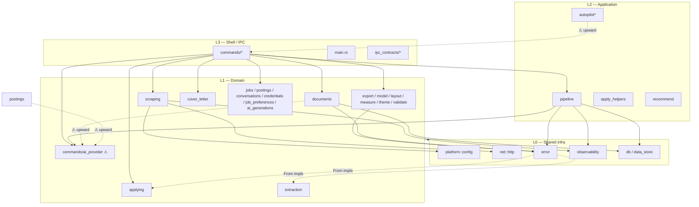

# Architecture Analysis — Rust/Tauri Core

> **Status:** discovery report (Phase 1). Read-only — describes the architecture **as it
> actually exists** in `apps/tauri/src-tauri/`, measured from the source tree, not an
> idealized target. The enforceable rules derived from this report live in
> [`architecture-rules.md`](architecture-rules.md); they are enforced by
> `apps/tauri/src-tauri/tests/architecture.rs` and CI.
>
> Measurements taken at commit on branch `feat/rust-arch-enforcement`: **36 top-level
> modules, 162 source files, ~28,000 non-test LOC.** Regenerate with the methodology in
> the appendix.

---

## 1. Current architecture overview

AI Job Hunter is a **local-first Tauri 2 desktop app**. The TypeScript side is a pnpm
monorepo (`packages/shared`, `packages/ui`, `packages/prompts`, `apps/tauri` renderer);
the **Rust side is a single crate**, `ajh-tauri` (`apps/tauri/src-tauri/`). There is no
network backend, no sidecar process — all heavy work (scraping, document extraction, AI
generation, embeddings, PDF/DOCX rendering) runs in-process on Tokio.

The crate is a **layered modular monolith**: one Cargo crate whose `src/` module tree is
organized into four de-facto layers. It is _not_ a Clean-Architecture onion and _not_ a
multi-crate workspace. Boundaries today are enforced by convention + three CI grep
guardrails (`docs/PATTERNS.md` §13), not by the compiler.

### The four layers (as built)

| Layer                                | Role                                                                                               | Representative modules                                                                                                                                                                                                                                                                        |
| ------------------------------------ | -------------------------------------------------------------------------------------------------- | --------------------------------------------------------------------------------------------------------------------------------------------------------------------------------------------------------------------------------------------------------------------------------------------- |
| **L3 — Shell / IPC**                 | Tauri command handlers, app bootstrap, IPC contract types. The only Tauri-aware layer (by intent). | `main.rs`, `commands/*` (96 `#[tauri::command]`), `ipc_contracts/*`, `export/commands`, updater command surface                                                                                                                                                                               |
| **L2 — Application / orchestration** | Multi-step flows that compose domain modules.                                                      | `pipeline/*`, `autopilot/*`, `autopilot_scheduler`, `autopilot_helpers`, `apply_helpers`, `recommend`                                                                                                                                                                                         |
| **L1 — Domain / feature**            | Business logic per concern; owns its schema/endpoint knowledge.                                    | `scraping/*`, `applying/*`, `extraction/*`, `export/*`, `cover_letter/*`, `documents`, `jobs`, `postings`, `conversations`, `credentials`, `job_preferences`, `ai_generations`, `profile_import`, `model/*`, `layout`, `measure`, `validate`, `locale`, `theme`, **`commands/ai_provider/*`** |
| **L0 — Shared infrastructure**       | Single-owner cross-cutting primitives.                                                             | `platform/{config,process,chrome}`, `net/http`, `error`, `observability`, `db`, `data_store`, `browser`                                                                                                                                                                                       |

> `locale` and `theme` are classified **L1**, not L0: they depend on `model`/`export`
> (lexicons + theme tokens feed the rendering cluster), so they sit with the domain
> rendering code rather than the dependency-free infra tier.

> `commands/ai_provider/*` is listed under L1 because it **is** domain/infra (AI provider
> routing, embeddings, capabilities) even though it physically lives under the L3
> `commands/` directory. That misplacement is finding **W-1** below.

### Architectural patterns already in use

These are genuine, consistently-applied patterns — the rules formalize them rather than
replace them:

- **Ports & adapters at the IPC seam** — renderer talks only through typed contracts;
  `commands/*` are the adapters.
- **Single-owner shared infrastructure** — `platform::config` (env + paths), `net::http`
  (one pooled rustls client), `error::AppError`/`AppResult` (typed errors),
  `observability::Span` (timed `→`/`←` traces). Each has exactly one owner.
- **Registry dispatch** — `scraping::boards::SCRAPERS`, `applying::registry::APPLIERS`,
  `commands::ai_provider::resolve(ProviderId)`. Dispatch + catalog derive from one list.
- **Store-per-domain behind one trait** — every persistent store implements
  `data_store::DataStore` (`export`/`import`); `commands/data.rs` assembles one versioned
  backup bundle.
- **Typed errors, no stringly Results** — `AppResult<T>` everywhere internal; domain
  enums (`ExtractionError`) add `From` into `AppError`.
- **Capability-driven dispatch** — provider behavior gates on capability structs, not
  identity string matching.
- **Isolated failure domains** — paginated scrapers keep partial results instead of
  aborting the whole board.

---

## 2. Dependency graph

Edges are top-level-module dependencies derived from `crate::<module>` references
(`use crate::…` + inline paths), aggregated to the first path segment under `src/`.

### Fan-in / fan-out (selected)

| Module                | Layer | Fan-out | Fan-in | Notes                                                                                                        |
| --------------------- | ----- | ------: | -----: | ------------------------------------------------------------------------------------------------------------ |
| `commands`            | L3    |  **23** |      5 | depends on nearly every domain module (expected for the shell) — but **5 modules depend back on it** (smell) |
| `export`              | L1    |       7 |      7 | hub of the rendering cluster                                                                                 |
| `error`               | L0    |       2 | **15** | foundational; the 2 out-edges (`extraction`, `applying`) are the `From` impls                                |
| `db`                  | L0    |       1 |      6 | SQLite helper                                                                                                |
| `data_store`          | L0    |       1 |      6 | backup/restore trait                                                                                         |
| `scraping`            | L1    |       3 |      5 | composes `net`, `observability`, `platform`                                                                  |
| `model`               | L1    |       1 |      5 | document model, hub of rendering cluster                                                                     |
| `documents`           | L1    |       5 |      2 | imports **up** into `commands::ai_provider`                                                                  |
| `pipeline`            | L2    |       4 |      2 | imports **up** into `commands::ai_provider`                                                                  |
| `autopilot_scheduler` | L2    |       2 |      0 | calls `commands::autopilot::autopilot_run`                                                                   |

### Layer dependency map (intended vs actual)

Solid edges follow the intended top-down flow; **dashed edges are upward / cyclic**
(findings W-1…W-3).

### Cycles detected (Tarjan SCC over the module graph)

Two strongly-connected components exist — i.e. **real module cycles**:

1. **Rendering cluster (intra-L1, high cohesion):**
   `export ↔ model ↔ layout ↔ measure ↔ theme ↔ validate ↔ locale ↔ extraction`, plus
   `error ↔ extraction`. Mutual pairs: `export↔measure`, `export↔validate`,
   `export↔theme`, `export↔layout`, `export↔model`, `error↔extraction`.
2. **Shell ↔ domain cluster (cross-layer — harmful):**
   `commands ↔ pipeline`, `commands ↔ postings`, `commands ↔ documents`,
   `commands ↔ autopilot_helpers` (via `autopilot_scheduler`).

Cluster (2) is entirely caused by **finding W-1** (misplaced `ai_provider`). Cluster (1)
is high-cohesion rendering code; it is reported but not gated (breaking it is a larger
refactor — see W-6).

---

## 3. Layer responsibilities

| Layer              | Owns                                                                                                                                                 | Must NOT contain                                                         |
| ------------------ | ---------------------------------------------------------------------------------------------------------------------------------------------------- | ------------------------------------------------------------------------ |
| **L3 Shell**       | `#[tauri::command]` handlers, `tauri::Builder`, window/tray/menu, `AppHandle`/`State`/`emit`, IPC DTOs                                               | business logic, SQL, HTTP construction                                   |
| **L2 Application** | step/stage orchestration, scheduling, cross-domain workflows                                                                                         | `#[tauri::command]`, direct SQL, `reqwest::Client` construction          |
| **L1 Domain**      | feature logic, board/provider/parser implementations, document model + rendering, per-domain SQLite stores                                           | Tauri types/macros, env/path resolution, `reqwest::Client` construction  |
| **L0 Infra**       | env+paths (`platform::config`), HTTP client (`net::http`), errors (`error`), traces (`observability`), DB handle (`db`), backup trait (`data_store`) | dependencies on L1/L2/L3 (one blessed exception: `error`'s `From` impls) |

---

## 4. Architectural weaknesses

Each finding has an ID, the measured evidence, a severity, and the rule it maps to in
[`architecture-rules.md`](architecture-rules.md).

| ID      | Finding                                                                                                                                                                                                                                                                                                                                                                                                                                                     | Severity              | Evidence                                                                                                                                                                                                                                                                                                  |
| ------- | ----------------------------------------------------------------------------------------------------------------------------------------------------------------------------------------------------------------------------------------------------------------------------------------------------------------------------------------------------------------------------------------------------------------------------------------------------------- | --------------------- | --------------------------------------------------------------------------------------------------------------------------------------------------------------------------------------------------------------------------------------------------------------------------------------------------------- |
| **W-1** | **`ai_provider` misplaced under the shell layer.** AI provider routing/embeddings/capabilities live in `commands/ai_provider/*` (~1,450 LOC), so domain/app modules import **upward** into `crate::commands` to use them — the sole cause of the shell↔domain cycle.                                                                                                                                                                                        | **High**              | `pipeline/mod.rs:25`, `documents/mod.rs:17,436,459`, `postings/mod.rs:14`, `autopilot_helpers/mod.rs:80` all `use crate::commands::ai_provider::…`                                                                                                                                                        |
| **W-2** | **`#[tauri::command]` defined outside `commands/`.** Command handlers live in two non-shell modules.                                                                                                                                                                                                                                                                                                                                                        | **Medium**            | `updater/mod.rs` (4×), `extraction/mod.rs` (1× — `extract_resume`)                                                                                                                                                                                                                                        |
| **W-3** | **Tauri types leak into L0/L1/L2.** `tauri::`/`AppHandle`/`Manager`/`.emit()` appear in 14 non-shell modules — infra (`platform/config`, `updater`), application (`pipeline`, `autopilot_*`, `apply_helpers`), and domain (`documents`, `conversations`, `credentials`, `cover_letter/*`, `extraction`, `export/commands`).                                                                                                                                 | **Medium**            | 14 files; `documents/mod.rs`, `conversations/mod.rs`, `pipeline/mod.rs`, `cover_letter/{mod,leakage,research}` …                                                                                                                                                                                          |
| **W-4** | **(False positive — investigated, no action.)** A naïve `.execute(` scan flagged `applying/form_filler/mod.rs`, but `page.execute(…)` there is a **chromiumoxide browser** call, not SQL. The 8 genuine `rusqlite::` files are all legitimate owners (`db.rs`, `error.rs` `From` impls, and per-domain stores). **DB access is clean.** The lesson — use the precise `rusqlite::`/`Connection` pattern, not bare `.execute(` — is baked into the arch test. | **None**              | `applying/form_filler/mod.rs:67` = `page.execute(`                                                                                                                                                                                                                                                        |
| **W-5** | **`std::env::var` read outside `platform::config`.** Six reads of `PATH`/`HOME`/`SHELL`/`CHROME`/`OLLAMA_HOST`/CLI-binary-override outside the env owner. (The existing CI grep only guards `AJH_DATA_DIR`, so these slipped through.)                                                                                                                                                                                                                      | **Low**               | `commands/ai_provider/cli_agent/mod.rs:108`, `commands/ai_provider/ollama.rs:25`, `platform/chrome/mod.rs:5`, `platform/process.rs:76,100,124`                                                                                                                                                            |
| **W-6** | **God objects / oversized modules.** Ten files > 450 LOC; the rendering subsystem dominates.                                                                                                                                                                                                                                                                                                                                                                | **Medium**            | `export/pdf_renderer/mod.rs` 1343, `layout/mod.rs` 905, `export/pdf/mod.rs` 820, `scraping/scrape_url/mod.rs` 667, `commands/ai_provider/cli_agent/mod.rs` 617, `documents/mod.rs` 561, `export/templates/mod.rs` 560, `commands/ai_provider/mod.rs` 519, `model/rich.rs` 480, `export/model_docx.rs` 476 |
| **W-7** | **Parallel/legacy renderers (duplication + conditional dead code).** Legacy line-based PDF/DOCX renderers (`export/pdf_renderer`, `export/docx_renderer`, `export/pdf`) coexist with the canonical model path (`layout_pdf`, `model_docx`) behind the default Cargo features `layout_pdf`/`model_docx`. On a default build the legacy path is compiled but unused for resumes (kept as parity reference + cover-letter renderer).                           | **Low** (intentional) | `Cargo.toml` features; `export/{pdf_renderer,docx_renderer,pdf}` vs `export/{layout_pdf,model_docx}`                                                                                                                                                                                                      |
| **W-8** | **Tight coupling in the rendering cluster.** `export`/`model`/`layout`/`measure`/`theme`/`validate` form a mutually-referential cluster (intra-L1 SCC). High cohesion, but no single parent boundary.                                                                                                                                                                                                                                                       | **Low**               | SCC #1 above                                                                                                                                                                                                                                                                                              |
| **W-9** | **`error` (L0) depends on `extraction` + `applying` (L1).** Inverted dependency from the `From<DomainError>` impls living in `error.rs`. Deliberate per §13, but it is the `error↔extraction` cycle edge.                                                                                                                                                                                                                                                   | **Low** (intentional) | `error.rs` `From` impls; fan-out `error -> {extraction, applying}`                                                                                                                                                                                                                                        |

**Clean / no violations found (worth recording):**

- `Result<_, String>` outside `error.rs`: **none**. The typed-error guardrail holds.
- `reqwest::Client::new/builder` outside `net/http.rs`: **none**. The HTTP-owner guardrail holds.
- `AJH_DATA_DIR` outside `platform/config.rs`: **none**. The data-dir guardrail holds.
- **Direct SQL outside store boundaries: none** (the 8 `rusqlite::` files are all owners; W-4 was a false positive).
- No dependency on a higher layer from `net`, `observability`, `db`, `data_store`, `platform` (besides W-9).

---

## 5. Recommended boundaries

Adopt the explicit **L0 → L1 → L2 → L3** layering above with a **downward-only**
dependency rule (higher layers depend on lower, never the reverse):

- **L0 infra** depends on nothing in L1/L2/L3 (grandfather W-9's `error` `From` impls).
- **L1 domain** depends on L0 + sibling domain via public `mod.rs` surfaces; **no Tauri**.
- **L2 application** depends on L0 + L1; **no `#[tauri::command]`**, no direct SQL/HTTP.
- **L3 shell** depends on anything below; **only L3 may use Tauri command macros, `State`, `AppHandle`, `emit`.**
- **Sole-owner concerns** keep one owner: env/paths → `platform::config`; HTTP →
  `net::http`; errors → `error`; traces → `observability`; DB handle → `db`;
  SQL access → `db` + per-domain `*/mod.rs` stores only.
- **Relocate `ai_provider`** (W-1) from `commands/` to a top-level L1 module (e.g.
  `src/ai_provider/`), leaving only thin `#[tauri::command]` wrappers in `commands/ai.rs`.
  This deletes the shell↔domain cycle. _(Recommended as a focused follow-up PR; until
  then it is an allowlisted exception in the arch test with a `TODO(arch)`.)_

---

## 6. Recommended linting rules

Each becomes a `#[test]` in `tests/architecture.rs` (regex/line scanner over `src/`) or a
toolchain gate. Allowlists encode today's known exceptions so the suite is green now and
blocks **new** drift.

| Rule                                                           | Mechanism                                                                | Maps to |
| -------------------------------------------------------------- | ------------------------------------------------------------------------ | ------- |
| R1 `#[tauri::command]` only in `commands/`                     | arch test (allowlist: `updater`, `export/commands` → or fix W-2)         | W-2     |
| R2 No `tauri::`/`AppHandle`/`tauri_plugin`/`.emit` in L0/L1/L2 | arch test (allowlist the 14 current files w/ TODO)                       | W-3     |
| R3 `rusqlite::` only in `db.rs`/`error.rs` + per-domain stores | arch test (precise pattern; already clean)                               | W-4     |
| R4 `std::env::var`/`AJH_DATA_DIR` only in `platform/*`         | arch test (broaden existing grep; allowlist provider reads)              | W-5     |
| R5 `reqwest::Client::new/builder` only in `net/http.rs`        | arch test (already clean)                                                | —       |
| R6 `Result<_, String>` forbidden outside `error.rs`            | arch test (already clean)                                                | —       |
| R7 No upward layer imports (`crate::commands` from L0/L1/L2)   | arch test (allowlist `commands::ai_provider`, scheduler→`autopilot_run`) | W-1     |
| R8 No oversized module > ~900 LOC (warn at 600)                | arch test (report-only / soft gate)                                      | W-6     |
| R9 `cargo fmt --check` clean                                   | toolchain + CI                                                           | —       |
| R10 `cargo clippy -D warnings`, no blanket crate allows        | toolchain + CI                                                           | —       |
| R11 `cargo deny check` (advisories/licenses/bans/sources)      | cargo-deny + CI                                                          | —       |
| R12 `cargo audit` on every PR (not just weekly)                | cargo-audit + CI                                                         | —       |
| R13 No unused dependencies                                     | cargo-machete + CI                                                       | —       |
| R14 Async safety: no lock held across `.await`                 | `#![deny(clippy::await_holding_lock)]`                                   | —       |

---

## 7. Recommended module ownership

Extends the `docs/PATTERNS.md` §13 ownership table with the boundaries this analysis adds:

| Concern                          | Sole owner                                                             | Rule                                                |
| -------------------------------- | ---------------------------------------------------------------------- | --------------------------------------------------- |
| env vars, data dir, FS paths     | `platform::config` (+ `platform::process`/`chrome` for OS-process env) | never read env elsewhere (W-5)                      |
| HTTP client construction         | `net::http`                                                            | `shared()` / `build_client()` only                  |
| timed trace spans                | `observability::Span`                                                  | never reimplement begin/elapsed/end                 |
| error types                      | `error::AppError`                                                      | `AppResult<T>`; domain enums add `From`             |
| SQLite handle + access           | `db` + per-domain `*/mod.rs` stores                                    | no `rusqlite` in logic/helper files (W-4)           |
| AI provider routing + embeddings | **`ai_provider`** (to be relocated out of `commands/`)                 | `resolve(ProviderId)`, `embed_text`, `cosine` (W-1) |
| job board scrapers / appliers    | `scraping::boards` / `applying::registry`                              | register in `SCRAPERS` / `APPLIERS`                 |
| workflow orchestration           | `pipeline`                                                             | compose `Stage`/`Pipeline`                          |
| Tauri command surface            | `commands/*`                                                           | the only place `#[tauri::command]` is defined (W-2) |

---

## Appendix — methodology (reproducible)

- **File/LOC inventory:** `git ls-files 'apps/tauri/src-tauri/src/**/*.rs'` + `wc -l`,
  excluding `*test.rs`/`tests.rs` and `target/`.
- **Module graph:** scan each file for `crate::<seg>` references, map the file to its
  first `src/` path segment, aggregate edges; fan-in/out + Tarjan SCC for cycles.
- **Leakage scans (regex over non-test `*.rs`):** `#[tauri::command]`,
  `tauri(_plugin)?::|AppHandle|Manager|\.emit\(`, `rusqlite::|Connection::open|\.prepare\(|\.execute\(`,
  `Result<_, String>`, `reqwest::Client::(new|builder)`, `std::env::var|AJH_DATA_DIR`.
- These checks are codified in `apps/tauri/src-tauri/tests/architecture.rs`; run
  `cargo test --test architecture` to reproduce the gated subset.
